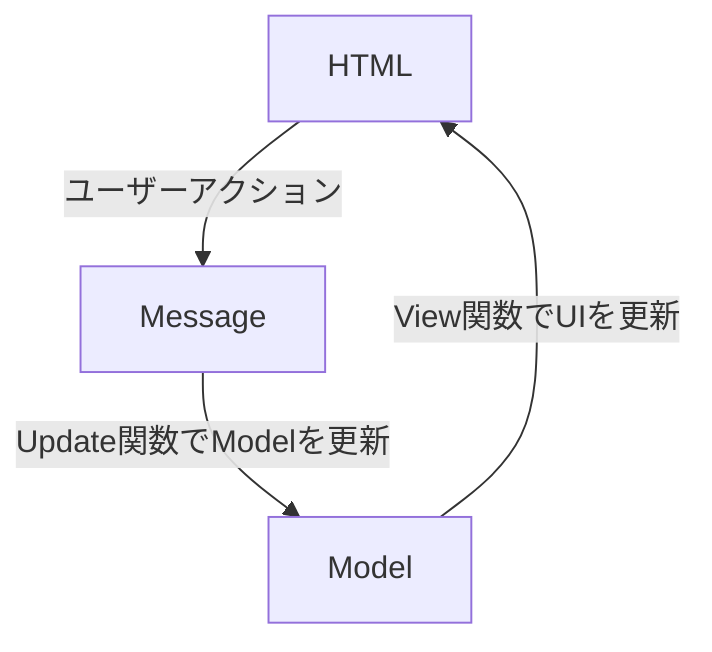

本記事は[エンジニア集会 Advent Calendar 2025](https://qiita.com/advent-calendar/2025/engineer-meetup)の12日目の記事です。

## まずはこいつを見てくれ。話はそれからだ。

https://www.youtube.com/watch?v=PNKF2xfyxS0

こちらから実際にプレイできます。  

https://tsuzuri-tutorial.pages.dev/

急いで作ったものなので一部荒いところがあります。  
表示が崩れているところは、ブラウザのズームを各自で調整いただきますようお願いいたします。  
一応Androidでも動くには動きますが、レスポンシブ対応等はしていないので、UIが大きく崩れています。  
iOSはまだ対応できていません……。

## はじめに

**tsuzuri**という、Elm Architecture（MVU Architecture）の仕組みを参考に、メッセージ駆動でノベルゲームが制作できる関数型ノベルゲームエンジンを開発しました。  
tsuzuriは、提供されるMessageを組み合わせることで、ノベルゲームを簡単に作ることができるコンセプトのゲームエンジンです。  
最初にご覧いただいたノベルゲームは、もちろんこのtsuzuriを使って開発しました。 

まだドキュメントも何も整っていませんが、リポジトリは以下になります。

https://github.com/ichi-h/tsuzuri

## どう使うのか

言葉で説明するよりコードを見せたほうが早いと思うので、先にどんな感じのインターフェースになるのか簡単に確認してみましょう。

まず、tsuzuriを以下のコマンドでインストールします。

```bash
npm i @ichi-h/tsuzuri-core @ichi-h/tsuzuri-driver
```

試しにシナリオを作ってみましょう。
冒頭のゲームで触れた通り、tsuzuriではノベルゲームをメッセージの集積と捉えているため、シナリオもメッセージの組み合わせによって構築することになります。

```tsx
// sequence = 複数のMessageを一括で発行するMessage
export const initMessage: NovelMessage = sequence([
  // 音声トラックの追加と再生
  addTrack({
    id: 'bgm',
    src: 'path/to/bgm',
  }),
  playChannel({ channelId: 'bgm' }),

  // Widgetという抽象的なUIを追加
  addWidgets([
    w.layout({ // layout = divタグのようなもの
      id: 'root',
      // classNameを張ることができるため、こちらでスタイリングを行う
      className: 'w-screen h-screen flex flex-col items-center justify-center',
    })([
      // テキストボックスの追加
      w.textBox({
        id: 'text-box',
        className:
          'w-3/4 h-48 bg-white/90 border-2 border-gray-300 rounded-lg p-4',
      })([]),
    ]),
  ]),
]);

export const scenario: NovelMessage[] = [
  // テキストボックスにテキストを表示
  addText({
    textBoxId: 'text-box',
    content: 'テキストを表示',
  }),
  addText({
    textBoxId: 'text-box',
    content: 'さらに表示',
  }),
];
```

ゲーム画面や音声トラックの準備を事前に行っておくため、`initMessages` という定数に発火するメッセージをまとめて詰め込んでいきます。  
次の `scenario` という定数がいわゆるノベルゲームのコンテンツになります。ここでは簡単に2つテキストを表示するだけにしておきます。

そして、これらをゲームに組み込みます。

### パターン1: コンポーネント内でメッセージを送る

例えばReactを使ってシンプルに組み込むと、以下のようなコードになります。

```tsx
import { createApplyMixer, NovelWidgetDriver } from '@ichi-h/tsuzuri-driver';
import { generateInitModel, tsuzuri } from '@ichi-h/tsuzuri-core';
import { useState } from 'react';
import { initMessage, scenario } from './scenario';
import '../index.css';

const applyMixer = createApplyMixer();
const initModel = generateInitModel();
const { createSender } = tsuzuri(
  // initMessageを用いてModelを初期化
  () => [initModel, async () => initMessage],
  applyMixer,
);

export const App = () => {
  const [model, setModel] = useState(initModel);

  // Modelを受け取ってViewを更新する関数（= View関数）を渡して
  // Messageをsendする関数を取得
  const send = createSender(setModel);

  const next = () => {
    const message = scenario[model.index];
    if (!message) {
      console.log('シナリオ終了');
      return;
    }
    // NextMessageでラップしたメッセージを送信
    // Nextでラップすることでmodel.indexを自動的に調整する
    send({ type: 'Next', message });
  };

  return (
    <div
      className="w-screen h-screen"
      onClick={next}
      onKeyDown={(e) => (e.key === 'Enter' || e.key === ' ' ? next() : null)}
    >
      {/* 各ウィジェットをReact Componentとして描画 */}
      <NovelWidgetDriver widgets={model.ui} model={model} send={send} />
    </div>
  );
};

```

色々と記述がありますが、まず重要なのは `tsuzuri` という関数です。  
これはtsuzuriのシステムを準備するための関数となっており、引数からModelの初期値や、初回に発火するメッセージを非同期で指定することができます。ElmでいうところのInit関数に近いものと捉えてください。

tsuzuriを実行すると得られるものの一つに、`createSender` という関数があります。これはメッセージを送信するsend関数を生成するための関数です。  
`createSender` では、Modelを使ってViewを更新を行うview関数を引数として求めます。Reactにおいては `useState` のset関数がそれに該当しますので、`setModel` を引数として渡しています。

次に、得られた `send` 関数を使ってメッセージを飛ばしましょう。  
ノベルゲームでは画面クリック時やエンターキー・スペースキーあたりを入力したときに物語が進むケースが多いので、そこに合わせてハンドラを埋め込むとよいと思います。

そしてModelをViewへと変換するために、`NovelWidgetDriver` を使って `model.ui` をReact Componentに変換します。  
tsuzuriでは特定のUIライブラリに依存しておらず、このようにModelの情報を他のUIライブラリの形式に変換するという方針を取っています。

これでユーザーがアクションを取るとテキストボックスにテキストが表示される簡単なデモを作成できます。

### パターン2: グローバルにメッセージを送れるようにする

先ほどのやり方では、`createSender` に直接view関数を渡して、Model→Viewの同期を行っていました。  
しかしこの場合、`send` 関数をコンポーネントの中でしか使うことができず、外からメッセージを送れないため不便となるケースがあります。

なので、メッセージ送信時に直接Viewを更新しない代わりに、Modelが変更されたことを外部に通知し、その通知が来たら最新のModelでViewを更新してもらうこともできます。
これにより、グローバルにメッセージを送信できるようになります。

具体的には以下の通りです。

```tsx
import { createApplyMixer, NovelWidgetDriver } from '@ichi-h/tsuzuri-driver';
import { generateInitModel, tsuzuri } from '@ichi-h/tsuzuri-core';
import { noView } from '@ichi-h/elmish';
import { useSyncExternalStore } from 'react';
import { initMessage, scenario } from './scenario';
import '../index.css';

const applyMixer = createApplyMixer();
const initModel = generateInitModel();
const { createSender, getModel, addListener, deleteListener } = tsuzuri(
  // initMessageを用いてModelを初期化
  () => [initModel, async () => initMessage],
  applyMixer,
);

// グローバルにメッセージを送信できるsend関数を作成
// viewの更新は伴わないためnoView関数を渡す
const send = createSender(noView);

const subscribe = (callback: () => void) => {
  addListener(callback);
  return () => {
    deleteListener(callback);
  };
};

export const App = () => {
  const model = useSyncExternalStore(subscribe, getModel);

  const next = () => {
    const message = scenario[model.index];
    if (!message) {
      console.log('シナリオ終了');
      return;
    }
    send({ type: 'Next', message });
  };

  return (
    <div
      className="w-screen h-screen"
      onClick={next}
      onKeyDown={(e) => (e.key === 'Enter' || e.key === ' ' ? next() : null)}
    >
      {/* 各ウィジェットをReact Componentとして描画 */}
      <NovelWidgetDriver widgets={model.ui} model={model} send={send} />
    </div>
  );
};

```

基本的な書き方は共通していますが、いくつか違いがあります。

まず `tsuzuri` 関数の戻り値から新しく `getModel` `addListener` `deleteListener` を受け取っています。
`getModel` は文字通り現在のModelを取得する関数、`addListener` と `deleteListener` はモデルが更新されたときに発火するハンドラを管理するための関数です。例えばReactであれば、 `useSyncExternalStore` を使って外部の状態と連動するときに使用します。

次に `createSender` の引数を確認すると、 `noView` 関数が渡されています。  
このパターンでは、モデルの変更時に直接的なViewの更新が伴わないため、Viewを更新するタイミングで何も行わないことを明示しています。  
これによりメッセージをどこからでも飛ばせる `send` 関数を得ることができます。

あとはコンポーネント内で`useSyncExternalStore` を使ってModelを参照する以外は同じになります。

## どういうコンセプトなのか

### tsuzuriの責務について

tsuzuriは明確に責務を定義しています。それは、**ノベルゲームにおける本質的な価値提供を行うものを、Functionalな視点からモデリングすること**です。

ここでいう本質的な価値提供とは、いったい何を指しているのでしょうか？
それはゲームのシナリオであったり、あるいはキャラクターであったり、いろいろあると思いますが、どちらも共通していることは、**ノベルゲームが提供したいコンテンツそのもの**という点に異論はないと思います。
そのコンテンツをプレイしたいからノベルゲームを手に取るのであって、**決してゲームのセーブ機能で遊びたいから手に取るわけではありません**。
あくまでセーブ機能は、ゲームを快適にプレイするために生まれた補助機能であり、DDDの文脈でいうなれば、それはサブドメインに該当します。
もちろんそれも重要な機能ではあるものの、それ自体が本質的な価値提供を行うわけではないので、tsuzuriにおいては優先度の低い項目として解釈されます（ちなみにtsuzuriではセーブ・ロードのロジックのみdriverから提供しています）。

### メッセージ駆動について

tsuzuriでは計画当初から、**ノベルゲームをメッセージの集積結果と解釈すること**を前提に設計していました。
これはどういうことかというと、**今画面に表示されているノベルゲームの状態は、過去に送信されたメッセージの積み重ねによって実現できる**というコンセプトを指します。

こうしたコンセプトは、**イベントソーシング**や**CQS/CQRS**の考え方と共通するところがあります。  
例えばイベントソーシングでは、現在のリソースの状態だけを永続化するのではなく、**そのリソースに対する変更内容（アクションやコマンド、イベントなどと呼ばれるもの）をすべて格納し、そこから現在の状態を算出する**ようにします。
つまり、100という数字そのものを保存するのではなく、まず0という数字を作成するコマンドを発行し、その次に200を足すコマンド、100を引くコマンドを発行して、最終的に得られる状態をコマンドの集積から算出する、という考え方です。

tsuzuriにおいても共通点があります。
例えば、ゲームスタート時に画面全体のUIを定義するメッセージを発火し、次にテキストを表示するメッセージ、BGMを再生するメッセージ、キャラの立ち絵を表示するメッセージなどを発火することになります。  
これらのメッセージの集積から現在のノベルゲームの状態（＝ Model）を算出できるようになります。

ただし実際には、tsuzuriはElm Architectureのデザインパターンを踏襲しています。  
つまり、メッセージの発行履歴は持っているものの、処理上は**メッセージ発火、即Modelに反映**となっているため、この点はイベントソーシングと一致しません。  
ただ、どちらもコマンドやメッセージといった、イベントで状態を管理しようとするアプローチは共通しています。

## なぜ作ったのか

動機は単純でして、**シンプルかつDeveloper-Friendlyなノベルゲームエンジンが欲しかったから**に尽きます。  
過去にいくつかのノベルゲームエンジンを使用したことがありましたが、以下のような不満点がありました。

- UIの組み方がわかりにくい。
- 独自の考え方の学習コスト。
- やりたいことを実現しようとしたときに、調べてもHowが出てこない。
- 突っ込んだことをやろうとすると途端に複雑になる。
- など。

また、ここの技術に投資をしてもエンジニアとしてのリターンが薄いという問題もあったため、こうなるのであれば自分で0から作ってしまった方が、短期的にも長期的にもメリットが大きいと考えたため、ゲームエンジンから制作しました。

## 型から見るtsuzuriの設計・仕組み

tsuzuriの内部設計をすべて説明すると長くなりすぎるため、ここではエンジンの型に注目しつつ、いくつかピックアップしてご紹介できればと思います。

### Elm Architecture

型の解説の前に、tsuzuriにおいて肝となる**Elm Architecture**について少しお話させてください。

私がここで解説するよりも[Elmのドキュメント](https://guide.elm-lang.jp/)の方がわかりやすいので詳細は割愛いたしますが、少し引用してみましょう。

> Elm のプログラムが動く仕組みを図にすると、こんな風になります。
> 
> 
> 
> 
> Elm が画面に表示するためのHTMLを出力し、コンピュータは画面の中で起きたこと、例えば「ボタンがクリックされたよ！」というようなメッセージを Elm へ送り返します。
> 
> さて、Elm プログラムの中では何が起きているのでしょうか？ Elm では、プログラムは必ず3つのパーツに分解できます。
> 
> - **Model** — アプリケーションの状態
> - **View** — 状態を HTML に変換する方法
> - **Update** — メッセージを使って状態を更新する方法
> 
> この3つのコンセプトこそ、**The Elm Architecture** の核心なのです。
> 
> \- [The Elm Architecture · An Introduction to Elm](https://guide.elm-lang.jp/architecture/)
> 

要は、 **Model** という状態と、その状態をHTMLとして出力する **View** 、状態更新を担う **Update** の3つによってElm Architectureは成り立っている、ということですね。  
図にすると以下のようになります。



このアーキテクチャを実現するために、すでに@ichi-h/elmishという自作の状態管理ライブラリを開発しています。

https://zenn.dev/ichi_h/articles/8c3fa8abd97d8c

https://github.com/ichi-h/elmish

こちらはElm ArchitectureにおけるView関数を抽象化することにより、**UIライブラリ非依存でElmishな状態管理を実現するために開発されたライブラリ**です。

そしてtsuzuriでは、この@ichi-h/elmishを内部で使用しています。  
tsuzuriが行っていることは、言ってしまえばノベルゲームに特化した状態管理システムと言い換えられるため、tsuzuriはこの@ichi-h/elmishのラッパーとして解釈することも可能です。

上記の技術記事に書いているため詳細は割愛するのですが、tsuzuriではメッセージ駆動とUI非依存という哲学を受け継ぐため、こちらのライブラリを使用しています。

### Model

tsuzuriでは、Modelを以下のように定義しています。

```tsx
// ノベルゲームの設定を管理するための型
export interface NovelConfig {
  historyLength: {
    [K in NovelMessageType]: number;
  };
  textAnimationSpeed: number;
}

// 現在実行中のアニメーションと、アニメーションが終了した後に
// Messageが送信されたときの挙動
export interface AnimationTicket {
  id: string;
  ttl: number;
  nextMessageCaught: 'ignore' | 'merge' | 'insert';
}

// 現在のノベルゲームのステータス
export type NovelStatus =
    // Messageが正しく処理された
  | {
      value: 'Processed';
    }
    // 送信されたメッセージと、内部で自動発火したメッセージが統合された
  | {
      value: 'Merged';
      message: NovelMessage;
    }
    // 送信されたメッセージの前に、内部で自動発火したメッセージが挿入された
  | {
      value: 'Inserted';
      message: NovelMessage;
      before: NovelMessage;
    }
    // 遅延中
  | {
      value: 'Delaying';
      remainingTime: number;
    }
    // ユーザーのアクション待ち
  | {
      value: 'AwaitingAction';
    }
    // ゲームエンジンの外側にNextメッセージの発火を要求
  | {
      value: 'RequestingNext';
    }
    // エラーが発生した
  | {
      value: 'Error';
      error: Error;
    };

export interface NovelModel<CustomState = unknown> {
  status: NovelStatus;
  // 現在選択中のシナリオ
  currentScenario: string;
  // 次に発火するメッセージのインデックス
  index: number;
  // オーディオミキサーの抽象
  mixer: {
    value: Mixer;
    isApplying: boolean;
  };
  // UIの抽象
  ui: w.NovelWidget[];
  animationTickets: AnimationTicket[];
  // 過去に発火したメッセージの履歴
  history: {
    [K in NovelMessageType]: Extract<NovelMessage, { type: K }>[];
  };
  config: NovelConfig;
  // ユーザーが任意で格納できる状態
  customState?: CustomState;
}
```

ここではステータスとシナリオ管理についてもう少し詳しく解説いたします。

#### NovelStatus

まず、ゲームエンジンの状態を表すステータスとして、 `status` というプロパティを設けています。  
`NovelStatus` の型の通りではあるのですが、受け取ったメッセージを正しく処理できたか、または内部で自動的に発火したメッセージへの対応状況、ユーザーに対する要求などを一元管理しています。

例えば、一番簡単なのは `Delaying` というステータスです。  
これは `DelayMessage` という、指定した秒数間だけ処理を止めることを要求するメッセージを発火することで設定されます。

```tsx
export interface DelayMessage extends BaseMessage {
  type: 'Delay';
  durationMs: number; // 待ち時間（ms）
}

// Delayが完了したときに自動的に発火するメッセージ
export interface DelayCompletedMessage extends BaseMessage {
  type: 'DelayCompleted';
}

export const delay = (durationMs: number): DelayMessage => {
  return {
    type: 'Delay',
    durationMs,
  };
};

export const handleDelay = <CustomState = unknown>(
  model: NovelModel<CustomState>,
  msg: DelayMessage,
): ReturnModel<NovelModel<CustomState>, DelayCompletedMessage> => {
  return [
    // 新しいModelの返却
    {
      ...model,
      // ステータスをDelayingに変更
      status: { value: 'Delaying', remainingTime: msg.durationMs },
    },
    // 副作用として非同期で処理を実行
    // 戻り値としてメッセージを返すことが要求される
    () =>
      new Promise<DelayCompletedMessage>((resolve) => {
        // 指定された秒数後にDelayが完了したことを発火
        setTimeout(() => {
          resolve({ type: 'DelayCompleted' });
        }, msg.durationMs);
      }),
  ];
};

// Delay完了後にステータスをProcessedに戻す
export const handleDelayCompleted = <CustomState = unknown>(
  model: NovelModel<CustomState>,
  _msg: DelayCompletedMessage,
): NovelModel<CustomState> => {
  return {
    ...model,
    status: { value: 'Processed' },
  };
};

```

処理を遅延するといっても、ゲームエンジンの処理そのものを止めることはできません。  
代わりにtsuzuriでは、ステータスを通じてゲームエンジンの外側で処理を止めること要求します。  
例えば、冒頭の使い方でこういったnext関数がありました。

```tsx
  const next = () => {
    const message = scenario[model.index];
    if (!message) {
      console.log('シナリオ終了');
      return;
    }
    send({ type: 'Next', message });
  };
```

ここに `Delaying` を対応させると以下のようになります。

```tsx
  const next = () => {
    // delay中はnextを発火しない
    if (model.status.value === 'Delaying') return;
  
    const message = scenario[model.index];
    if (!message) {
      console.log('シナリオ終了');
      return;
    }
    send({ type: 'Next', message });
  };
```

ノベルゲームを数秒間止めるとは、**シナリオを数秒間進めないことと同義**です。  
なので、`Delaying` 中にnextメッセージが発火されないようにすれば、この目的を達成することができます。

このようにtsuzuriでは、**ステータスを通じて外部に何らかの処理を要求することがあります**。  
こういったデザインパターンはElm Architectureではよく見られるのですが、tsuzuriは具体的なUIを制御しない思想になっているため、トレードオフとしてこういった実装を利用者に要求しています。  
面倒ではありますが、こういうものなんだなと捉えていただければと思います。

#### currentScenario/index

次に `currentScenario` と `index` についてです。  
まずtsuzuriでは、Modelの中でシナリオ自体を管理していません。  
代わりに、**今どのシナリオを参照しているかのエイリアス（`currentScenario`）と、どこまでシナリオが進んでいるかの進行度を管理するインデックス（`index`）を抱えています**。

どういうことかというと、例えばtsuzuriの使い方にて、以下のようにシナリオが定義されていました。

```tsx
export const scenario: NovelMessage[] = [
  // テキストボックスにテキストを表示
  addText({
    textBoxId: 'text-box',
    content: 'テキストを表示',
  }),
  addText({
    textBoxId: 'text-box',
    content: 'さらに表示',
  }),
];
```

しかし実際のノベルゲームでは、選択肢によるシナリオ分岐という問題があります。

そこで、シナリオごとにエイリアスを作成し、`currentScenario` に与えることで、読み込むシナリオを変更できるようにしています。

```tsx
export const scenario = {
  // メインのシナリオ
  main: [
    addText({
      textBoxId: 'text-box',
      content: 'あなたはどう思う？',
    }),
    // 選択肢の表示
    addWidgets(
      [
        w.layout({
          id: 'choice-buttons',
        })([
          // ボタンを表示
          w.button({
            label: 'こう思う',
            // クリック時にシナリオをoptionAに切り替える
            onClick: switchScenario({ scenario: 'optionA' }),
            id: 'option-a',
          }),
          // ボタンを表示
          w.button({
            label: 'ああ思う',
            // クリック時にシナリオをoptionBに切り替える
            onClick: switchScenario({ scenario: 'optionB' }),
            id: 'option-b',
          }),
        ]),
      ],
      'textbox-area',
    ),
    awaitAction(), // ユーザーの選択を待つ
  ],
  optionA: [
    clearTextBox('text-box'),
    addText({
      textBoxId: 'text-box',
      content: 'なるほど、いいね！',
    }),
    // シナリオをafterに変更
    switchScenario({ scenario: 'after' }),
  ],
  optionB: [
    clearTextBox('text-box'),
    addText({
      textBoxId: 'text-box',
      content: 'なるほど、素晴らしいね！',
    }),
    // シナリオをafterに変更
    switchScenario({ scenario: 'after' }),
  ],
  after: [
    clearTextBox('text-box'),
    addText({
      textBoxId: 'text-box',
      content: 'よくわかったわ！',
    }),
  ],
};
```

`onClick` 等で発火している `switchScenario({ scenario: 'XXX' })` というのは、シナリオ変更のメッセージを作成する関数です。

```tsx
export type SwitchScenarioMessage = {
  type: 'SwitchScenario';
  scenario: string; // 変更先のシナリオのエイリアス
  index?: number; // 変更後のindex（初期値: 0）
  resetState?: boolean; // シナリオ変更時にuiやmixer、アニメーションをリセットするか
};

export const switchScenario = ({
  scenario,
  index,
  resetState,
}: Omit<SwitchScenarioMessage, 'type'>): SwitchScenarioMessage => ({
  type: 'SwitchScenario',
  scenario,
  ...(index !== undefined ? { index } : {}),
  ...(resetState !== undefined ? { resetState } : {}),
});

export const handleSwitchScenario = <CustomState = unknown>(
  model: NovelModel<CustomState>,
  msg: SwitchScenarioMessage,
): NovelModel<CustomState> => {
  const newIndex = msg.index ?? 0;

  let newModel: NovelModel<CustomState> = {
    ...model,
    status: { value: 'RequestingNext' }, // Nextメッセージを発火するよう外側に要求
    currentScenario: msg.scenario,
    index: newIndex,
  };

  if (msg.resetState) {
    newModel = {
      ...newModel,
      mixer: {
        value: clearAllChannels(newModel.mixer.value),
        isApplying: false,
      },
      ui: [],
      animationTickets: [],
    };
  }

  return newModel;
};
```

これにより、先ほどの`currentScenario` は指定されたシナリオを参照するようになり、`index` も（指定がなければ）0からスタートすることになります。

### UIの抽象化

これまで何回か登場しましたが、tsuzuriでは**Widget**という概念を使ってUIを抽象化しています。  
シナリオの構築で出てきた `addText` という関数は、テキストを表示するためのメッセージですし、 `addWidgets` という関数は、Widgetを宣言的に追加するためのメッセージです。

tsuzuriでは以下の5つのWidgetを提供しています。

| Name | Description |
| --- | --- |
| **layout** | Widgetを複数抱えることができるコンテナ。divタグのようなもの。 |
| **textBox** | テキストを抱えることに特化したコンテナ。テキストボックス内のテキストをまとめて削除するといった便利機能がある。 |
| **text** | テキストの表示。 |
| **image** | 画像の表示。 |
| **button** | ボタンの表示。onClickで任意のメッセージを発火することができる。 |

こうしたWidgetを先ほどの `addText` や `addWidgets` といったメッセージで追加することで、`model.ui` にWidgetが反映されていきます。

それぞれのWidgetは**NovelWidgetBase**という共通の型を継承しています。

```tsx
export interface NovelWidgetBase {
  id: string;
  type: string;
  className?: string;
}
```

`className` プロパティを持たせている通り、tsuzuriでは**UIのスタイリングを完全に利用者に委ねています**。  
Tailwind CSSやVanilla Extract、あるいは純粋なCSSなど、class-basedなスタイリングであれば、どのような方法でも利用可能です。

そしてこのWidgetは、**ゲームエンジンの外側で具体的なUIへと変換する必要があります**。  
@ichi-h/tsuzuri-driverパッケージでは、React Componentへと変換する `NovelWidgetDriver` を標準で提供しています。

```tsx
interface Props {
  widgets: NovelWidget[];
  model: NovelModel;
  send: (msg: NovelMessage) => void;
}

export const NovelWidgetDriver = ({ widgets, model, send }: Props) => {
  return (
    <>
      {widgets.map((widget, i) => {
        switch (widget.type) {
          case 'Image':
            return (
              <Image key={`${widget.type}_${widget.id}_${i}`} widget={widget} />
            );
          case 'Layout':
            return (
              <Layout
                key={`${widget.type}_${widget.id}_${i}`}
                widget={widget}
                model={model}
                send={send}
              />
            );
          case 'TextBox':
            return (
              <TextBox
                key={`${widget.type}_${widget.id}_${i}`}
                widget={widget}
                model={model}
                send={send}
              />
            );
          case 'Text':
            return (
              <Text
                key={`${widget.type}_${widget.id}_${i}`}
                widget={widget}
                isAnimating={model.animationTickets.some(
                  (ticket) => ticket.id === widget.id,
                )}
                model={model}
              />
            );
          case 'Button':
            return (
              <Button
                key={`${widget.type}_${widget.id}_${i}`}
                widget={widget}
                send={send}
              />
            );
          default:
            return null;
        }
      })}
    </>
  );
};
```

やっていることは非常にシンプルでして、単にWidgetオブジェクトの中のプロパティをReact Componentに変換しているだけです。  
現在tsuzuriからはReact用のDriverしか提供していませんが、同様の方法で他のUIライブラリでも実装可能です。

### 音声の抽象化

オーディオというのは、いつでも扱いが厄介です。  
副作用の塊であるためテストがしにくく、また裏側で動くWeb Audio APIも低レベルなインターフェースであるため、アプリケーションという抽象度でここまで具体的なものは扱いたくありません。  
例えば、ゲームエンジン利用者が行いたいことは、例えば、**「BGMを再生したい」「ボイスを流したい」といった宣言的な命令**であるはずです。  
決して、**「まずAudioContextからGainNodeを生成して……」みたいなことは本来考えたくない**はずです。

この問題に対してtsuzuriでは、**Mixer**という概念を使って音声を抽象化することにしました。  
これにより、**音声のあるべき状態をModelで定義し、その状態に従って、外側のDriverから実際の再生状態へと反映する**ことができるようになっています。  
考え方としては、KubernetesのManifestファイルと近いものがあります。というより、むしろそこを参考に設計を行いました。

Mixerは以下のような型になっています。

```tsx
// 音声を流すトラック
export interface Track {
  id: string;
  type: 'Track';
  playStatus: 'Standby' | 'Playing' | 'Stopped';
  volume: Volume;
  isLoop?: {
    start: Samples;
    end: Samples;
  };
  src: string;
  fadeInMs?: FadeInMs;
  fadeOutMs?: FadeOutMs;
  delayMs?: DelayMs;
  offsetMs?: OffsetMs;
}

// 複数のチャンネルをまとめて管理するトラック
// バストラック自身もチャンネルであるため、入れ子構造が可能
export interface BusTrack {
  id: string;
  type: 'BusTrack';
  volume: Volume;
  channels: Channel[];
}

export type Channel = Track | BusTrack;

// ミキサーの本体
export interface Mixer {
  volume: Volume;
  channels: Channel[];
}

// Mixerを実際の音声へ反映するための関数の型
// この型に基づいてDriverで実装を行う
export type ApplyMixer = (mixer: Mixer) => Promise<void>;
```

トラックやバストラックという用語を見てピンときた方がいるかもしれませんが、これは**オーディオミキサーであったり、レコーディングスタジオにあるコンソール卓をベースにモデリングしたもの**です。  
結局のところ、BGMや効果音、ボイスなどの再生というのは、**すべてオーディオミキシングとして説明できる**ため、こうした概念を導入するのが最も真っ当であると考えています。  
というのも、こうしたシステムはどういったドメインであっても応用が効きやすく、またオーディオの世界においても有用であることが歴史的に証明されているからです。

このMixerもメッセージによって操作することが可能です。  
例えばトラックの追加は `AddTrackMessage` というメッセージで行うことができます。

```ts
export interface AddTrackMessage extends BaseMessage {
  type: 'AddTrack';
  id: string;
  src: string;
  busTrackId?: string;
  volume?: Volume;
  loop?: {
    start: Samples;
    end: Samples;
  };
}

export const addTrack = ({
  id,
  src,
  busTrackId,
  volume,
  loop,
}: Omit<AddTrackMessage, 'type'>): AddTrackMessage => {
  return {
    type: 'AddTrack',
    id,
    src,
    ...(busTrackId !== undefined ? { busTrackId } : {}),
    ...(volume !== undefined ? { volume } : {}),
    ...(loop !== undefined ? { loop } : {}),
  };
};

export const handleAddTrack = <CustomState = unknown>(
  model: NovelModel<CustomState>,
  msg: AddTrackMessage,
  update: Update<NovelModel<CustomState>, NovelMessage<CustomState>>,
): ReturnModel<NovelModel<CustomState>, NovelMessage<CustomState>> => {
  const track: Track = {
    id: msg.id,
    type: 'Track',
    playStatus: 'Standby',
    volume: msg.volume ?? 1.0,
    src: msg.src,
    ...(msg.loop !== undefined ? { isLoop: msg.loop } : {}),
  };

  try {
    const mixer = addChannel(model.mixer.value, track, msg.busTrackId);

    // 追加したトラックを実際の音声へ反映するために、
    // ApplyMixerという別のメッセージを連続で発火
    return update(
      {
        ...model,
        mixer: {
          ...model.mixer,
          value: mixer,
        },
      },
      {
        type: 'ApplyMixer',
      },
    );
  } catch (error) {
    return update(model, {
      type: 'Error',
      value:
        error instanceof Error
          ? error
          : new Error('Unknown error occurred while adding Track'),
    });
  }
};
```

こうした仕組みによって、Web Audio APIのような低レベルな仕組みを直接利用することなく、宣言的に音声操作を行えるようになります。

## 現状の課題

これまでtsuzuriについて簡単にご紹介いたしましたが、もちろんいくつか課題も存在しています。

### tsuzuri外の実装難度が高い

最大の課題は、**tsuzuriの外側で実装する部分の難易度が高い**という点です。

tsuzuriは最小限のAPIの提供しか行わないため、それ以外の実装をすべて利用者に任せています。  
そのため、UIのデザインはもちろん、セーブ・ロード画面、バックログ、オートモード、スキップなど、ノベルゲームによく見られる機能や画面の実装は基本的にすべて利用者が行う必要があります。  
一部はtsuzuriでも対応予定ではあるものの、他のノベルゲームエンジンに比べると、利用者がやらなければならないことが圧倒的に多くなっています。

これはもう設計思想上の問題なので、トレードオフとして割り切っているのですが、かといってこのまま放置するわけにもいかないですし、私自身も毎回実装するのは面倒です。  
なので将来的に、**CLIから簡単なテンプレートプロジェクトを生成する仕組み**を提供することになると思います。  
複数のUIライブラリでテンプレートを用意するのが理想的ですが、さすがにそこまでは手が回らないため、まずはReact版を提供する予定です。

### セーブデータを横断するGlobal Stateの管理

第二の問題は、**セーブデータを跨ぐ状態管理のややこしさ**です。

一番最初のチュートリアルゲームにて、Modelを保存すればゲームのセーブは完了するとお話ししていました。  
これはその通りなのですが、逆に言うと、一つひとつのModelで完結してしまっているため、**この境界を跨いで状態を管理する方法が存在しません**。  
例えば、ゲーム全体の音量管理やフラグ管理などはそれに該当します。

これも設計思想上の問題なので、一定仕方ないと思っているのですが、おそらく本家であるElmでも同じ問題を抱えているような気がするので、そちらを参照しながらどうするかを考えていきたいと思います。

### WidgetによるUI構築の煩雑さ

実際にtsuzuriを使っていての感想ですが、**WidgetでUIを構築するのが想像以上に面倒だった**ことですね。

普段はReactをメイン、たまにElmやPureScriptを使って開発していますが、そのあたりのインターフェースと比べると構築の煩雑さがぬぐえません。  
WidgetはおそらくJSX/TSX化できるはずなので、今度の機会に検討してみたいと思います。

## まとめ

- **特徴・長所**
  - tsuzuriとは、**Elm Architectureを踏襲した、メッセージ駆動でノベルゲームが開発できるゲームエンジン**。
  - その責務は、**ノベルゲームにおける本質的な価値提供を行うものを、Functionalな視点からモデリングすること**。
    - → ゲームエンジンの機能を最小限に絞り、**Developer-Friendlyでシンプル・軽量なAPI**を実現。  
  - **ノベルゲームをメッセージの集積結果と解釈**することで、利用者は**メッセージ駆動で宣言的にノベルゲームを構築できる**。
- **短所**
  - APIを最小限に絞っている都合上、**実装者に対して他の多くの実装をゆだねるというトレードオフ**を許容している。
- **おすすめできる人**
  - ゲームのすべてをコントロールしたい人。
  - 宣言的にゲームを構築したい人。
- **おすすめできない人**
  - 手軽にノベルゲームを作りたい人。

## おまけ

今回開発したゲームエンジンですが、実は複数のモックアップを経て開発が行われています。  
そのうちの一つが、**デジタルノベル『めうちきりんのメトロポリス』** という拙作になります。  
よろしければこちらもプレイしてみてください。  
自分で作曲もしています。私がやりたいことの一部がここに詰まっています。

https://myochikirin.ichi-h.com/

https://github.com/ichi-h/myochikirin-no-metropolis-remake

ちなみに、こちらはPureScriptという純粋関数型プログラミング言語を用いて開発されています。  
昔のコードなので少し粗がありますが、もし純粋な関数でノベルゲームを構築するとこうなるよという参考程度に捉えていただければと思います。
