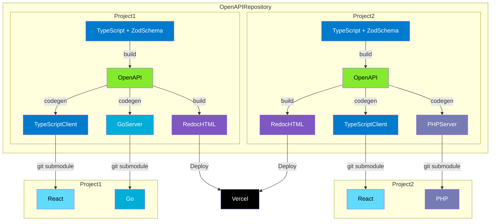

## OpenAPI、辛くありませんか？

弊社ではスキーマ駆動開発を採用しており、API の仕様を OpenAPI で定義してからバックエンド・フロントエンドの開発をスタートする体制を取っています。  
そのため、開発の前に先にスキーマを定義する必要がある都合上、生の YAML ファイルの OpenAPI を手動で書く必要があるのですが、この開発体験が最悪でして、エンジニアの精神衛生上あまりよろしくない問題を抱えておりました。  
VSCode でインテリセンスを効かせたり、YAML ファイルを分割したり、Linter を導入して静的解析を回したりなど……色々と手を打ってきたのですが、それでもミスるときはミスりますし、またそもそもの「YAML を手動で書く」という行為自体が辛いので、大きな新規開発でスキーマを書く際に心理的ハードルが上がってしまうという状況が続いていました。

やはりエンジニアたるもの「Lazy」でいたいものですので、なんとか

## どうやって書くのか

## 全体構成

## 運用方法

## 導入するうえでの懸念

### バックエンドエンジニアが TypeScript を書くのはやりづらくないのか？

### ProtoBuf はどうなのか？

## おわりに
