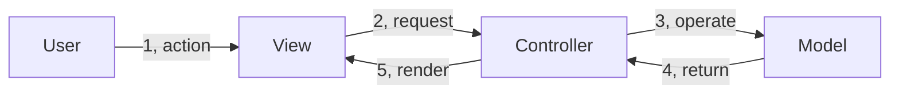
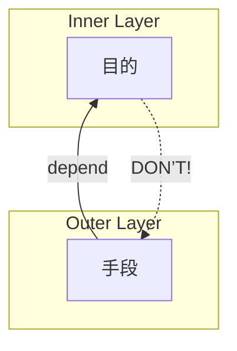

## ソフトウェアアーキテクチャの目的

### ソフトウェア開発の課題

ソフトウェア開発において、プロジェクトが成長するにつれて直面する課題の一つに、コードベースの複雑さと保守コストの増大があります。時間が経つにつれ、機能追加や変更要求が積み重なると、コードベースは次第に複雑になり、理解しづらく、変更が困難になります。

この状況では、小さな変更を加えるだけでも予想外の副作用を引き起こす可能性があり、開発者は変更の影響範囲を把握するために多くの時間を費やさなければなりません。結果として、新機能の開発速度は徐々に低下し、バグ修正にかかる時間は増加してしまいます。

さらに深刻なのは、「スパゲッティコード」や「巨大な泥団子」と呼ばれるような無秩序なコードが形成されてしまうと、それを理解し保守することが非常に困難となる点です。エンジニアの人数を増やしてもうまくソフトウェアをスケールさせることができず、最終的にはコストだけが増大し、ビジネスの成長を妨げる要因となります。

### アーキテクチャの目的

ソフトウェアアーキテクチャの根本的な目的は、**求められるシステムを構築・保守するために必要な人材を最小限に抑えること**です。これは単なる技術的な美しさや理論的な正しさを追求することではなく、ビジネス上の実用的な目標です。

ビジネスの段階に応じて適切に選択されたアーキテクチャは、少ない人数でも効率的にソフトウェアを開発・保守できる環境を提供しつつ、新しい開発者がプロジェクトに参加した際の学習曲線も緩やかになります。これにより、開発にかかる人的リソースのコストを抑えながら、修正や機能追加の際のリスクも低減しつつビジネス要求に迅速に対応することが可能になります。

Robert C. Martin『Clean Architecture 達人に学ぶソフトウェアの構造と設計』（以下、『CA』）の中で、著者は「一番早く進む唯一の方法は上手く進むことである」と述べています。  
短期的な速度を追求してアーキテクチャを疎かにすると、実のところ短期的にも長期的にも生産性は低下します。対照的に、適切なアーキテクチャ設計に時間を投資することで、長期的には開発速度を維持し、ビジネスの成長をサポートすることができます。  
Clean Architecture を含む様々なアーキテクチャパターンは、この目的を達成するための手段であり、それぞれの状況に応じて適切なものを選択することが求められます。

どういったアーキテクチャを選択するかといった技術的意思決定に関する記事を過去に執筆しておりますので、もしよろしければご参照ください。

https://zenn.dev/wizleap_tech/articles/8e26df93acdeb8

## Clean Architecture の基本概念

### Clean Architecture とは、メタアーキテクチャーである

Clean Architecture とは本来、特定のアーキテクチャのパターンを指すものではなく、**ソフトウェアアーキテクチャを構築するうえでの設計原則**であり、いわばメタアーキテクチャーとも言えるものです。  
よく Clean Architecture は難解であるとか、学習コストが高いとよく誤解されますが、コアとなる考え方は非常にシンプルでして、その本質は **「層の定義と責務の分離」** と **「依存関係を内側に向けて一方向にする」** の 2 点に集約されます。

#### 層の定義と責務の分離

様々なアーキテクチャでは層の定義を行い、各層の責務に沿った実装を行うことが求められます。例えば MVC アーキテクチャでは、大まかには以下のような役割になるでしょう。

- Model： ビジネスロジックやデータ管理
- View: UI 表示
- Controller： ユーザーからの入力処理



ここで、もし上記の層の役割に沿わないコードを実装してしまうとどうなるでしょうか？  
例えば Controller にビジネスロジックを書いてしまったとしましょう。いわゆる Fat Controller と呼ばれるアンチパターンですが、そうすると Controller に本来の責務以上のことを負わせることになりますので、まず単一責任の原則への違反が考えられます。  
また、1 つのファイルにより多くのロジックを書くことになりますので、コードも肥大化するでしょうし、また複数の責務に横断するファイルが生まれるため Testability も低下するでしょう。  
挙げていくときりがありませんが、一言で言えば、**保守しにくいコードが生まれてしまいます。**

MVC アーキテクチャに限らず、層の役割に沿った実装を行うことには数多くのメリットがあります。  
例えば、各層の役割以外の実装をすることができなくなりますので、自然と単一責任の原則が守られたコードが書きやすくなります。  
また、層ごとに役割を定義することで、書かなければならないコードをどこに書けばよいのかが明確になり、一定程度はエンジニアのレベルによらずコードの品質を担保することができます。
さらには、層によって特定の機能を持つコードが集約されることになりますので、必要に応じてコードを再利用することも可能ですし、また特定の機能のみのテストも容易になります。

まだまだメリットはあるとは思いますが、とにかく、**層の定義を明確にし、その層に沿ったコードの実装を行うことで、保守性の高いコードを維持させる力がアーキテクチャにはある**のです。

#### 依存関係を内側に向けて一方向にする

上記では MVC アーキテクチャを例に挙げましたが、MVC アーキテクチャが Clean Architecture の一つとして語られることはおそらくないと思われます。それはなぜかというと、**ビジネスロジックの扱いが Clean Architecture と大きく異なるから**です。  
Clean Architecture では、**依存関係を内側に向けて一方向にすること**が求められます。では、ここでいう **「内側」** には何が来るのでしょうか？　また、なぜそうする必要があるのでしょうか？

結論としては、**より内側では目的が表現され、その外側で目的を実現するための具体的な手段を記述**します^[『CA』では目的と手段ではなく、「方針」と「レベル」という言葉を使う。『CA』はに方針に関する直接的な定義は見当たらなかったが、p.185 では「ソフトウェアシステムとは方針を示したものである」と述べ、また p.151 では「方針の要素は、ビジネスのすべてのルールや手順を含んでいる。方針には、システムの本当の価値がある」とも述べている。おそらく方針は "policy" の訳と予想しているが、そのように仮定すると、**方針は組織的な意思決定の内容**を指しており、**レベルはその重要度**と解釈している。本記事ではこれを踏まえ、**高レベルな方針＝目的**、**低レベルな方針＝手段**として用いている。]。そうすることで目的と手段が分離され、**目的によらず手段を自由に変更でき、かつ手段の変更が内部に伝播しないようにする**ことができます。



ソフトウェアは現実で起こっている問題を解決したり、問題解決を効率化するために存在します。そのため、ソフトウェアが最も注目しなければならないことは、使用するフレームワークやその使い方、データベースの種類といった技術の詳細（＝手段）ではなく、 **そのソフトウェアが取り扱ったり、解決しようとしている問題（＝目的）** です。  
そのためソフトウェアのソースコード上には、何らかの形でこの問題を解決するためのコードが記述されているはずであり、そしてそれを**フレームワークやデータベース、Web といった技術の詳細から分離し、現実の世界や業界に存在するルールやデータの表現（モデル）を内側で持つことで、他の技術の影響を受けずに目的達成のためのコードを保守することが可能**になります。

### 層の定義や数は自由である

Clean Architecture のルールは上記の 2 つであり、逆にいえば、**それらが守られていれば層の定義や数は自由である**ともいえます。  
なので Clean Architecture でよく見かける Entity, Use Case, Interface Adapter, Frameworks and Drivers の 4 層構造で説明できるのであればそれでよいですし、足りなかったり、（Martin は言及していませんが、私個人としては）逆に多すぎると思うのであれば、ビジネスの要求に応じて適宜変更しても問題はないのです。

**ただしルールは変わりません。**  
ミクロからマクロまでの視点における設計において、一貫してこのルールを適用することがソフトウェア開発を「うまく」進める方法だというのが、Clean Architecture のコアとなる主張になります。

## Dependency Inversion Principle

ところで、我々はソフトウェアを構築していると、各モジュールの依存関係と制御フローが一致することが多いことに気づきます。  
例えば Web アプリケーションであれば、データベースはほぼ不可避なインフラであり、これなしにソフトウェアを稼働させることはできません。  
しかし、だからといってソースコード上でデータベースに関するロジックを直接依存させてしまうと、依存関係の内側に手段を招き入れることになってしまいます。

こうした依存関係と制御フローを逆転させる方法が **Dependency Inversion Principle（依存関係逆転の原則）** です。

データベースのインフラを逆転させる方法として Repository Pattern がよく知られています。  
ここでは例として、アプリケーション上で何らかの商品情報を更新する Use Case を考えてみましょう。

```go
func (u *UpdateInteractor) Handle(
	ctx context.Context,
	input *UpdateInputData,
	output UpdateOutputPort,
) (err error) {
	// トランザクション開始
	tx, ctxWithTx, err := u.txFactory.Begin(ctx)
	if err != nil {
		return err
	}

	// エラー内容に応じて commit または rollback
	defer func() {
		err = tx.CommitOrRollback(err)
	}()

	// 永続化層から商品の取得
	product, err := u.productRepo.FindByID(ctxWithTx, input.ID)
	if err != nil {
		return err
	}

	// 商品エンティティの更新
	product.Update(
		input.Name,
		input.Price,
	)

	// 永続化層への保存
	if err = u.productRepo.Put(ctxWithTx, product); err != nil {
		return err
	}

	// 結果を出力
	return output.Present()
}
```

上記の処理においてデータベースと関連が深い部分は「永続化層から商品の取得」と「永続化層への保存」の 2 つです。  
この 2 つの処理を実行するためにはデータベースとのやり取りが発生しますが、この処理を直接実装したり、モジュール間の依存関係を発生させるのではなく、**永続化層とやり取りを行う振る舞いを層の内側にインターフェースとして定義し、そのインターフェースへ依存するように処理を記述すればよい**のです。

```go
type ProductRepository interface {
  FindByID(ctx context.Context, id string) (*Product, error)
  Put(ctx context.Context, product *Product) error
}
```

上記のインターフェースを満たす実装を Use Case の外側から注入（Dependency Injection）することで、このソースコードは依存性を逆転させた状態で Use Case が規定した制御フローを実行することができます。

このようにすれば、Use Case はデータベースという具体的な技術を知ることはなくなり、またこのインターフェースが変わらないのであれば、データベースという手段にまつわる変更をしたとしても内部に影響が及ぶことはありません。
