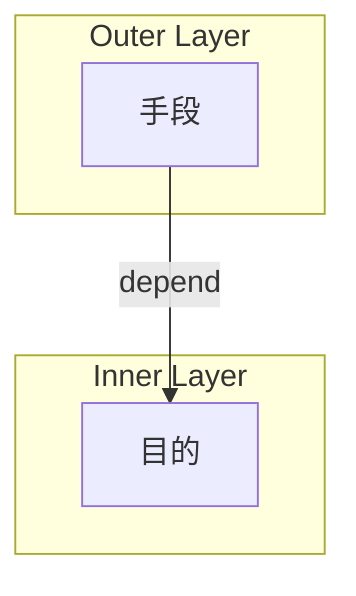
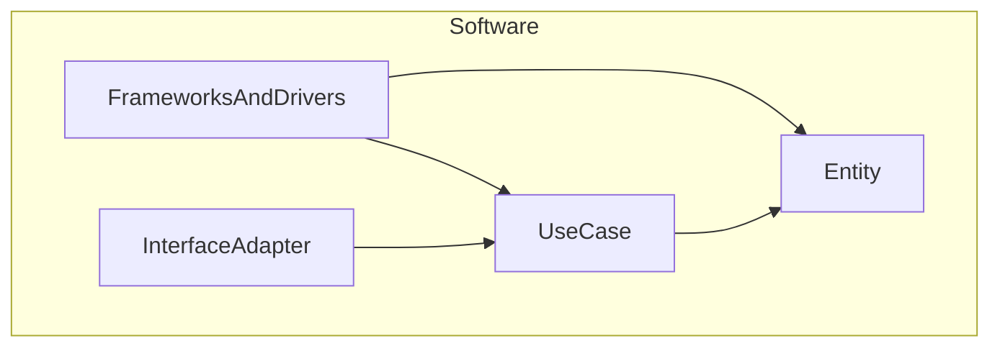

## ソフトウェアアーキテクチャの目的

### ソフトウェア開発の課題

ソフトウェア開発において、プロジェクトが成長するにつれて直面する課題の一つに、コードベースの複雑さと保守コストの増大があります。時間が経つにつれ、機能追加や変更要求が積み重なると、コードベースは次第に複雑になり、理解しづらく、変更が困難になります。

この状況では、小さな変更を加えるだけでも予想外の副作用を引き起こす可能性があり、開発者は変更の影響範囲を把握するために多くの時間を費やさなければなりません。結果として、新機能の開発速度は徐々に低下し、バグ修正にかかる時間は増加してしまいます。

さらに深刻なのは、「スパゲッティコード」や「巨大な泥団子」と呼ばれるような無秩序なコードが形成されてしまうと、それを理解し保守することが非常に困難となる点です。エンジニアの人数を増やしてもうまくソフトウェアをスケールさせることができず、最終的にはコストだけが増大し、ビジネスの成長を妨げる要因となります。

### アーキテクチャの目的

ソフトウェアアーキテクチャの根本的な目的は、**求められるシステムを構築・保守するために必要な人材を最小限に抑えること**です。これは単なる技術的な美しさや理論的な正しさを追求することではなく、ビジネス上の実用的な目標です。

ビジネスの段階に応じて適切に選択されたアーキテクチャは、少ない人数でも効率的にソフトウェアを開発・保守できる環境を提供しつつ、新しい開発者がプロジェクトに参加した際の学習曲線も緩やかになります。これにより、開発にかかる人的リソースのコストを抑えながら、修正や機能追加の際のリスクも低減しつつビジネス要求に迅速に対応することが可能になります。

Robert C. Martin『Clean Architecture 達人に学ぶソフトウェアの構造と設計』（以下、『CA』）の中で、著者は「一番早く進む唯一の方法は上手く進むことである」と述べています。  
その言葉の通り、短期的な速度を追求して設計を疎かにすると、長期的には開発速度の著しい低下を招きます。対照的に、適切なアーキテクチャ設計に時間を投資することで、長期的には開発速度を維持し、ビジネスの成長をサポートすることができます。  
Clean Architecture を含む様々なアーキテクチャパターンは、この目的を達成するための手段であり、それぞれの状況に応じて適切なものを選択することが求められます。

どういったアーキテクチャを選択するかといった技術的意思決定に関する記事を過去に執筆しておりますので、もしよろしければご参照ください。

https://zenn.dev/wizleap_tech/articles/8e26df93acdeb8

## Clean Architecture の基本概念

### Clean Architecture とは、メタアーキテクチャーである

Clean Architecture とは本来、特定のアーキテクチャのパターンを指すものではなく、**ソフトウェアアーキテクチャを構築するうえでの設計原則**であり、いわばメタアーキテクチャーとも言えるものです。  
よく Clean Architecture は難解であるとか、学習コストが高いとよく誤解されますが、コアとなる考え方は非常にシンプルでして、その本質は **「層の定義と責務の分離」** と **「層の依存関係を内側に向けて一方向にする」** の 2 点に集約されます。

#### 層の定義と責務の分離

様々なアーキテクチャでは層の定義を行い、各層の責務に沿った実装を行うことが求められます。例えば MVC アーキテクチャでは、大まかには以下のような役割になるでしょう。

- Model： ビジネスロジックやデータ管理
- View: UI 表示
- Controller： ユーザーからの入力処理


ここで、もし上記の層の役割に沿わないコードを実装してしまうとどうなるでしょうか？  
例えば Controller にビジネスロジックを書いてしまったとしましょう。いわゆる Fat Controller と呼ばれるアンチパターンですが、そうすると Controller に本来の責務以上のことを負わせることになりますので、まず単一責任の原則への違反が考えられます。  
また、1 つのファイルにより多くのロジックを書くことになりますので、コードも肥大化するでしょうし、また複数の責務に横断するファイルが生まれるため Testability も低下するでしょう。  
挙げていくときりがありませんが、一言で言えば、**保守しにくいコードが生まれてしまいます。**

MVC アーキテクチャに限らず、層の役割に沿った実装を行うことには数多くのメリットがあります。  
例えば、各層の役割以外の実装をすることができなくなりますので、自然と単一責任の原則が守られたコードが書きやすくなります。  
また、層ごとに役割を定義することで、書かなければならないコードをどこに書けばよいのかが明確になり、一定程度はエンジニアのレベルによらずコードの品質を担保することができます。
さらには、層によって特定の機能を持つコードが集約されることになりますので、必要に応じてコードを再利用することも可能ですし、また特定の機能のみのテストも容易になります。

まだまだメリットはあるとは思いますが、とにかく、**層の定義を明確にし、その層に沿ったコードの実装を行うことで、保守性の高いコードを維持させる力がアーキテクチャにはある**のです。

#### 層の依存関係を内側に向けて一方向にする

上記では MVC アーキテクチャを例に挙げましたが、MVC アーキテクチャが Clean Architecture の一つとして語られることはおそらくないと思われます。それはなぜかというと、**ビジネスロジックの扱いが Clean Architecture と大きく異なるから**です。  
Clean Architecture では、**層の依存関係を内側に向けて一方向にすること**が求められます。では、ここでいう **「内側」** には何が来るのでしょうか？　また、なぜそうする必要があるのでしょうか？

##### 目的と手段

結論としては、**層のより内側では目的が表現され、その外側で目的を実現するための具体的な手段を記述**します。そうすることで、目的と手段が分離され、**手段の変更が内部に伝播しないようにする**ことができます。



ソフトウェアは現実で起こっている問題を解決したり、問題解決を効率化するために存在します。そのため、ソフトウェアが最も注目しなければならないことは、使用するフレームワークやその使い方、データベースの種類といった技術の詳細（＝手段）ではなく、 **そのソフトウェアが取り扱ったり、解決しようとしている問題（＝目的）** です。  
そのためソフトウェアのソースコード上には、何らかの形でこの問題を解決するためのコードが記述されているはずであり、そしてそれを**フレームワークやデータベース、Web といった技術の詳細から分離し、現実の世界や業界に存在するルールやデータの表現（モデル）を内側で持つことで、他の技術の影響を受けずに目的達成のためのコードを保守することが可能**になります。

## 狭義の Clean Architecture の 4 層構造

Clean Architecture のルールは上記の 2 つであり、それらが守られていれば層の定義や数は自由です。  
しかし、『CA』や他の技術記事では**Entity・Use Case・Interface Adapter・Frameworks and Drivers** の 4 層構造がよく紹介されます。  
このデザインパターンとしての Clean Architecture について簡単に説明します。



### Entity

上記で簡単に説明した通り、Entity は**そのソフトウェアが取り扱う問題を表現する層**です。  
『CA』の言葉に従えば、**最重要ビジネスルールと最重要ビジネスデータを紐付けたオブジェクト**を定義する層です。

最重要ビジネスルールや最重要ビジネスデータとは、いわゆるビジネスロジックやそれにまつわるデータ構造を指す言葉なのですが、その中でも**アプリケーションやシステムがなかったとしても存在すると考えられる事柄の表現に特化した層**です。

例えば『CA』では、ローンを表現した Entity として以下のようなクラス図が紹介されています。


ローンという概念を表現するために、元本（principle）や利率（rate）、期間（period）といったものが含まれていますが、これらはアプリケーションがなくとも存在する概念ですので、こうした独立して存在できるものが Entity として定義することができます。

#### 補足: Clean Architecture と DDD の Entity

Clean Architecture と DDD の両方で Entity という用語が登場しますが、この 2 つは異なる概念を指しています。

DDD とは、端的に言えば**現実の世界で起こっている問題（ドメイン）を把握し、それをモデリングするための設計手法**を指しています。  
これは Clean Architecture の Entity の説明と似たものを感じるかもしれませんが、その認識は正しく、誤解を恐れずに言うならば、**DDD は Clean Architecture における Entity の具体的な表現方法を提供している**と捉えることができます。

そのうち DDD における Entity とは、表現される現実の問題（ドメイン）のうち、**同一性を保持し続けるオブジェクト**を指しています。  
例えば、以下のようなオブジェクトがあったとします。

```ts
class UserEntity {
  constructor(private id: UserID, public name: Name, public email: Email) {}

  getID(): UserID {
    return this.id;
  }
}
```

ここでは仮に、このシステムのユーザーである山田 花子さんがサーバー上のインスタンスとして作成されていたとしましょう。

```ts
user1.getID(); // UserID("12345")
user1.name; // Name("山田 花子")
user1.email; // Email("yamada@example.com")
```

ここでポイントとなるのは、**このインスタンスは名前やメールアドレスが変わったとしても、id が同じであればそれは同一のユーザーを表す点**です。  
例えば、もし山田 花子さんが結婚して名字が変わったとしても、システム上は同じユーザーとして扱われることが期待されます。  
また一方、同名の山田 花子さんがシステム上に存在していたとしても、id が異なれば別のユーザーとして解釈される必要があります。

```ts
user2.getID(); // UserID("67890")
user2.name; // Name("山田 花子")
user2.email; // Email("hanako@example.com")

user1.getID() === user2.getID(); // false → 同じユーザーではない
```

### Use Case

Use Case とは、**アプリケーション固有のビジネスロジックの記述や、ビジネスロジックのオーケストレーションを行う層**を指します。

この層でもビジネスロジックの記述を行いますが、こちらは Entity とは異なり、**アプリケーション固有のビジネスロジックを記述すること**になります。  
Entity で定義したロジックを呼び出したり、トランザクションの制御を行うことで、ビジネスロジック全体のオーケストレーションを行うことが求められます。

例えば、アプリケーション上で何らかの商品情報を更新する Use Case を考えてみましょう。

```go
func (u *UpdateInteractor) Handle(
	ctx context.Context,
	input *UpdateInputData,
	output UpdateOutputPort,
) (err error) {
	// トランザクション開始
	tx, ctxWithTx, err := u.txFactory.Begin(ctx)
	if err != nil {
		return err
	}

	// エラー内容に応じて commit または rollback
	defer func() {
		err = tx.CommitOrRollback(err)
	}()

	// 永続化層から商品の取得
	product, err := u.productRepo.FindByID(ctxWithTx, input.ID)
	if err != nil {
		return err
	}

	// 商品情報の更新
	product.Update(
		input.Name,
		input.Price,
	)

	// 永続化層への保存
	if err = u.productRepo.Put(ctxWithTx, product); err != nil {
		return err
	}

	// 結果を出力
	return output.Present()
}
```

コメントアウトにもある通り、「商品情報を更新する」というアプリケーション固有の問題を以下のフローによって解決しています。

- トランザクションの開始
  - 永続化層から商品の取得
  - 商品情報の更新
  - 永続化層への保存
  - 結果を出力
- トランザクションの commit または rollback

このように Use Case では、Entity のロジックやトランザクションの制御を行うことで、アプリケーション固有のビジネスロジックを記述します。

### Interface Adapter

### Frameworks and Drivers

## 実装例: Input/Output Port と Adapter の実装

Entity の実装は DDD の記事で詳しく解説しようと思いますので、ここではその外側の層である UseCase 層と Presenter 層の実装について解説します。

### なぜ Input/Output Port を使うのか

- ビジネスロジックのオーケストレーションから HTTP の文脈から解放する（依存関係の逆転）
- テスト容易性の向上

### Input/Output Data

### Input/Output Port

### Input/Output Boundary（Port の実装）

- Interactor
- Presenter
