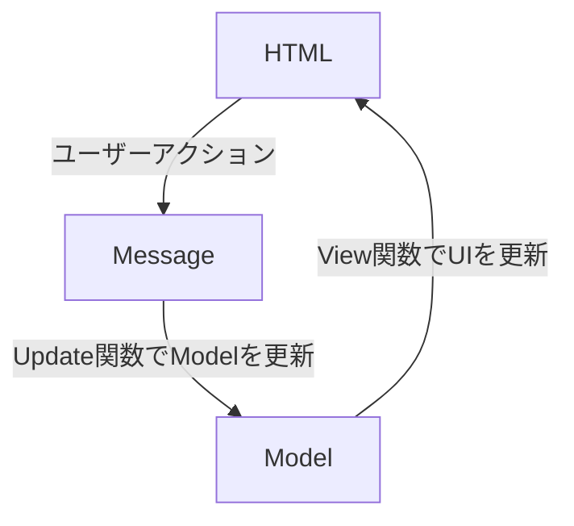
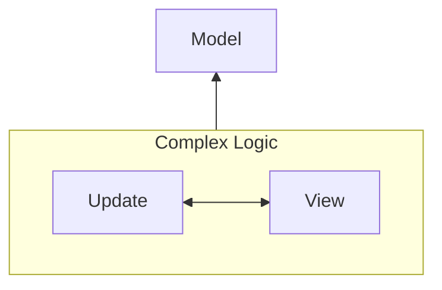
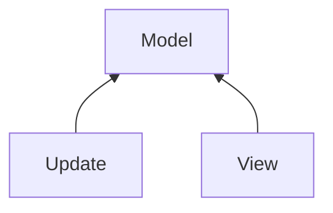
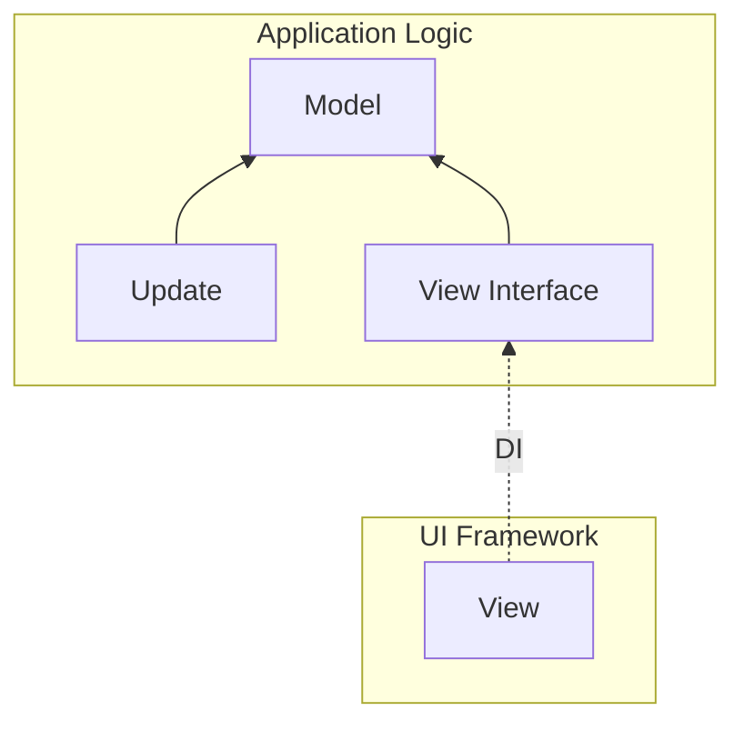

## はじめに

**@ichi-h/elmish** という、UIフレームワークに依存せず、TS/JSの資産を活かしつつElmishに状態管理が行えるライブラリを作りました。  
アプリケーションロジックとビューを分離することで、コードの責務が明確になるとともに、ロジックの可搬性やTestableなコードも保証できます。

https://github.com/ichi-h/elmish

実際にこちらのライブラリを使用して、**メッセージで駆動する関数型ノベルゲームエンジン**というものを開発しました。  
こちらもかなり尖ったことをやっているので、興味がございましたらぜひご覧ください。

https://zenn.dev/ichi_h/articles/036cd108880743

## とりあえず使ってみよう

以下のコマンドでインストールできます。

```bash
npm install @ichi-h/elmish
```

はじめにデータ構造とメッセージを定義しましょう。

```tsx
// data.ts
import { elmish } from "@ichi-h/elmish";

// Modelのデータ構造
export type Model = {
  count: number;
  loader: "idle" | "loading";
};

// ユーザーの行動に対応するメッセージ
export type Message =
  | { type: "increment" }
  | { type: "decrement" }
  | { type: "startReset" }
  | { type: "endReset" };

// Modelの初期値
export const init: Model = {
  count: 0,
  loader: "idle",
} as const;

// 状態管理を行う関数の生成
export const useElement = elmish<Model, Message>();
```

次に、各メッセージに対するロジックを定義しましょう。

```tsx
// update.ts
import { Update } from "@ichi-h/elmish";

import { Model, Message } from "./data";

// 現在のmodelと送信されたmessageを受け取る
export const update: Update<Model, Message> = (model, message) => {
  switch (message.type) {
    case "increment": {
      // 新しいmodelを返却することで、状態を更新できる
      return { ...model, count: model.count + 1 };
    }

    case "decrement": {
      return { ...model, count: model.count - 1 };
    }

    case "startReset": {
      return [
        // 新しいmodel
        { ...model, loader: "loading" },
        // 副作用として非同期な関数も一緒に返せる
        // 戻り値としてメッセージを返すことが要求される
        async () => {
          return new Promise((resolve) => {
            // 1秒後にendResetのメッセージを送信
            setTimeout(() => {
              resolve({ type: "endReset" });
            }, 1000);
          });
        },
      ];
    }

    case "endReset": {
      return { ...model, count: 0, loader: "idle" };
    }
  }
};
```

最後に、このロジックを好きなフレームワークに組み込みます。例えばReactであれば以下のように書けます。

```tsx
import { init, useElement } from "./data";
import { update } from "./update";

export const App = () => {
  const [model, view] = useState(init);

  // メッセージを送信する関数を取得
  const send = useElement(
    model, // 状態の初期値
    update, // Modelを更新する関数
    view // 新しいModelを受け取って、UIを更新する関数
  );

  const increment = () => send({ type: "increment" });
  const decrement = () => send({ type: "decrement" });
  const reset = () => send({ type: "startReset" });

  return (
    <div>
      <button onClick={decrement}>-</button>
      <button onClick={reset}>reset</button>
      <button onClick={increment}>+</button>
      {model.loader === "loading" && <p>loading...</p>}
      {model.loader === "idle" && <p>count is {model.count}</p>}
    </div>
  );
};
```

Vueであればこうです。

```html
<script setup lang="ts">
import { ref } from "vue";

import { Model, init, useElement } from "./data";
import { update } from "./update";

const model = ref(init);
const view = (newModel: Model) => (model.value = newModel);

// メッセージを送信する関数を取得
const send = useElement(model.value, update, view);

const increment = () => send({ type: "increment" });
const decrement = () => send({ type: "decrement" });
const reset = () => send({ type: "startReset" });
</script>

<template>
  <div>
    <button type="button" @click="decrement">-</button>
    <button type="button" @click="reset">reset</button>
    <button type="button" @click="increment">+</button>
    <p v-if="model.loader === 'loading'">loading...</p>
    <p v-else-if="model.loader === 'idle'">count is {{ model.count }}</p>
  </div>
</template>
```

フレームワークを使わずに、Vanilla JS/TSだっていけちゃいます。

```tsx
import { Model, init, useElement } from "./data";
import { update } from "./update";

function setupCounter(
  counter: HTMLParagraphElement,
  incrementBtn: HTMLButtonElement,
  decrementBtn: HTMLButtonElement,
  resetBtn: HTMLButtonElement,
) {
  const view = (newModel: Model) => {
    if (newModel.loader === "loading") {
      counter.innerHTML = "loading...";
    } else {
      counter.innerHTML = `count is ${newModel.count}`;
    }
  };

  // メッセージを送信する関数を取得
  const send = useElement(init, update, view);

  incrementBtn.addEventListener("click", () => send({ type: "increment" }));
  decrementBtn.addEventListener("click", () => send({ type: "decrement" }));
  resetBtn.addEventListener("click", () => send({ type: "startReset" }));
}

document.querySelector<HTMLDivElement>("#app")!.innerHTML = `
  <div>
    <button id="decrement" type="button">-</button>
    <button id="reset" type="button">reset</button>
    <button id="increment" type="button">+</button>
    <p id="counter"></p>
  </div>
`;

setupCounter(
  document.querySelector<HTMLParagraphElement>("#counter")!,
  document.querySelector<HTMLButtonElement>("#increment")!,
  document.querySelector<HTMLButtonElement>("#decrement")!,
  document.querySelector<HTMLButtonElement>("#reset")!,
);
```

すごくないですか？（なぜこんなことができるのかは後ほど）

## なぜ作ったのか？

結論としては、**コンポーネントとしての状態管理と、アプリケーションとしての状態管理を切り離して考えたいときに、その後者の手段として、UIライブラリ非依存でElm Architecture（MVU Architecture）の哲学に沿った記述ができるライブラリが欲しかったから**、です。

まず、コンポーネント指向というのは、**状態・ロジック・UIを1つのコンポーネントにまとめることで、再利用性や保守性を高める設計手法**です。  
こうした考え方はオブジェクト指向に近く、例えばReactのように、コンポーネントの表現に関数が使われていたとしても、状態やロジック等をコンポーネントという箱の中に隠ぺいしている点において、オブジェクト指向とやっていることに本質的な違いはないと考えています。

オブジェクト指向では、上記の方法によって高凝集・疎結合なコードを全体で実現しようとしますが、一方、**状態が内部に隠れてしまうことで、そこに依存するロジックの挙動が外側から見たときに予想しづらく、またテストも書きにくい**という問題があります。  
そこで近年注目されていたのが**関数型プログラミング**というパラダイムであり、**副作用を持たず、参照透過性が保証された関数によって状態を評価することにより、コードの予測性やTestabilityを高めようとした**と記憶しています。

ソフトウェアの正確さを保証する点において、オブジェクト指向でも関数型プログラミングでも、工夫次第で同程度に保証することは可能だと思います。  
ただ、**保証しやすさ**という観点では、上記の理由から**関数型プログラミングのほうが軍配が上がる**と考えています。  
アプリケーションを構築する場合、初めからやるにしても、後付けでやるにしても、どこかで正確さの保証を行うタイミングがやってきます。  
私は怠惰な人間なので、そうした保証を行うのであれば、それがよりやりやすいFunctionalなアプローチで状態管理をできた方が良いのではないかと考えています。

しかし、何でもかんでもFunctionalに記述すればよいとは思っておらず、オブジェクト指向的な考え方が有用となるケースももちろんあります。  
上記で軽く触れた通り、状態やロジック等を再利用できることをメリットとして挙げましたが、これがフロントエンドにおいて最も活かされるのは、例えばshadcn/uiのような**UIコンポーネントライブラリ**です。  
UIコンポーネントライブラリを利用する際、我々はコンポーネント内部のロジックや状態を基本的に考えることがないわけですが、これには**前提依存条件**という考え方が大きく絡んでいます。  
これは、**ソフトウェアを構成する個々の要素の中で正しく動くことを保証し、その信頼の上で別の要素を依存させる**という方法論です（詳しくは以下の記事で解説しています）。

https://zenn.dev/wizleap_tech/articles/8e26df93acdeb8#%E5%89%8D%E6%8F%90%E6%9D%A1%E4%BB%B6%E4%BE%9D%E5%AD%98%E3%81%AB%E3%82%88%E3%82%8B%E6%AD%A3%E7%A2%BA%E3%81%95%E4%BF%9D%E8%A8%BC

コンポーネントを再利用するというのは、**コンポーネントが正しく動くことを前提に別のコンポーネントやアプリケーションを構築すること**を意味します。  
このレベルで正確さを信頼できるときにはじめて、コンポーネントの再利用性が有用であったと捉えています。

なので、この双方のメリットを活かしたいというのが私の考えです。  
**再利用性が高く信頼できるコンポーネントを使用しつつ、アプリケーションはよりTestableで予測可能なアプローチで構築する**。  
だからこそ、コンポーネントとアプリケーションの状態管理は別軸で考えたいわけです。

すでにこれと近いアプローチを実現する状態管理ライブラリは多く存在するのですが、**UIライブラリ非依存**で、**よりElmishな書き心地で記述できる**ライブラリは、私の知る限り存在しなかったため、この際自分で作ってしまおうと思い、開発に至りました。

いろいろと述べさせていただいたのですが、こうしたものを作る時に一番重要なものは、ロジックや思想といったものではなく、最終的には**パッション**です。作りたいから作る。

## The Elm Architectureについて

The Elm Architectureとは、Elm言語で採用されているWebフロントエンドアプリケーションを構築するためのアーキテクチャです。  
私がここで解説するよりも[Elmのドキュメント](https://guide.elm-lang.jp/)の方がわかりやすいので詳細は割愛いたしますが、少し引用させていただきます。

> Elm のプログラムが動く仕組みを図にすると、こんな風になります。
> 
> 
> 
> 
> Elm が画面に表示するためのHTMLを出力し、コンピュータは画面の中で起きたこと、例えば「ボタンがクリックされたよ！」というようなメッセージを Elm へ送り返します。
> 
> さて、Elm プログラムの中では何が起きているのでしょうか？ Elm では、プログラムは必ず3つのパーツに分解できます。
> 
> - **Model** — アプリケーションの状態
> - **View** — 状態を HTML に変換する方法
> - **Update** — メッセージを使って状態を更新する方法
> 
> この3つのコンセプトこそ、**The Elm Architecture** の核心なのです。
> 
> \- [The Elm Architecture · An Introduction to Elm](https://guide.elm-lang.jp/architecture/)
> 

要は、**Model**という状態と、その状態をHTMLとして出力する**View**、状態更新を担う**Update**の3つによってElmは成り立っている、ということですね。  
図にすると以下のようになります。



## Viewの依存性逆転

ここで注目したいのは**View関数**です。  
これは何なのかというと、Reactで説明するならば、`const [count, setCount] = useState(0);` の `setCount` がそれに近い役割に当たります。  
`setCount` では引数に新しい状態を受け取り、その状態に依存するコンポーネントの再レンダリングを行いますが、つまりこれが「状態をHTMLに変換する」きっかけとなっているわけです（もちろんこの挙動はElmにおけるView関数と同じではありません、後述）。

結論としては、**このView関数さえ抽象化できれば、アプリケーションロジックとUIフレームワークは切り離す**ことができます。

どういうことかと言いますと、Elmもそうなのですが、ReactやVueといった最近のフレームワークは宣言的UIを採用するものが多くあります。  
宣言的UIとは、端的に言えば**状態を更新すれば、DOMを触るといった手続き的な操作を考えずとも、自動的にUIを更新してくれるコンセプト**を指します。  
このコンセプトは**状態を更新するロジックと、UIを更新するロジックは切り離せる**という事実に基づいています。  
つまり依存関係がこうなるのではなく、



これでもいけるよ、ということですね。



そこで、もしUpdateとViewを切り離せるのであれば、「Model + Update **『と』** View」という持ち方もできると思いませんか？



つまり、**ModelとUpdateでアプリケーションロジックを固め、抽象化されたViewに向けて外から実体を注入してあげれば、アプリケーションロジックとUIフレームワークは分離可能**なはずであり、そしてこの仮説を実践したのが **@ichi-h/elmish** だ、ということです。

### 補足: Elmと@ichi-h/elmishのView関数の違い

Elmと@ichi-h/elmishでは、同じView関数といっても、それぞれの捉え方が大きく異なります。

ElmのView関数の型は `Model -> Html msg` となっており、Modelを受け取ってHTMLという型の抽象的なUIを返すことを要求します。

```elm
-- https://guide.elm-lang.jp/architecture/buttons.html#view

view : Model -> Html Msg
view model =
  div []
    [ button [ onClick Decrement ] [ text "-" ]
    , div [] [ text (String.fromInt model) ]
    , button [ onClick Increment ] [ text "+" ]
    ]
```

ElmがこのHTMLを受け取ると、Elmのランタイム上でなんやかんやの処理を行い、ブラウザ上に実際のHTMLが表示される仕組みになっています。

一方、@ichi-h/elmishのView関数の型定義は `(model: Model) => void` となっており、こちらはModelを受け取って何も返さないことを要求します。

```tsx
// React
const [model, view] = useState(init);

// Vue
const model = ref(init);
const view = (newModel: Model) => (model.value = newModel);

// Vanilla TS/JS
const view = (newModel: Model) => {
  if (newModel.loader === "loading") {
    counter.innerHTML = "loading...";
  } else {
    counter.innerHTML = `count is ${newModel.count}`;
  }
};
```

つまりこれは、ElmのようにHTMLのような何かを返せばイイ感じにやってくれるのではなく、**ブラウザに実際のHTMLを表示するところまでの実装**を要求しています。

これにより、ReactやVueといった宣言的UIを採用するフレームワークから、Vanilla JS/TSを使ったDOM操作まで、UI更新の手段を制限されずにView関数を実装することができます。

## 嬉しいこと

@ichi-h/elmishを使用するメリットは、大きく4つあります。

### Testable

冒頭の作った動機で述べた通り、@ichi-h/elmishでは状態更新のロジックを参照透過性が保たれた関数として記述することができるため、Testabilityを高く保つことができます。  
@ichi-h/elmishがアプリケーションロジックに干渉するのは、Update関数やMessageの**型のみ**であるため、それ以外でライブラリがロジックに干渉することはありません。  

```tsx
// update.ts
import { Update } from "@ichi-h/elmish"; // 型のみインポート

import { Model, Message } from "./data";

// update関数のロジック自体に、@ichi-h/elmishが干渉することはない
export const update: Update<Model, Message> = (model, message) => {
  switch (message.type) {
    case "increment": {
      return { ...model, count: model.count + 1 };
    }
  }
};
```

そのため、ロジックのテストをとても素直に書けます。追加でプラグインを当てたり、難しいことを考える必要はありません。

```tsx
// update.test.ts
test("カウントを1増やす", () => {
  const model: Model = { count: 0, loader: "idle" };
  const message: Message = { type: "increment" };
  const updated = update(model, message);
  expect(updated).toStrictEqual({ count: 1, loader: "idle" });
});
```


### コードの責務が明確になる

アプリケーションロジックとUIフレームワークを分離すると、アプリケーションロジックとビューを分離しやすくなり、それぞれの責務が明確となるコードが自然と生まれます（もちろん、書き方に依ってはこの2つの境界を「ぶち壊す」こともできるので注意は必要です）。

### アプリケーションロジックの可搬性が上がる

フロントエンドを開発する場合、何かしらのフレームワークを使うことが一般的になっていると思うのですが、今後もっと魅力的なフレームワークが出てくることもあるでしょう。

過去に仕事でVueからReactへのリプレイスを行ったことがあるのですが、VueとReactの差分を解消するに苦労した経験があります。  
というのも、そのVueの書き方がまさにアプリケーションロジックとベッタリくっ付いた書き方になってしまっていたので、ロジックの再利用がほぼできず、結局すべて書き直すことになってしまいました。

そういったときにアプリケーションロジックが再利用できると、リプレイスの工数はかなり抑えられると思います。

### JS/TSの資産をフルに活用しつつ、Elmishに記述できる

Elmを使うと、ElmからJSを呼び出すのが少し面倒になります。  
Elmでは他言語で採用されているようなFFIの仕組みをあえて採用しない代わりに、プログラムの安全性を保障するという選択を行っています（詳しくは [制限事項 · An Introduction to Elm](https://guide.elm-lang.jp/interop/limits.html) を参照）。

なのですが本音としては、やはりめんどくさいです。  
もちろん、Elmの主張は間違いなく正しいと思います。その一方で、全てのケースにおいてそうした哲学が正しいかと問われると、そういうわけではありませんし、Elm自身もそのことを認めています。

**「Elmishに開発したい！　でももっと自由に開発できたってよいじゃない！」**

そんな選択があって良いとも思うのです。

## 弱点

こうしたアプローチの弱点として**パフォーマンス**がよく取り上げられますが、これは実際その通りだと思います。  
例えばReactで@ichi-h/elmishを使ったときに、View関数としてuseStateのsetterを渡していましたが、これはModelが更新されるたび、そこに依存するすべてのコンポーネントが再レンダリングされることになります。  
小さい状態であれば問題ないと思いますが、Modelが大きくなればなるほど、この問題は顕著になると予想しています。

また、アプリケーションの状態を一枚岩のModelで管理することになるため、**細かいコンポーネントの状態を制御しようとすると煩雑になる可能性があります**。  
ここに関してはケースバイケースでして、細かい状態をコンポーネントの内部に封じ込めて信頼できるのであれば対応することも可能だと思います。

あとは根っこの思想が関数型プログラミングなので、そこやElm Architectureの学習コストなんかもあげられるかもしれません。  
が、正直なところここは大きな問題にはならないと思います。Elm Architectureの考え方は非常にシンプルでわかりやすいです。  
また関数型プログラミングといっても、ApplicativeやMonadといった概念を常に使うわけではなく、「副作用とは何か」「参照透過性とは何か」という基礎的なところを抑えてコードを書くだけでも、十分に保守性の高いコードは書けるので、そこまで大きな障壁にはならないと思います。

頑張って弱点をひねり出してみましたが、正直上記くらいしか思い浮かびませんでした。  
あとは個人で開発しているものなので、ドキュメントが充実していないとか、メンテナンス性に問題があるとか、そういった運用上の問題はありますが、ライブラリが提供する技術的な価値としては一定のものはあるのではないかなと思っています。  
もちろんこれは自画自賛したいのではなく、もともとは**The Elm Architectureという偉大な設計を生み出したコミュニティの功績**です。  
私のライブラリも触ってほしいですが、これを機に本家Elmを触っていただけた方が、私としては非常にうれしく思います。

## おまけ: 完全Elm再現ライブラリへの道

これは全くの実験なのですが、TypeScriptでElmのインターフェースをどれだけ再現できるのかを検証したライブラリも作りました。  
それが **@ichi-h/elmish-experimental** です。名前からしてやばい。

https://github.com/ichi-h/elmish-experimental

一応npmからインストールできます

```bash
npm install @ichi-h/elmish-experimental
```

コンセプト自体は@ichi-h/elmishと同じなのですが、Elmishに記述できる状態管理ライブラリの **『中』** にUIライブラリを組み込んでしまおうという試みです。  
詳細はGitHubに書いたので割愛しますが、Reactだとこのように書けます。

```tsx
// おまじない
const root = ReactDOM.createRoot(document.getElementById("root")!);
const renderer = (html: React.ReactElement) => {
  root.render(<React.StrictMode>{html}</React.StrictMode>);
};
const { useElement, send } = elmish<Model, Message, React.ReactElement>(renderer);

// modelからUIへ変換する関数を突っ込む
useElement(init, update, ({ model }) => {
  const increment = () => send({ type: "increment" });
  const decrement = () => send({ type: "decrement" });
  const reset = () => send({ type: "startReset" });

  // ReactのJSXでUIを返す
  return (
    <div>
      <button onClick={decrement}>-</button>
      <button onClick={reset}>reset</button>
      <button onClick={increment}>+</button>
      {model.loader === "loading" && <p>loading...</p>}
      {model.loader === "idle" && <p>count is {model.count}</p>}
    </div>
  );
});
```

見るからにやばいコードが見えますが、実際にModel/Message/Updateを突っ込めば一応動くことを確認しています。

ただ、これは本当に興味本位というか、実際にできるのかを試しただけなので、実用性は皆無です。  
特にパフォーマンスが終わっているので、本番環境では絶対に使わないようにしましょう。
