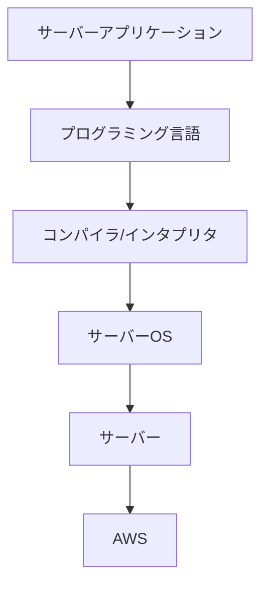
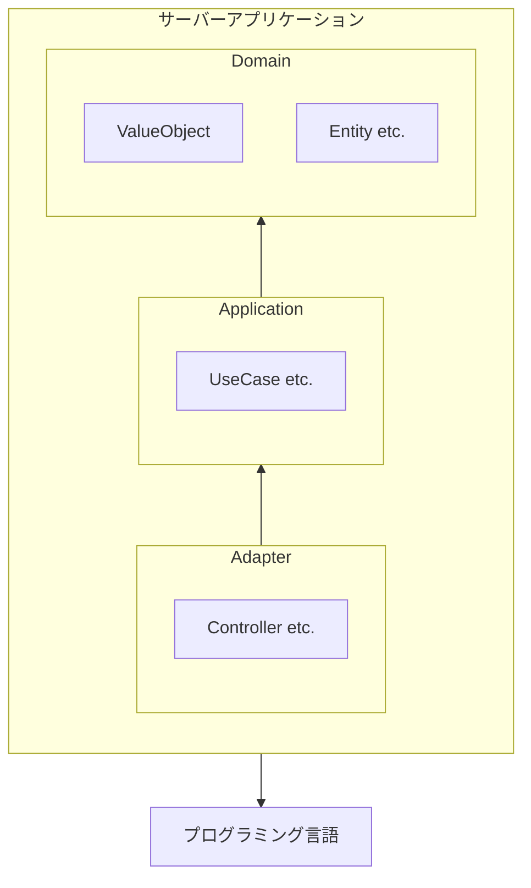

## はじめに

エンジニアの究極的な目標とは、**高品質なソフトウェアを開発・保守・運用すること**です。  
エンジニアが行うすべての意思決定は、この目標に紐づいていなければなりませんが、そもそも **「高品質」** とは一体何を指すのでしょうか？

それはソフトウェアの使いやすさでしょうか？  
パフォーマンスの良さでしょうか？  
はたまた、コードの読みやすさでしょうか？
逆に、これらが満たされていればソフトウェアは高品質と言えるのでしょうか？

また、エンジニアはこの目標を達成するために技術的な意思決定を行いますが、その意思決定がプロダクトにどのようなインパクトを与え、またそれを技術に詳しくない人にも伝え、理解を得ることができるでしょうか？

本記事では、バートランド・メイヤー著の『オブジェクト指向入門 第2版: 原則・コンセプト』を参考に、ソフトウェアの品質について確認し、そこからどのように適切な技術的意思決定を遂行するかについて考察します。

読者にはエンジニアを想定しており、ある程度ソフトウェア、特にWebアプリケーションの開発経験があることを想定していますが、技術に詳しくない方でも理解しやすいように心がけています（技術的な話題は流していただいても全体像を把握できるように書いております）。

本記事は以下のような問題を抱えている方を想定しています。

- 技術的な意思決定がどのようにソフトウェアに貢献するのかを説明したい
- 技術的な意思決定についてBizサイドから理解が得られない
- エンジニアとのコミュニケーションが上手く取れない
- など

## 外部品質と内部品質

ソフトウェアの品質は、**外部品質**と**内部品質**の2つに分類されます。  
この2つの違いは、端的に言えば「ユーザーが認識できるかどうか」に依ります。

外部品質は、**ユーザーが直接的、または間接的に認識できる品質**を指します。  
ここで言う「ユーザー」とは、ソフトウェアの利用者のみを指すものではなく、ソフトウェアを契約する役員、そのソフトウェアの営業をする人、ソフトウェアの仕様を考える人なども含まれるため、ある意味、ソフトウェアに関わる全ての人と言い換えても良いかもしれません（外部品質の詳細は後述）。  

一方、ユーザーが認識できない品質は内部品質と呼びます。  
端的に言えば、**ソースコードにアクセスできるエンジニアのための品質**と言って差し支えありません。  
例えば、コードの可読性の高さ、オブジェクト指向や関数型プログラミングといったパラダイムの原則に従っているか、DDDやClean Architectureといった設計に忠実かなどの、エンジニアにとって重要な項目が内部品質に含まれます（内部品質の詳細は割愛）。

どちらも重要な品質ですが、最終的に問題になるのは**外部品質**です。  
どんなにコードが正しく管理されていたとしても、ユーザーにとって使いにくかったり、パフォーマンスやセキュリティ上の問題があれば、そのソフトウェアは高品質とは言えません。  
また逆に、多少コードに難があったとしても、ユーザーに致命的な問題が発生することに比べれば、それがより大きな問題になることはないでしょう。  
これらのことから、**外部品質は内部品質よりも常に優位にあり、すべての技術的な意思決定は、外部品質を向上させるために行われなければならない**と言えます。

しかし、だからといって内部品質をおざなりにして良いわけではありません。  
むしろ、**外部品質の成功の鍵は、内部品質にあります。**  
外部品質に紐づくであろう内部品質に関する意思決定の連続が、高品質なソフトウェアを生み出す基盤となります。

高い外部品質を生み出すためにエンジニアがまず確認することは、**外部品質そのもの**を理解することです。  
もちろん技術的なあれこれについて思考を巡らすことも重要ですが、その技術がどのような形で外部品質に影響するのかを正確に把握することが、適切な意思決定を行うための第一歩と言えます。

## 主要な外部品質の要因

『オブジェクト指向入門 第2版: 原則・コンセプト』では14の外部品質要因について紹介されています。

| 要因           | 概要                                                                         |
| -------------- | ---------------------------------------------------------------------------- |
| **正確さ**     | ソフトウェアは仕様通りに正しく動かなければならない                           |
| **頑丈さ**     | 意図しない挙動をしても、ソフトウェアは壊れず正しく終了し、通知する必要がある |
| **拡張性**     | 仕様変更のしやすさ                                                           |
| **再利用性**   | ソフトウェアのパターンを発見し、再利用する                                   |
| **互換性**     | 他のソフトウェアとの組み合わせやすさ                                         |
| **効率性**     | パフォーマンスの良さ                                                         |
| **可搬性**     | 移植しやすいインフラ                                                         |
| **使いやすさ** | 優れたUI/UX                                                                  |
| **機能性**     | ソフトウェアができることの範囲                                               |
| **適時性**     | リリースの速度                                                               |
| **実証性**     | QAのしやすさ                                                                 |
| **統合性**     | セキュリティの堅牢さ                                                         |
| **修復性**     | インシデントが発生したときのリカバーの速さ                                   |
| **経済性**     | 金銭的な運用コスト                                                           |

今回は上記からいくつかをピックアップして詳しくお話いたします。

### 正確さ

> 正確さとは仕様によって定義されているとおりに仕事を実行するソフトウェア製品の能力である。  
> （引用: バートランド・メイヤー『オブジェクト指向入門 第2版 原則・コンセプト』 p4）

**これは外部品質の中で最も重要な項目といっても過言ではありません。**  
ソフトウェアは正しく動くことが大前提です。正しく動かないソフトウェアを意図して作る理由も、それをリリースする理由もありません。  
そのため、エンジニアはこの正確さを達成することを第一の目標として行動する必要があります。

#### ドメインモデリング

ソフトウェアを作るためには、要求や要件をプログラムで表現することになりますが、しかしながら、そもそもこのハードル自体が非常に高いものとなっています。  
というのも、コーディングはもちろんのこと、要求や要件の理解やシステムデザインなども行うため、単純なプログラミングの能力だけではなく、コミュニケーション能力やドメイン知識、設計の能力も必要となるからです。

こうした問題に立ち向かうための方法論として有名なのが、**ドメイン駆動設計（DDD）** です。  
DDDは、ソフトウェアを作る際に、そのソフトウェアが扱うドメイン（業務領域）をモデリングし、それをプログラムに落とし込む設計手法です。  
DDDを導入する理由の一つとして、**ソースコードによってドメインを表現し、ソフトウェアが正確に動くこと（ドメインに適合すること）を保証しようとする**といったものがあります（もちろん他の理由もございますが、そちらは後述いたします）。  
もちろんDDDを導入しなければ正確さを保証できないというわけではありません。  
重要なのは、**プロダクトの段階や要求を踏まえて適切に意思決定を行うこと**ですので、DDDはその**手段**としてあるということを忘れてはいけません。

#### 前提条件依存による正確さ保証

そうした開発の困難を経た次には、本当に開発したものが正しく動くか検証する作業がありますが、これにも困難が伴います。  
どんなにQAを頑張ったとしても、ソフトウェアを作るのが人間である以上、完全にバグを排除することはほぼ不可能といってよいでしょう。

では、そうした困難の中でどのようにして正確さを保証すればよいのかというと、基本的には**前提条件依存**によって行われます。  
つまり、ソフトウェアという大きな単位だけを見て正確さを保証しようとするのではなく、**ソフトウェアを構成する個々の層の中で正しく動くことを保証し、その信頼の上で別の層を依存させる**という方法が取られます。

例えば、Webアプリケーションがどのような依存関係になっているのかを図を交えながら考えてみましょう。

上記の図は、Webアプリケーションのサーバーサイドがどのような依存関係になっているかを簡単に示しています。矢印が依存関係、矢印の先が依存される側を表しています。

サーバーアプリケーションを作るためにはプログラミング言語を使いますが、そのためにはプログラミング言語が正しく機能している必要があります。  
しかし我々がプログラムを書くとき、プログラミング言語が正しく機能するかどうかを確認することはほぼありません。つまり、そこではプログラミング言語が正しく動くことを前提としてアプリケーションが構築されているということです。

一方プログラミング言語側では、何かしらの方法を用いて自分自身が正しく動くことを保証していると思いますが、しかしプログラミング言語が正しく動くためには、コンパイラやインタプリタが正しく機能することが必要となり……といった具合に、依存先が正しく動くことを前提として、各層の依存関係は構築されているわけです。

もう少し具体的に、サーバーアプリケーションの中でどのような依存関係があるのかを考えてみましょう。

これはDDD + Clean Architectureの設計を簡易的に表現したものです。  
コードレベルでも前提条件依存は存在しており、例えばUseCaseにてロジックを記述する際は、ValueObjectやEntityが正しく動くことを前提としています。  
そして、それぞれの層が正しく動くことを保証する手段として、我々はよく**テストコード**を書きます。  
つまり、テストコードによって層の中の各モジュールが正しく動くことを保証しつつ、モジュールの利用者視点では、それらが正しく動くことを信頼して依存するという連鎖によってコーディングを行っているわけです。

ここまでを踏まえると、**Clean Architectureやテストコードというのは、この前提条件依存を実現するための手段（=内部品質）であり、その効果として正確に動作するソフトウェアを実現できる**というのが見えてくると思います。

#### 正確さ - まとめ

- 正確さとは、仕様通りにソフトウェアが動くかの能力である。
- 正確さを保証するためには、要求をプログラムで正しく表現する**ドメインモデリング**という視点と、ソフトウェアを構成する個々の層の中で正しく動くことを保証し、その信頼の上で別の層を依存させる**前提条件依存**という視点が重要である。
- 正確さを保証する内部品質の手段として、**DDD**や**Clean Architecture**、**テストコード**などがある。

### 拡張性

> 拡張性とは仕様の変更に対するソフトウェア製品の適用のしやすさである。
> 
> ソフトウェアは「ソフト」であるはずであり、原則的にはそうである。ソースコードにアクセスできれば、プログラムを変更するほど簡単なことはない。  
> （引用: バートランド・メイヤー『オブジェクト指向入門 第2版 原則・コンセプト』 p7）

### 再利用性

> 再利用性とは多数多彩なアプリケーションの構築に使うことのできる、ソフトウェア要素の能力である。  
> （引用: バートランド・メイヤー『オブジェクト指向入門 第2版 原則・コンセプト』 p8）

### 互換性

> 互換性とは、ソフトウェアの要素の、他のソフトウェア要素との組み合わせやすさである。  
> （引用: バートランド・メイヤー『オブジェクト指向入門 第2版 原則・コンセプト』 p9）

### 効率性

> 効率性とは、処理時間、内部記憶および外部記憶上の空間、通信装置で使用する帯域幅などのハードウェア資源をできる限り必要としないソフトウェアシステムの能力である。  
> （引用: バートランド・メイヤー『オブジェクト指向入門 第2版 原則・コンセプト』 p10）

### 機能性/適時性

> 機能性とは、そのシステムが提供できるサービスの範囲である。  
> （引用: バートランド・メイヤー『オブジェクト指向入門 第2版 原則・コンセプト』 p15）

> 適時性とはユーザが必要としているとき、または、必要とする前にソフトウェアシステムをリリースできることである。  
> （引用: バートランド・メイヤー『オブジェクト指向入門 第2版 原則・コンセプト』 p15）

### 各品質のトレードオフを考え、言語化する

## 非エンジニアとのコミュニケーション

### ソフトウェアの高品質を定義する

トレードオフ・スライダー

要求を過不足なく実現

実現不可能な要求には、NOという勇気も

### 技術的な意思決定が、品質に与える影響を説明する

なぜやるのかの共通の認識を持つために、言語化しよう

その際に、内部品質について詳しく説明する必要はない

## おわりに

ソフトウェアはエンジニアだけで作れるものではありません。  
プロダクトマネージャーやデザイナー、営業、マーケティング、カスタマーサポート、そして何よりユーザーとともに作り上げるものです。

## 参考

- バートランド・メイヤー『オブジェクト指向入門 第2版: 原則・コンセプト』、酒匂 寛 訳、翔泳社
