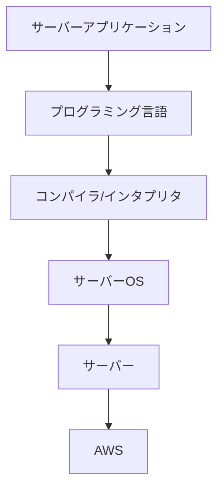
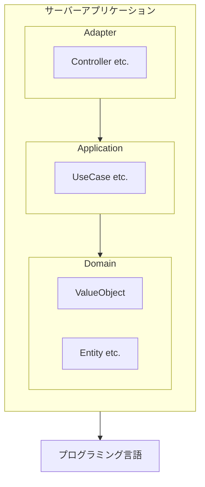
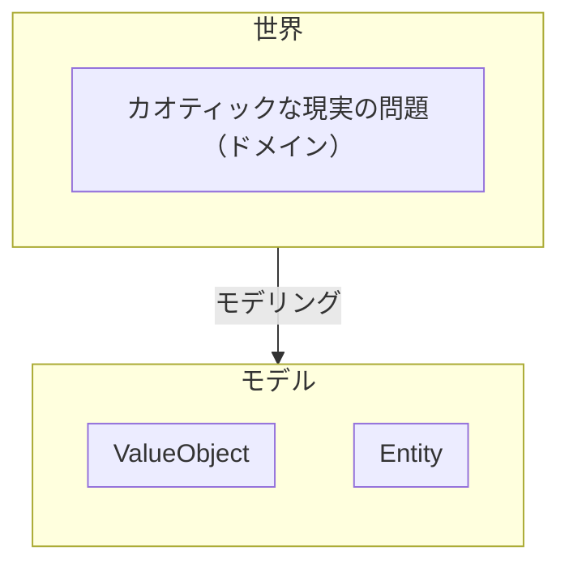

## はじめに

エンジニアの究極的な目標は、**高品質なソフトウェアを開発・保守・運用すること**です。  
エンジニアが行うすべての意思決定は、この目標に紐づいていなければなりませんが、そもそも **「高品質」** とは一体何を指すのでしょうか？

それはソフトウェアの使いやすさでしょうか？  
パフォーマンスの良さでしょうか？  
はたまた、コードの読みやすさでしょうか？
逆に、これらが満たされていればソフトウェアは高品質と言えるのでしょうか？

また、エンジニアはこの目標を達成するために技術的な意思決定を行いますが、その意思決定がプロダクトにどのようなインパクトを与え、またそれを技術に詳しくない人にも伝え、理解を得ることができるでしょうか？

本記事では、バートランド・メイヤー著の『オブジェクト指向入門 第 2 版 原則・コンセプト』を参考に、ソフトウェアの品質について確認し、どのように適切な技術的意思決定を遂行するかを考察します。

読者にはエンジニアを想定しており、ある程度ソフトウェア、特に Web アプリケーションの開発経験があることを想定していますが、技術に詳しくない方でも理解しやすいように心がけています（技術的な話題は流していただいても全体像を把握できるように書いております）。

本記事は以下のような問題を抱えている方を想定しています。

- 技術的な意思決定がどのようにソフトウェアに貢献するのかを考えたい
- 技術的な意思決定について Biz サイドから理解が得られない
- エンジニアとのコミュニケーションが上手く取れない
- など

## 外部品質と内部品質

ソフトウェアの品質は、**外部品質**と**内部品質**の 2 つに分類されます。

外部品質は、**ユーザーが直接認識できる品質**を指します。  
例えば、ソフトウェアがバグなく動くことや、UI/UX が使いやすいこと、パフォーマンスが良いことなどが外部品質に含まれます。

一方、内部品質は**ユーザーが認識できない品質**を指します。言い換えれば、ソースコードにアクセスできるエンジニアのための品質と言って差し支えありません。  
コードの可読性の高さ、オブジェクト指向や関数型プログラミングといったパラダイムの原則に従っているかなどの、エンジニアにとって重要な項目が内部品質に含まれます。

この 2 つの違いは、「ユーザーが認識できる品質かどうか」になりますが、ここでの「ユーザー」とは、**ソフトウェアに関わる全ての人**を指しています。  
つまり、ソフトウェアの利用者だけでなく、ソフトウェアを契約する役員、そのソフトウェアの営業をする人、ソフトウェアの仕様を考える人なども含まれるため、通常使われる言葉より意味が広いことに注意が必要です。

さて、ソフトウェアにとってどちらも重要な品質ではありますが、最終的に問題になるのは**外部品質**です。  
どんなにコードが正しく管理されていたとしても、ユーザーにとって使いにくかったり、パフォーマンスやセキュリティ上の問題があれば、そのソフトウェアは高品質とは言えません。  
また逆に、多少コードに難があったとしても、ユーザーに致命的な問題が発生することに比べれば、それがより大きな問題になることはないでしょう。  
これらのことから、**外部品質は内部品質よりも常に優位にあり、すべての技術的な意思決定は、外部品質を向上させるために行われなければならない**と言えます。

しかし、だからといって内部品質をおざなりにして良いわけではありません。  
むしろ、**外部品質の成功の鍵は、内部品質にあります。**  
外部品質に紐づくであろう内部品質に関する意思決定の連続が、高品質なソフトウェアを生み出す基盤となります。  
そのため、高い外部品質を生み出すためにエンジニアがまず取り組むことは、**外部品質そのものを理解すること**です。  
技術的なあれこれについて思考を巡らすことももちろん重要ですが、その技術がどのような形で外部品質に影響するのかを考察するためにも、外部品質の理解は必要となります。

## 主要な外部品質の要因

『オブジェクト指向入門 第 2 版 原則・コンセプト』では 14 の外部品質要因について紹介されています。

| 要因           | 概要                                                                         |
| -------------- | ---------------------------------------------------------------------------- |
| **正確さ**     | ソフトウェアは仕様通りに正しく動かなければならない                           |
| **頑丈さ**     | 意図しない挙動をしても、ソフトウェアは壊れず正しく終了し、通知する必要がある |
| **拡張性**     | 仕様変更のしやすさ                                                           |
| **再利用性**   | ソフトウェアのパターンを発見し、再利用する                                   |
| **互換性**     | 他のソフトウェアとの組み合わせやすさ                                         |
| **効率性**     | パフォーマンスの良さ                                                         |
| **可搬性**     | 移植しやすいインフラ                                                         |
| **使いやすさ** | 優れた UI/UX                                                                 |
| **機能性**     | ソフトウェアができることの範囲                                               |
| **適時性**     | リリースの速度                                                               |
| **実証性**     | QA のしやすさ                                                                |
| **統合性**     | セキュリティの堅牢さ                                                         |
| **修復性**     | インシデントが発生したときのリカバーの速さ                                   |
| **経済性**     | 金銭的な運用コスト                                                           |

ここでは上記からいくつかをピックアップし、各外部品質に絡む内部品質の選択について、例を出しつつお話いたします。

### 正確さ

> 正確さとは仕様によって定義されているとおりに仕事を実行するソフトウェア製品の能力である。  
> （引用: バートランド・メイヤー『オブジェクト指向入門 第 2 版 原則・コンセプト』 p4）

**これは外部品質の中で最も重要な項目といっても過言ではありません。**  
ソフトウェアは正しく動くことが絶対条件です。正しく動かないソフトウェアを意図して作る理由も、それをリリースする理由もありません。  
そのため、エンジニアはこの正確さを達成することを第一の目標として行動する必要があります。

#### ドメインモデリング

ソフトウェアを作るためには、要求や要件をプログラムで表現することになりますが、しかしながら、そもそもこのハードル自体が非常に高いものとなっています。  
というのも、コーディングはもちろんのこと、要求や要件の理解やシステムデザインなども行うため、単純なプログラミングの能力だけではなく、コミュニケーション能力やドメイン知識、設計の能力も必要となるからです。

こうした問題に立ち向かうための方法論として有名なのが、**ドメイン駆動設計（DDD）** です。  
DDD は、ソフトウェアを作る際に、そのソフトウェアが扱うドメイン（業務領域）をモデリングし、それをプログラムに落とし込む設計手法です。  
DDD を導入する理由の一つとして、**ソースコードによってドメインを表現し、ソフトウェアが正確に動くこと（ドメインに適合すること）を保証しようとする**といったものがあります（もちろん他の理由もございますが、そちらは後述いたします）。  
もちろん DDD を導入しなければ正確さを保証できないというわけではありません。  
重要なのは、**プロダクトの段階や要求を踏まえて適切に意思決定を行うこと**ですので、DDD はその**手段**としてあるということを忘れてはいけません。

#### 前提条件依存による正確さ保証

そうした開発の困難を経た次には、本当に開発したものが正しく動くか検証する作業がありますが、これにも困難が伴います。  
どんなに QA を頑張ったとしても、ソフトウェアを作るのが人間である以上、完全にバグを排除することはほぼ不可能といってよいでしょう。

では、そうした困難の中でどのようにして正確さを保証すればよいのかというと、基本的には**前提条件依存**によって行われます。  
つまり、ソフトウェアという大きな単位だけを見て正確さを保証しようとするのではなく、**ソフトウェアを構成する個々の層の中で正しく動くことを保証し、その信頼の上で別の層を依存させる**という方法が取られます。

例えば、Web アプリケーションがどのような依存関係になっているのかを図を交えながら考えてみましょう。



上記の図は、Web アプリケーションのサーバーサイドがどのような依存関係になっているかを簡単に示しています。矢印が依存関係、矢印の先が依存される側を表しています。

サーバーアプリケーションを作るためにはプログラミング言語を使いますが、そのためにはプログラミング言語が正しく機能している必要があります。  
しかし我々がプログラムを書くとき、プログラミング言語が正しく機能するかどうかを確認することはほぼありません。つまり、そこではプログラミング言語が正しく動くことを前提としてアプリケーションが構築されているということです。

一方プログラミング言語側では、何かしらの方法を用いて自分自身が正しく動くことを保証していると思いますが、しかしプログラミング言語が正しく動くためには、コンパイラやインタプリタが正しく機能することが必要となり……といった具合に、依存先が正しく動くことを前提として、各層の依存関係は構築されているわけです。

もう少し具体的に、サーバーアプリケーションの中でどのような依存関係があるのかを考えてみましょう。



これは DDD + Clean Architecture の設計を簡易的に表現したものです。  
コードレベルでも前提条件依存は存在しており、例えば UseCase にてロジックを記述する際は、ValueObject や Entity が正しく動くことを前提としています。  
そして、それぞれの層が正しく動くことを保証する手段として、我々はよく**テストコード**を書きます。  
つまり、テストコードによって層の中の各モジュールが正しく動くことを保証しつつ、モジュールの利用者視点では、それらが正しく動くことを信頼して依存するという連鎖によってコーディングを行っているわけです。

ここまでを踏まえると、**Clean Architecture やテストコードというのは、この前提条件依存を実現するための手段（=内部品質）であり、その効果として正確に動作するソフトウェアを実現できる**というのが見えてくると思います。

#### 正確さ - まとめ

- 正確さとは、**仕様通りにソフトウェアが動く能力である。**
- 正確さを保証するためには、要求をプログラムで正しく表現する**ドメインモデリング**という視点と、ソフトウェアを構成する個々の層の中で正しく動くことを保証し、その信頼の上で別の層を依存させる**前提条件依存**という視点が重要である。
- 正確さを保証する内部品質の手段として、**DDD**や**Clean Architecture**、**テストコード**などがある。

### 拡張性

> 拡張性とは仕様の変更に対するソフトウェア製品の適用のしやすさである。  
> （引用: バートランド・メイヤー『オブジェクト指向入門 第 2 版 原則・コンセプト』 p7）

ソフトウェアの「ソフト」とは、ハードウェアと比べて変更が容易（ソフト）であることを指していますが、ソフトウェアの規模が大きくなると、その変更が困難になることがあります。  
ドメインは時間とともに変化するものでありますから、変化について行けないソフトウェアを作ってしまうと、改修に本来不必要なコストが掛かってしまったり、最悪の場合、ソフトウェア自体を作り直す必要が出てきてしまうこともあります。

この本では拡張性を向上させるための原則として、**設計の単純さ**と**非集中化**の 2 つが挙げられています。

> - **設計の単純さ（design simplicity）**: 単純なアーキテクチャは常に複雑なアーキテクチャよりも変更に適応しやすい。
> - **非集中化（decentralization）**: モジュールの自治性が高まるほど、単純な変更が与える影響が１つまたは少数のモジュールにとどまる可能性が高く、システム全体に及ぶ変更の連鎖反応を起こさない。
>
> （引用: バートランド・メイヤー『オブジェクト指向入門 第 2 版 原則・コンセプト』 p8）

前者について、状況によっては複雑なものを導入しなければならないときもありますが、できるだけシンプルなアーキテクチャを選択できたほうが学習コストも下げられ、変更しやすいというのは想像できます。  
また後者については、単一責任の原則（SRP）にもあるとおりなので、こちらは言わずもがなと思います。

#### 再びドメインモデリング

正確さ保証の手段として DDD を例として挙げておりましたが、拡張性を担保する手段としても DDD は有効です。  
DDD では現実世界の問題（ドメイン）を何らかの方法でモデリングし抽象を作ろうとしますが、それが何を意味するのかというと、一言で言えば **モデルを用いたドメインとの対応付け** です。



ドメインは時間とともに変化するわけですが、もちろんその際にモデルも更新する必要があります。  
もしコードでモデリングを行い、それがドメインとの対応が取れていたならば、ドメインの変化のとおりにコードを変更すれば良いので、技術的な観点でコードを変更するのではなく、**Domain-Driven で** コードを変更でき、それが結果的に拡張性を担保することになります（詳しくは改めて記事を執筆する予定です）。

#### 拡張性 - まとめ

- 拡張性とは、**仕様の変更に対するソフトウェア製品の適用のしやすさである。**
- 拡張性を向上させるためには、**設計の単純さ** と **非集中化（≒ 単一責任）** が重要である。
- 拡張性を担保する手段の 1 つとして、**DDD**が有効である。

### 再利用性

> 再利用性とは多数多彩なアプリケーションの構築に使うことのできる、ソフトウェア要素の能力である。  
> （引用: バートランド・メイヤー『オブジェクト指向入門 第 2 版 原則・コンセプト』 p8）

上の引用は少しわかりにくいですが、端的に言えば **「共通するパターンを把握し、複数の開発で再利用する能力」** です。  
再利用ができれば、過去に遭遇した問題の解決方法を再度考える必要がなくなり、他の多くの外部品質にも影響を与えることができます。  
例えば、書くコードの量が減らせますので、開発の工数が減り、他の要素の向上に割くことができるようになります。  
また、コードの量が減ることは、内部の複雑さを抑えられるという面もあるため、正確さや拡張性といった外部品質にも貢献することになるでしょう。

#### ライブラリの活用・作成

再利用性を高める技術的なアプローチとして、**オブジェクト指向**や**デザインパターン**といったものもございますが、ここでは **ライブラリの活用** についてお話させてください。

例えば、バックエンドの Web アプリケーション開発では、何らかのフレームワークを使うことが多いですが、これも再利用の一種です。  
Web アプリケーションの開発で求められる機能は、どんなプロダクトであっても共通となる要素が多いため、フレームワークの活用は非常に有効です。

また、**自社でライブラリを作成してしまう**というのも一つの方法です。  
例えば弊社のフロントエンドチームでは、Wiz UI という **Vue/React に両対応する独自の UI ライブラリをオープンソースで開発しています**。

[](https://wiz-ui-react.vercel.app/?path=/docs/base-graphs-transition--docs)

GitHub  
https://github.com/Wizleap-Inc/wiz-ui

Storybook  
https://wiz-ui-react.vercel.app/

技術記事  
https://zenn.dev/wizleap_tech/articles/822f99945ae2b6

このライブラリを利用することで、プロダクト側でスタイリングを行う工数が激減し、生産性向上に大きく貢献しました。  
また、デザインシステムをライブラリで保証しておりますので、仕様で定義されたデザインとの齟齬なく実装がしやすくなり、正確さの向上にも繋がりました。

このように、ライブラリを活用したり、ときには作成することによって、ソフトウェアの品質を大きく向上できる可能性があります。

#### 再利用性 - まとめ

- 再利用性とは、**共通するパターンを把握し、複数の開発で再利用する能力である。**
- 再利用性を向上させることは、開発工数の削減や内部の複雑さの抑制に繋がり、他の外部品質の向上に貢献する。
- 再利用性を高める技術的なアプローチとして、**オブジェクト指向**や**デザインパターンの活用**、**ライブラリの活用・作成**などがある。

### 効率性

> 効率性とは、処理時間、内部記憶および外部記憶上の空間、通信装置で使用する帯域幅などのハードウェア資源をできる限り必要としないソフトウェアシステムの能力である。  
> （引用: バートランド・メイヤー『オブジェクト指向入門 第 2 版 原則・コンセプト』 p10）

こちらも長々と定義がございますが、一言で言って**パフォーマンス**です。  
もちろんパフォーマンスは良いに越したことはありませんが、効率性は他の外部品質とトレードオフの関係になることが多い点に注意が必要です。

例えば、40 番目のフィボナッチ数を求めるプログラムを考えてみましょう。  
特にパフォーマンスは考えず、再帰関数を使って実装すると以下のようになります。

```go
package main

import (
    "fmt"
    "time"
)

const N = 40

func fibonacci(n uint) uint64 {
    if n <= 1 {
        return uint64(n)
    }
    return fibonacci(n-1) + fibonacci(n-2)
}

func main() {
    n := uint(N)
    start := time.Now()
    result := fibonacci(n)
    duration := time.Since(start)

    fmt.Printf("Fibonacci(%d) = %d\n", n, result)
    fmt.Printf("Calculation completed in %v\n", duration)
}
```

```
Fibonacci(40) = 102334155
Calculation completed in 300.461789ms
```

上記のコードでは fibonacci を 1 回実行するたびに 2 回再帰呼び出しを行うため、計算量は `O(2^n)` となり、n の数が増えれば増えるほど指数的に計算時間が増えてしまいます。

では、このコードのパフォーマンスを上げるために、メモ化を用いて高速化を図ってみましょう。

```go
package main

import (
    "fmt"
    "time"
)

const N = 40

var fib [N + 1]uint64
var calculated uint

func init() {
    fib[0], fib[1] = 0, 1
    calculated = 1
}

func fibonacci(n uint) uint64 {
    if n <= calculated {
        return fib[n]
    }

    a, b := fib[calculated-1], fib[calculated]

    for i := calculated + 1; i <= n; i++ {
        c := a + b
        fib[i] = c
        a, b = b, c
    }

    calculated = n
    return fib[n]
}

func main() {
    n := uint(N)
    start := time.Now()
    result := fibonacci(n)
    duration := time.Since(start)

    fmt.Printf("Fibonacci(%d) = %d\n", n, result)
    fmt.Printf("Calculation completed in %v\n", duration)
}
```

```
Fibonacci(40) = 102334155
Calculation completed in 83ns
```

このコードでは、計算結果を配列に保存し再利用することで、計算量を `O(n)` に抑えることができます。  
ローカルで実行すると、計算時間は 80ns (= 0.08ms) 前後となり、約 3750 倍の高速化が達成できました。

しかしながら、パフォーマンスチューニングを行った前後でコードの読みやすさを比較すると、コードの記述量が増え、複雑さが少し増してしまっています。  
また、このパフォーマンスチューニングを行った前後で、正確さに影響が出ないことを保証する必要があります。  
早くなったは良いものの、バグが発生してしまっては元も子もありません。
そもそも、現在のビジネスにおいパフォーマンスが要求されているのかはまた別の問題です。  
300ms のスピードでユーザーが満足しているのであれば、パフォーマンスチューニングを行う必要はないとも言えるので、他の外部品質にリソースを割いた方がソフトウェアとしては良い結果になるでしょう。

なぜここまでトレードオフになりやすいのかというと、**ソフトウェア開発の要求の中に、概念としての要求と、ハードウェアの特性に関する具体的な要求が混在している**からです。  
例えばソフトウェアの仕様に関する要求は前者であり、パフォーマンスはまさに後者に関するものです。  
もし要求が前者のみであれば、ドメインに沿ってソフトウェアを実装すればよいのですが、後者の要求は CPU やメモリといったハードウェアなどの都合を考えながら実装しなければなりません。  
そのためパフォーマンスを向上させるために、ドメイン表現としての正しさを犠牲にして、泥臭い実装を余儀なくされることもあるでしょう。

繰り返しになりますが、パフォーマンスは良いに越したことはありません。  
しかし、ユーザーの要求以上にパフォーマンスを追求する必要はありませんし、正確さといった他の要因とトレードオフが効かないのであれば、一旦要求を断るのも 1 つの選択といえます。

#### 効率性 - まとめ

- 効率性とは、一言でいえば**パフォーマンスの良さ**である。
- 効率性は、ハードウェアの特性に関する具体的な要求であるため、他の外部品質とトレードオフの関係になりやすい。

### 機能性/適時性

> 機能性とは、そのシステムが提供できるサービスの範囲である。  
> （引用: バートランド・メイヤー『オブジェクト指向入門 第 2 版 原則・コンセプト』 p15）

> 適時性とはユーザが必要としているとき、または、必要とする前にソフトウェアシステムをリリースできることである。  
> （引用: バートランド・メイヤー『オブジェクト指向入門 第 2 版 原則・コンセプト』 p15）

### 各品質のトレードオフを考え、言語化する

## 非エンジニアとのコミュニケーション

### ソフトウェアの高品質を定義する

トレードオフ・スライダー

要求を過不足なく実現

実現不可能な要求には、NO という勇気も

### 技術的な意思決定が、品質に与える影響を説明する

なぜやるのかの共通の認識を持つために、言語化しよう

その際に、内部品質について詳しく説明する必要はない

## おわりに

ソフトウェアはエンジニアだけで作れるものではありません。  
プロダクトマネージャーやデザイナー、営業、マーケティング、カスタマーサポート、そして何よりユーザーとともに作り上げるものです。

## 参考

- バートランド・メイヤー『オブジェクト指向入門 第 2 版 原則・コンセプト』、酒匂 寛 訳、翔泳社
