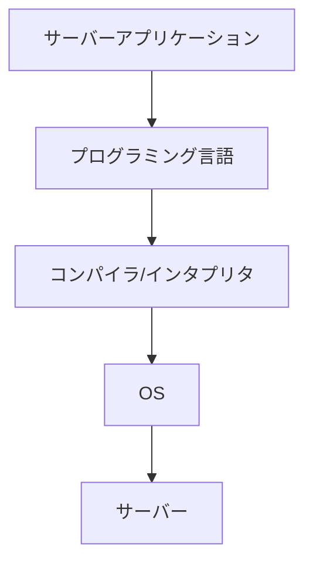
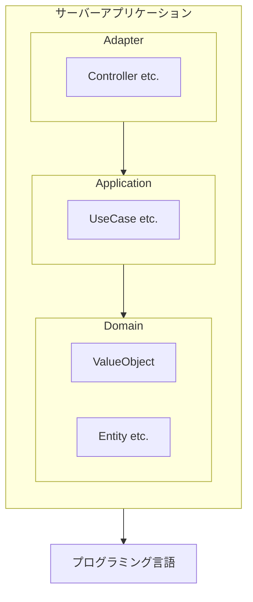
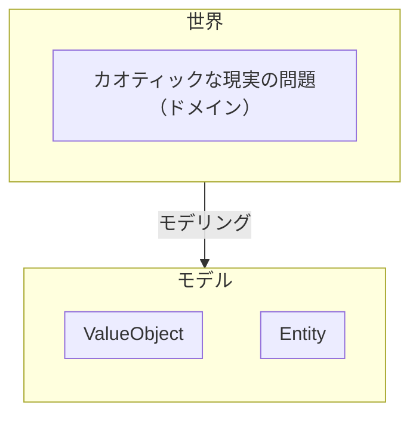

## はじめに

エンジニアの究極的な目標は、**高品質なソフトウェアを開発・保守・運用すること**です。  
エンジニアが行うすべての意思決定は、この目標に紐づいていなければなりませんが、そもそも **「高品質」** とは一体何を指すのでしょうか？

それはソフトウェアの使いやすさでしょうか？  
パフォーマンスの良さでしょうか？  
はたまた、コードの読みやすさでしょうか？
逆に、これらが満たされていればソフトウェアは高品質と言えるのでしょうか？

また、エンジニアはこの目標を達成するために様々な技術的な意思決定を行いますが、何を持ってその意思決定が適切なものであったと言えるのでしょうか？  
さらに、技術的な意思決定を行うにあたって、その意義を技術に詳しくない人にも伝え、理解を得ることができるでしょうか？

本記事では、バートランド・メイヤー著の『オブジェクト指向入門 第 2 版 原則・コンセプト』を参考に、私見を交えつつソフトウェアの品質について確認し、どのように適切な技術的意思決定を遂行するかを考察します。

読者には基本的にエンジニアを想定しており、ある程度ソフトウェア、特に Web アプリケーションの開発経験があることを想定しています。技術的な用語が使われますが、各技術についての解説は行いませんので、その点はご了承ください。  
一方で、技術に詳しくない方でも理解しやすいように心がけており、技術的な話題や用語は流していただいても全体像を把握できるように書いております。

本記事は以下のような方を想定しています。

- 技術的な意思決定を行うエンジニア
- プロジェクトやプロダクトのマネージャー
- 適切な技術的な意思決定がわからない・できない・確信を持てない方
- 技術負債を解消したいが、 Biz サイドから理解が得られない方
- 毎回無理なスケジュールでの開発を行ってしまい、疲弊してしまっている方
- エンジニアと非エンジニアのコミュニケーションが上手く取れない方
- など

また、この記事は「自社開発を行う会社のエンジニア」の立場で書かれておりますので、受託開発での視点では書かれていないことにご留意ください。

## 外部品質と内部品質

ソフトウェアの品質は、**外部品質**と**内部品質**の 2 つに分類されます。

外部品質は、**ユーザーが直接認識できる品質**を指します。  
例えば、ソフトウェアがバグなく動くことや、UI/UX が使いやすいこと、パフォーマンスが良いことなどが外部品質に含まれます。

一方、内部品質は**ユーザーが認識できない品質**を指します。言い換えれば、ソースコードにアクセスできるエンジニアのための品質と言って差し支えありません。  
コードの可読性の高さ、オブジェクト指向や関数型プログラミングといったパラダイムの原則に従っているかなどの、エンジニアにとって重要な項目が内部品質に含まれます。

この 2 つの違いは、「ユーザーが認識できる品質かどうか」になりますが、ここでの「ユーザー」とは、**ソフトウェアに関わる全ての人**を指しています。  
つまり、ソフトウェアの利用者だけでなく、ソフトウェアを契約する役員、そのソフトウェアの営業をする人、ソフトウェアの仕様を考える人なども含まれるため、通常使われる言葉より意味が広いことに注意が必要です（以下、**「ユーザー」** という言葉はこの定義で扱い、ソフトウェアの利用者を **「エンドユーザー」** と呼びます）。

さて、ソフトウェアにとってどちらも重要な品質ではありますが、最終的に問題になるのは**外部品質**です。  
どんなにコードが正しく管理されていたとしても、例えばユーザーにとって使いにくかったり、パフォーマンスやセキュリティ上の問題があるといった、**プロダクトが要求する品質を満たせていなければ、そのソフトウェアは高品質とは言えません**。  
また逆に、多少コードに難があったとしても、ユーザーに致命的な問題が発生することに比べれば、それがより大きな問題になることはないでしょう。  
これらのことから、**外部品質は内部品質よりも常に優位にあり、すべての技術的な意思決定は、外部品質を向上させるために行われなければならない**と言えます。

しかし、だからといって内部品質をおざなりにして良いわけではありません。  
むしろ、**外部品質の成功の鍵は、内部品質にあります。**  
外部品質に紐づくであろう内部品質に関する意思決定の連続が、高品質なソフトウェアを生み出す基盤となります。  
そのため、高い外部品質を生み出すためにエンジニアがまず取り組むことは、**外部品質そのものを理解すること**です。  
技術的なあれこれについて思考を巡らすことももちろん重要ですが、その技術がどのような形で外部品質に影響するのかを考察するためにも、外部品質の理解は必要となります。

## 主要な外部品質の要因

『オブジェクト指向入門 第 2 版 原則・コンセプト』では 14 の外部品質要因について紹介されています。  
以下は各品質を私の言葉で端的にまとめたものです。

| 要因           | 要約                                                                         |
| -------------- | ---------------------------------------------------------------------------- |
| **正確さ**     | ソフトウェアは仕様通りに正しく動かなければならない                           |
| **頑丈さ**     | 意図しない挙動をしても、ソフトウェアは壊れず正しく終了し、通知する必要がある |
| **拡張性**     | 仕様変更のしやすさ                                                           |
| **再利用性**   | ソフトウェアのパターンを発見し、再利用する                                   |
| **互換性**     | 他のソフトウェアとの組み合わせやすさ                                         |
| **効率性**     | パフォーマンスの良さ                                                         |
| **可搬性**     | 移植しやすいインフラ                                                         |
| **使いやすさ** | 優れた UI/UX                                                                 |
| **機能性**     | ソフトウェアができることの範囲                                               |
| **適時性**     | リリースの速度                                                               |
| **実証性**     | QA のしやすさ                                                                |
| **統合性**     | セキュリティの堅牢さ                                                         |
| **修復性**     | インシデントが発生したときのリカバーの速さ                                   |
| **経済性**     | 金銭的な運用コスト                                                           |

ここでは上記からいくつかをピックアップし、外部品質と内部品質の関係について、例を出しつつお話いたします。

### 正確さ

> 正確さとは仕様によって定義されているとおりに仕事を実行するソフトウェア製品の能力である。
>
> （引用: バートランド・メイヤー『オブジェクト指向入門 第 2 版 原則・コンセプト』 p4）

**これは外部品質の中で最も重要な項目といっても過言ではありません。**  
ソフトウェアは正しく動くことが絶対条件です。正しく動かないソフトウェアを意図して作る理由も、それをリリースする理由もありません。  
そのため、エンジニアはこの正確さを達成することを第一の目標として行動する必要があります。

#### ドメインモデリング

ソフトウェアを作るためには、要求や要件をプログラムで表現することになりますが、しかしながら、これには多くの困難が伴います。  
というのも、コーディングはもちろんのこと、要求や要件の理解やシステムデザインなども行うため、単純なプログラミングの能力だけではなく、コミュニケーション能力やドメイン知識、設計の能力も必要となるからです。

こうした問題に立ち向かうための方法論として有名なのが、**ドメイン駆動設計（DDD）** です。  
DDD は、ソフトウェアを作る際に、そのソフトウェアが扱うドメイン（業務領域）をモデリングし、プログラムへと落とし込むための設計手法です。  
DDD を導入する理由の 1 つとして、**ソースコードによってドメインを表現し、ソフトウェアが正確に動くこと（ドメインに適合すること）を保証しようとする**というものがあります。

もちろん DDD を導入しなければ正確さを保証できないというわけではありません。  
重要なことは、**プロダクトの段階や要求を踏まえて適切に意思決定を行うこと**ですので、DDD はその**手段**としてあるということを忘れてはいけません。

#### 前提条件依存による正確さ保証

そうした開発の困難を経た次には、本当に開発したものが正しく動くか検証する作業がありますが、こちらも一筋縄では行きません。  
どんなに QA に力を入れたとしても、ソフトウェアを作ったり検証するのが人間である以上、完全にバグを排除することは不可能といってよいでしょう。

では、そうした困難の中でどのようにして正確さを保証すればよいのかというと、基本的には**前提条件依存**によって行われます。  
つまり、ソフトウェアという大きな単位で正確さを保証しようとするのではなく、**ソフトウェアを構成する個々の要素の中で正しく動くことを保証し、各要素が正しく動くという信頼の上で別の要素を依存させる**という方法が取られます。

例えば、Web アプリケーションがどのような依存関係になっているのかを考えてみましょう。

上記の図は、Web アプリケーションのサーバーサイドがどのような依存関係になっているかを簡単に示しています。矢印が依存関係、矢印の先が依存される側を表しています。

サーバーアプリケーションを構築するためにはプログラミング言語を使いますが、もちろんそのためには、プログラミング言語が正しく機能している必要があります。  
しかしエンジニアがプログラムを書くとき、プログラミング言語が正しく機能するかどうかを確認することはまずありません。つまり、そこでは**プログラミング言語が正しく動くことを前提にアプリケーションが構築されている**ということです。

一方プログラミング言語の視点で見てみると、プログラミング言語が正しく動くためには、コンパイラやインタプリタが正しく機能することが必要となり、そしてそのコンパイラ/インタプリタが正しく機能するためには OS が正しく機能する必要があり……といった具合に、どの段階においても**依存先の要素が正しく動くことを前提として、各要素の依存関係は構築されている**のがわかると思います。

もう少し具体的に、サーバーアプリケーションの中でどのような依存関係があるのかを考えてみましょう。

これは DDD + Clean Architecture の設計を簡易的に表現したものです。  
コードレベルでも前提条件依存は存在しており、例えば UseCase にてロジックを記述する際は、ValueObject や Entity が正しく動くことを前提としています。  
そして、それぞれの要素が正しく動くことを保証する手段として、エンジニアはよく**テストコード**という手法を用います。  
つまり、テストコードによって各モジュールが正しく動くことを保証しつつ、モジュールの利用者視点では、それらが正しく動くことを信頼して依存するという連鎖によってコーディングが行われているということです。

ここまでを踏まえると、**Clean Architecture やテストコードというのは、この前提条件依存を実現するための手段（=内部品質）であり、その効果として正確に動作するソフトウェアが期待できる**というのが見えてくると思います。

#### 正確さ - まとめ

- 正確さとは、**仕様通りにソフトウェアが動く能力である。**
- 正確さを保証するためには、ドメインや要求をプログラムで正しく表現する**ドメインモデリング**という視点と、ソフトウェアを構成する各要素で正しく動くことを保証し、その信頼の上で別の要素を依存させる**前提条件依存**という視点が重要である。
- 正確さを保証する内部品質の手段として、**DDD**や**Clean Architecture**、**テストコード**などがある。

### 拡張性

> 拡張性とは仕様の変更に対するソフトウェア製品の適用のしやすさである。
>
> （引用: バートランド・メイヤー『オブジェクト指向入門 第 2 版 原則・コンセプト』 p7）

ソフトウェアの「ソフト」とは、ハードウェアと比べて変更が容易（ソフト）であることを指していますが、ソフトウェアの規模が大きくなると、その変更が困難になることがあります。  
ドメインは時間とともに変化するものでありますから、変化について行けないソフトウェアを作ってしまうと、改修に本来不必要なコストが掛かってしまったり、最悪の場合、ソフトウェア自体を作り直す必要が出てきてしまうこともあります。

この本では拡張性を向上させるための原則として、**設計の単純さ**と**非集中化**の 2 つが挙げられています。

> - **設計の単純さ（design simplicity）**: 単純なアーキテクチャは常に複雑なアーキテクチャよりも変更に適応しやすい。
> - **非集中化（decentralization）**: モジュールの自治性が高まるほど、単純な変更が与える影響が１つまたは少数のモジュールにとどまる可能性が高く、システム全体に及ぶ変更の連鎖反応を起こさない。
>
> （引用: バートランド・メイヤー『オブジェクト指向入門 第 2 版 原則・コンセプト』 p8、太字は筆者による）

前者について、状況によっては複雑なものを導入しなければならないときもありますが、できるだけシンプルなアーキテクチャを選択できたほうが学習コストも下げられ、変更しやすいというのは想像できます。  
また後者については、単一責任の原則（SRP）にもあるとおりなので、こちらは言わずもがなと思います。

#### 再びドメインモデリング

正確さ保証の手段として DDD を例として挙げておりましたが、拡張性を担保する手段としても DDD は有効です。  
DDD では現実世界の問題（ドメイン）を何らかの方法でモデリングし抽象を作ろうとしますが、それが何を意味するのかというと、一言で言えば **モデルを用いたドメインとの対応付け** です。

ドメインは時間とともに変化するわけですが、もちろんその際にモデルも更新する必要があります。  
もしコードでモデリングを行い、それがドメインとの対応が取れていたならば、ドメインの変化のとおりにコードを変更すれば良いので、技術的な観点でコードを変更するのではなく、**Domain-Driven で** コードを変更でき、それが結果的に拡張性を担保することになります（詳しくは改めて記事を執筆する予定です）。

#### 拡張性 - まとめ

- 拡張性とは、**仕様の変更に対するソフトウェア製品の適用のしやすさである。**
- 拡張性を向上させるためには、**設計の単純さ** と **非集中化（≒ 単一責任）** が重要である。
- 拡張性を担保する手段の 1 つとして、**DDD**が有効である。

### 再利用性

> 再利用性とは多数多彩なアプリケーションの構築に使うことのできる、ソフトウェア要素の能力である。
>
> （引用: バートランド・メイヤー『オブジェクト指向入門 第 2 版 原則・コンセプト』 p8）

上の引用は少しわかりにくいですが、端的に言えば **「共通するパターンを把握し、複数の開発で再利用する能力」** です。  
再利用ができれば、過去に遭遇した問題の解決方法を再度考える必要がなくなり、浮いた時間を他の要素の向上に割くことができるようになります。  
また、例えばコードが再利用できるということは、コードの記述量が減ることでもあり、その結果、コードの複雑さを抑えられることもできるため、正確さや拡張性といった別の外部品質にも貢献することになるでしょう。

#### ライブラリの活用・作成

再利用性を高める技術的なアプローチとして、**オブジェクト指向**や**デザインパターン**といったものもございますが、ここでは **ライブラリの活用** についてお話させてください。

例えば、バックエンドの Web アプリケーション開発では、何らかのフレームワークを使うことが多いですが、これも再利用の一種です。  
Web アプリケーションの開発で求められる機能は、どんなプロダクトであっても共通となる要素が多いため、フレームワークの活用は非常に有効です。

また、**ライブラリを作成してしまう**というのも 1 つの方法です。  
例えば弊社のフロントエンドチームでは、Wiz UI という **Vue/React に両対応する UI ライブラリをオープンソースで開発・保守・運用しています**。

https://github.com/Wizleap-Inc/wiz-ui

https://wiz-ui-react.vercel.app/

https://zenn.dev/wizleap_tech/articles/822f99945ae2b6

このライブラリを利用することで、**ソフトウェアの開発時に行うスタイリングの工数が激減し、生産性向上に大きく貢献**することができました。  
また、**デザインシステムをライブラリで保証**しておりますので、**仕様で定義されたデザインと齟齬なく実装しやすくなり、正確さの向上**にも繋がりました。

このように、ライブラリを活用したり、ときには作成することによって、ソフトウェアの品質を大きく向上できる可能性があります。

#### 再利用性 - まとめ

- 再利用性とは、**共通するパターンを把握し、複数の開発で再利用する能力である。**
- 再利用性を向上させることは、開発工数の削減や内部の複雑さの抑制に繋がり、**他の外部品質の向上に貢献する**。
- 再利用性を高める技術的なアプローチとして、**オブジェクト指向**や**デザインパターンの活用**、**ライブラリの活用・作成**などがある。

### 効率性

> 効率性とは、処理時間、内部記憶および外部記憶上の空間、通信装置で使用する帯域幅などのハードウェア資源をできる限り必要としないソフトウェアシステムの能力である。
>
> （引用: バートランド・メイヤー『オブジェクト指向入門 第 2 版 原則・コンセプト』 p10）

定義が少し回りくどいですが、これは要するに**パフォーマンス**です。  
もちろんパフォーマンスは良いに越したことはありませんが、効率性は他の外部品質とトレードオフの関係になることが多い点に注意が必要です。

#### Rust と効率性

例えば、Rust というプログラミング言語では、**所有権・借用・ライフタイム**といった独自のルールがあります。  
これらのルールにより、ガベージコレクタなしにメモリや並行処理の安全性を保証できるというのが一般的な理解だと思います。

上記のルールを効率性の観点からもう一歩深掘ると、Rust には**ビジネス要求（概念としての要求）とシステム制約（ハードウェアの特性に関する具体的な要求）を同時かつ安全に表現することができる（表現せざるを得ない）特徴がある** と解釈することができます[^1]。

これが何を生み出すのかというと、1 つは、所有・借用といったルールやゼロコスト抽象化といった特性により、**高効率な品質を保証しやすい**というメリットです。  
その一方で、他の言語と比較したときの**コードの冗長さや複雑さ**、また**学習曲線の急峻さ**といったデメリットが生じます。

例えば、学習曲線の急峻さは、「エンジニアのソフトウェア開発に十分にコミットできるまでにかかる時間の長さ」であり、「Rust エンジニアの採用の難しさ」とも言えるため、どちらにしても Rust が書けるエンジニアを増やすのにかかる時間的コストが高いということです。  
エンジニアが増やしにくいということは、**絶対的な開発量を増やしにくいと**いうことであるため、これは次の章で取り上げる**適時性（≒ リリースまでのスピード）** の外部品質に影響する可能性があります。

もちろん、Rust に対する経験値や、人を増やす以外の工夫で生産性を上げることは十分に可能ですが、少なくとも **「最速で動くものを用意してほしい」** という要求があった際に、Rust が本当に最良の選択肢であるかは、十分に検討する必要があると感じます。

[^1]: Rust に限らず、ポインタの利用の明示といった仕組みも効率性の一部と捉えられるので、この特徴は Rust 固有のものではないのですが、ルールとして定義されている分、他言語よりも厳格にある点において異論はないと思います。

#### 効率性とトレードオフ

効率性が他の外部品質とトレードオフになりやすい理由は、**ソフトウェア開発の要求の中に、概念としての要求と、ハードウェアの特性に関する具体的な要求が混在している**からです。  
例えばソフトウェアの仕様に関する要求は前者であり、パフォーマンスはまさに後者に関するものです。  
もし要求が前者のみであれば、ドメインに沿ってソフトウェアを実装すればよいのですが、後者の要求は CPU やメモリといったハードウェアなどの都合を考えながら実装しなければなりません。  
そのためパフォーマンスを向上させるために、ドメイン表現としての正しさを犠牲にして、泥臭い実装を余儀なくされることもあるでしょう。

この章の冒頭でお話した通り、パフォーマンスは良いに越したことはありません。  
しかし、**ユーザーの要求以上にパフォーマンスを追求する必要はありません**。過剰な効率性への投資を行うのであれば、他の要因にコストを割いたほうがプロダクト全体としては良い結果になるでしょう。  
また、他の要因とトレードオフが無視できないと考えられる場合、要求だからといって盲目的に受け入れるのではなく、**本当にそのトレードオフを受け入れてまで実行すべきなのか**を、ユーザーと議論することも必要です。

#### 効率性 - まとめ

- 効率性とは、一言でいえば**パフォーマンスの良さ**である。
- 効率性は、ビジネス上の抽象的な要求ではなく、ハードウェアの特性に関する具体的な要求であるため、他の外部品質とトレードオフの関係になりやすい。

### 機能性/適時性

> 機能性とは、そのシステムが提供できるサービスの範囲である。
>
> （引用: バートランド・メイヤー『オブジェクト指向入門 第 2 版 原則・コンセプト』 p15）

> 適時性とはユーザが必要としているとき、または、必要とする前にソフトウェアシステムをリリースできることである。
>
> （引用: バートランド・メイヤー『オブジェクト指向入門 第 2 版 原則・コンセプト』 p15）

この 2 つを端的に表現するならば、 **「もっといろいろな機能を開発してほしい」「もっと早くリリースしてほしい」** という要求に答える能力です。  
これらをまとめて取り上げたのには理由があり、これらはどちらも**プロジェクトに負荷をかけてしまいがちな要因**だからです。  
ここからは実際に弊社で発生した過去の事例を取り上げてみましょう。

#### 少ない人数で大きな開発を 3 つほぼ同時に行った話

これはメインのプロダクトの開発を行うエンジニアが 5 人ほどだった頃のお話です。  
その時は時期が悪く、いろいろな要求や要件がいくつか重なってしまい、どうしても **「3 人ほどリソースを投下して 2, 3 ヶ月くらいかかる大きな開発」** を **「3 つほぼ同時」** かつ **「半年以内のリリース」** を行う必要がありました。

さらにこの開発以外にも、随時発生するソフトウェアの改修やバグフィックス、他プロダクトの開発を行う必要もあります。  
また、当時 QA 組織が存在しなかったため、リリースが近くなるとエンジニアが開発の手を止めてシステムテストも行うという状況でした。  
人数にも組織にも問題はあったのですが、会社として大きなターニングポイントになるところだったので、なんとかエンジニア総出で頑張り、リリースを達成することができました。

**※ 現在では QA 組織を設立し、ソフトウェアの品質保証の責務をエンジニアから一部分離した体制となっております。またエンジニアも順当に人数を増やし、極端に負荷がかからないよう、一人ひとりに継続可能な開発量を目標に立てて開発を行っております。**

#### リリース後、どうなったか

確かに、エンジニアは多くの機能を早くリリースできました。しかしその結果はどうだったでしょうか？  
ご想像のとおりだと思いますが、できるだけ内部の品質を落とさないように開発はしていたものの、ハードなスケジュールだったため、**一部で内部品質を落としてしまった**ところもございますし、**QA 漏れ**や、**そもそもの要求・要件に漏れがあり、リリース後にエラーが発覚する**といった問題も起こりました。

結果的に自分たちが理想とするプロダクトに大きく近づいたので、その点は良かったのですが、一方でこの状態ではソフトウェアの品質を維持できているとは言えないでしょう。

#### 何が問題だったのか

これらの問題の根本は、**機能性と適時性を追求しすぎた**ことにあります。  
冒頭でこの 2 つはプロジェクトに負荷をかけやすいとお話しましたが、その理由を端的にいってしまえば、**利益に直結しやすいから**です。

新しい機能をリリースできれば、ユーザーの要望をより多く叶えられる。  
早くリリースできれば、ユーザーの要望を早く叶えられる。

もちろんこんなにも単純ではありませんし、プロダクトにも依るのですが、経営者やプロダクトマネージャーにとって、利益という側面でも、より早く多くの仮説・検証ができるという点においても重要な項目になります。

しかしながら上記の例のように、過剰に追求することは、他の外部品質に大きな影響を与えることになります。  
実際に先のソフトウェアは、拡張性や効率性ももちろんそうですし、なにより最も死守しなければならない**正確さ**を失ってしまうことになりました。

では、どうすればよかったのでしょうか？  
次の章から考えていきましょう。

#### 機能性/適時性 - まとめ

- 機能性とは、**そのシステムが提供できるサービスの範囲**である。
- 適時性とは、**ユーザが必要としているとき、または、必要とする前にサービスをリリースできる能力**である。
- 機能性と適時性は、プロジェクトに対して負荷をかけてしまうことが多く、他の外部品質とトレードオフの関係になりやすい。

## ソフトウェアの高品質を定義する

ここまで様々な外部品質や、それらのトレードオフについて考えてきました。  
今度はこれらの品質を踏まえた上でどのように活用していけばよいのかを、あるプロダクトの例を見ながら考えていきましょう。

### 各品質のトレードオフを考え、明確にする

プロダクトの段階や性質によって、求められる外部品質は大きく異なりますので、すべての外部品質を完璧に達成する必要はありませんし、そもそもそれは不可能です。  
そのため、**現段階のプロダクトに求められる外部品質を明確にし、それをどの程度追求するのか・逆にしないのかを考える**ことが重要です。

これを大まかに把握する手法として、アジャイル開発ではおなじみの**トレードオフ・スライダー**というものがあります。  
例えば、「リリース最優先・最低限動くものを最速で作る段階のプロダクト」を可視化すると、おおよそ以下のようになると思います。

トレードオフ・スライダーでは「スコープ」「予算」「スケジュール」「品質」という項目がよく用いられますが、これらを外部品質の用語に落とし込むと以下のようになります。

- スコープ: **機能性**
- 予算: **経済性**
- スケジュール: **適時性**
- 品質: **正確さ・拡張性・再利用性・効率性など**

上記のグラフは、今チームでは何が重要で、何を犠牲にしているのかの判断基準となるため、これを軸に有効であると仮定できる意思決定を行うことができます（具体例は後述）。

少し脱線しますが、上記の 4 項目以外のものがチームにとって重要な項目ももちろんあるでしょう。そうしたものを話し合い、スライダーに反映するケースもあります。

上のグラフに「使いやすさ」と「パフォーマンス」の 2 つを追加してみました。  
これにより、「リリースの速度は優先したいけど、エンドユーザーにとっての快適さも重視する」といったことが共有できるようになります。

ところで、上記のようなトレードオフ・スライダーは果たして実行可能でしょうか？  
よく見てみると、「パフォーマンス」の優先度が比較的上位に設定されています。  
パフォーマンスとは前述の通り**効率性**であり、これは他の外部品質とトレードオフになりやすく、今回であればスケジュール、つまりは**適時性の外部品質と競合する可能性**があります。

ここで行うことは、**チームの負担やプロダクトの将来性への懸念を受け入れ、このスライダーでなんとか実行し切る**か、もしくは**このバランスの取り方を再検討する**ことです。  
これはどちらが正解というわけではありませんが、**少なくとも本当に達成可能な要求なのかをチームで議論すること**は重要です。  
ときには頑張ることも必要ですが、要求されている品質が達成できなくなってしまったり、何よりチームが完全に消耗してしまっては元も子もありません。  
プロダクトはユーザー全員で楽しく作り上げていきたいものです。

### 要求から技術的な意思決定を行う

話をもとに戻しまして、プロダクトにとって何が重要なのかが明確になれば、この要求を達成できると考えられる技術的な意思決定へと繋げることができます。  
もう一度、最初のトレードオフ・スライダーを見てみましょう。

前述の通り、「リリース最優先・最低限動くものを最速で作る段階のプロダクト」になりますが、ここにおける適切な技術的な意思決定とは何でしょうか？  
少なくとも、DDD や Clean Architecture を採用した堅牢さ最優先の技術選定**ではない**ことは確かでしょう。このプロダクトにおいて開発コストが大きくかかってしまうようなアーキテクチャは歓迎されないはずです。

ここで、このトレードオフをエンジニアがもう一歩解釈するならば、以下のようになると思います。

- とにかく開発速度が要求されている。
- 予算をあまり割くことができないので、このプロジェクトに投下できるエンジニアは少ない。
- 品質はそこまで重視していないが、少しは考慮される。
- 多くの機能を要求されていないので、開発量が多くなることはなさそう。

更に踏み込んで考え、具体的な戦術に落とし込んでみましょう。

- 開発速度が重視されているならば、**開発メンバーが慣れている技術スタックを採用**しつつ、**フレームワークに乗っかったアーキテクチャで開発**すれば早く進められそう。
- 予算があまり多く避けないので、**フルスタックなエンジニアを 1 人投下して最速で作ってもらおう。**
- そこまで品質は重視されていないけど、**ビジネス上エラーが起きたら本当にまずいところはテストコードをしっかり書こう。**

ここまで考えれば、どういった技術を選定し、どういった開発体制、テスト戦略で進めて行けばよいのかが見えて来るはずです。  
これはあくまで一例ですが、このように外部品質の要求から技術的な意思決定を行うことができれば、プロダクトの高品質に貢献できる可能性は高まります。

### 技術負債とはなにか・どう返済するか

例えば先のプロダクトが成長し、要求がスピード重視から品質重視に変化したとしましょう。

こうなると何が起こるでしょうか？  
プロダクトの初期ではスピードが重視されていた分、もしかしたらコード面の堅牢さが犠牲になっているかもしれません。  
またテストも十分ではなく、正確さの保証ができていないところもあるでしょう。  
つまり、**技術負債**が蓄積してしまっている可能性があります。

ここで注意したいのは、技術負債とは単にコードの読みやすさといったことではなく、**ユーザーの要求を十分に実現できない原因が内部品質にある状態**です。  
雑に書かれたコードそのものは技術負債ではありません。なぜなら、雑に書かれたコードによって瞬間的に**適時性（スピード）** という別の品質に貢献している可能性があるからです。  
（もちろん、コードを雑に書いていいというわけではありませんし、そういったコードは間違いなく将来的に技術負債になります）

技術負債とは本来、内部の技術を取り囲む外部の環境が変化したことにより、既存の技術がユーザーの新しい要求を満たせなくなったときに発生します。  
そのため、コードだけを見て技術負債を判断するのではなく、**その内部品質がプロダクトの要求を十分に満たせるかどうか**を見ることが重要です。

例えば、**プロダクトにてエラーが多発する**という問題が発生していたとしましょう。  
これではトレードオフ・スライダーの「品質」が十分に満たされておりませんので、何かしらの対策が必要になるでしょう。  
ここで、エラーについて以下のような原因が考えられたとします。

- テストコードが不十分であるため、コードの正確さをエンジニアが保証できていない。
- そもそも Testable なコードになっていないため、テストコードが書きにくい。

このように考えると、プロダクトとして以下のような仮説と対策を考えることができるでしょう。

- 仮説
  - **テストコードを充実させることによりエラーを減らし、プロダクトの品質向上に貢献できる。**
- 根拠
  - なぜならば、**テストコードを記述することでエンジニアがコードの正確さを保証でき、ソフトウェアの何が起こるかわからない部分を減らすことができるから**である。
- 対策
  - テストコードを書きやすい状態にするため、**アーキテクチャを Clean Architecture へとリファクタリングする。**
  - **テストカバレッジを 80% 以上にする。**

こうした技術的な施策がプロダクトの品質へと貢献できる仮説を立てられたのであれば、技術の詳細について詳しくないメンバーとも議論を交わすことができるようになるでしょう。

### 過不足ない内部品質の追求

ところが、先の仮説をプロダクトの会議に持っていったところ、**仮説や根拠は妥当だが、少し工数ががかかりすぎる**という指摘を受けてしまったとしましょう。  
これはどこが問題になっていたのでしょうか？  
再びトレードオフ・スライダーを確認してみましょう。

よく見ると、「スケジュール」の項目が若干ながら考慮されていることが確認できると思います。  
つまり工数がかかりすぎるというのは、**「品質は重視したいけど、スケジュール感を度外視にしているわけではない」** というチームの共通認識から少し外れた提案をしてしまったため、指摘を受けてしまったのかもしれません。  
この要求を満たすためには、**品質を向上させつつ、多少スケジュールを考慮した技術的な意思決定へと修正する**必要があります。

先ほどの対策は「Clean Architecture の導入」と「テストカバレッジ 80% 以上」の 2 つでした。  
ここから工数を少し減らす方法を考えてみましょう。

Clean Architecture だとメンバーへのキャッチアップや、実装にかかる工数が多くなってしまうかもしれません。  
また、今回の仮説の最も重要なところは**テストコードを充実させることによりエラーを減らせる**という部分です。  
もしそうであるならば、**コードの Testability が確保されていればアーキテクチャ面は OK なはず**なので、Clean Architecture でなくてもこの仮説は実行可能のようにも見えます。  
例えば代案として、Layered Architecture であれば Clean Architecture ほど実装は大変にならず、モックを活用すれば Testability も確保できそうです。  
これで対策を修正してみましょう。

- 対策
  - テストコードを書きやすい状態にするため、**アーキテクチャを Layered Architecture へとリファクタリングする。**
  - **テストカバレッジを 80% 以上にする。**
- 工数
  - Clean Architecture の導入よりも**コストを 30% 程度削減できる見込み。**

技術的な意思決定を行うポイントとして、**内部品質は要求を過不足なく満たすように追求する**というものがあります。  
俗に言う「オーバーエンジニアリング」というもので、過剰な内部品質の追求は、別のなにかの外部品質をトレードオフとして支払っている可能性があります。  
先の Clean Architecture は、このオーバーエンジニアリングの一例であり、品質のトレードオフとしてスケジュールを払いすぎていたことが問題となりました。  
もちろん、より品質を重視するプロダクトであれば実行していたと思いますが、今回のプロダクトではたまたまマッチしなかったというだけのお話です。

私もエンジニアなので、ついつい技術的な面白さや目新しさに惹かれてしまうことがありますが、一旦立ち止まり、**本当にそれがプロダクトにマッチした技術なのか**を考えるようにしています。  
もちろんマッチすれば嬉しいですが、マッチしなかったらしなかったで、次に採用できる機会を伺う……というのも開発の楽しみの 1 つなのかなと思います。

### ソフトウェアの高品質を定義する - まとめ

- トレードオフ・スライダーなどの手法を用いて、**プロダクトに求められる外部品質を明確にすること**が重要である。
- 技術的な意思決定は、**プロダクトに求められる外部品質を実現できるように行われる**。
- **技術負債**とは、**ユーザーの要求を十分に実現できない原因が内部品質にある状態**である。
- 技術負債の返済は、**その結果として外部品質の改善が仮定できる場合に検討・遂行される**。
- 技術的な意思決定は、オーバーエンジニアリングに陥らないように、**要求を過不足なく満たすように追求する**ことが重要である。

## おわりに

ソフトウェアはエンジニアだけで作るものではありません。  
エンドユーザーや決済者、プロダクトマネージャーやデザイナー、営業、マーケティング、カスタマーサポートといったユーザーとともに作り上げるものです。

そしてエンジニアもまた、ソフトウェアに関わる立派なユーザーの一人なのです。  
だから我々はユーザーとして、よりソフトウェアに問いかけても良いと思いますし、またそういった組織を作っていきたいとも思うのです。
