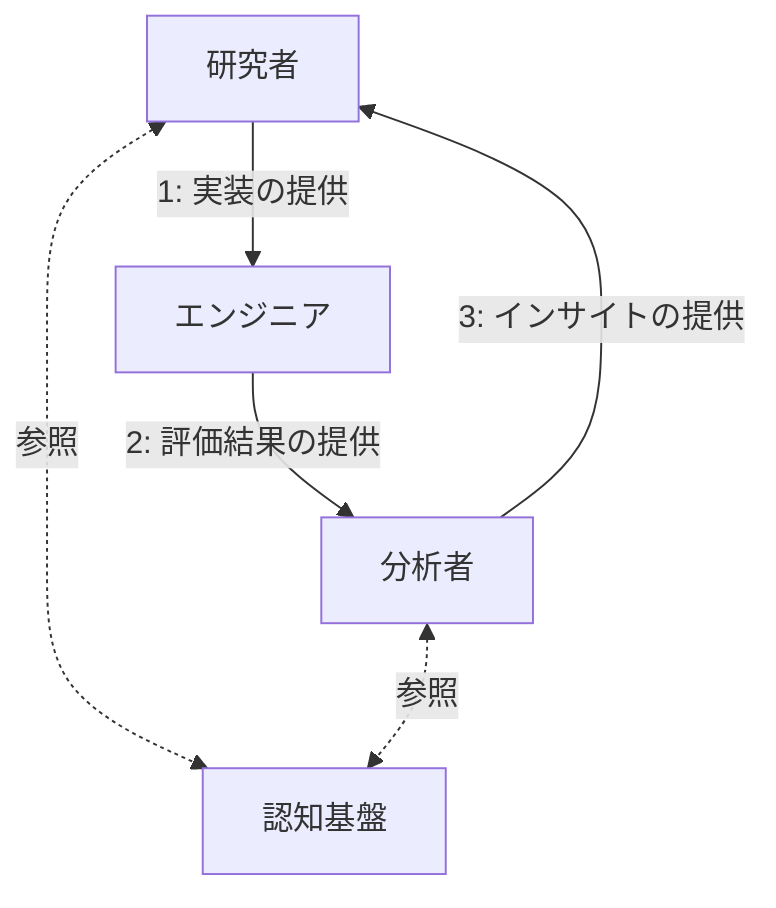

## 要点

- 資本主義において、**ソフトウェアのような質量のない製品は生産コストが低く、利潤率が高い**ため、**人間にソフトウェアを消費させる方が資本主義は成熟しやすい**。
- 生成 AI の登場により、ソフトウェア開発はエンジニアの手作業から、**生成 AI という名の機械による開発のオートメーション化**へと変化しつつある。
- **ソフトウェア開発のオートメーション化は経済的な合理性から導かれるもの**であり、ソフトウェアに関わる人々は、**この事実と、その検証の結果を冷静に整理し、受け入れ、適応すること**が求められる。
- 生成 AI によるソフトウェアのブラックボックス化は、**生成物を適切に疑い、検証し、必要に応じて介入できる余地を残したうえで、前提依存条件に基づく信頼の連鎖上に生成 AI を位置づけたものとして受容できる**。
- 生成 AI が人間に要求するインターフェースは、**目的設定・意味付け・責任、つまりは世界の決定**であり、仮に AI による自律的な価値創造が可能であっても、それらは人間に依存している。
- 上記によって導かれる生存戦略は、**経済成長のために人間をより均一化し、労働する動物としての人間をより加速させるもの**となってしまう。
- AI が自立して生産を行う世界において、**残された人間はどのように生きるべきかという、より根本的で実存的な問いを検討し続ける必要がある**。

## はじめに

2025 年 11 月 25 日に Anthropic の Claude Opus 4.5 の発表に合わせて、同社の Adam Wolff 氏が X にて以下のポストを行いました（二つ目のポスト）。

https://x.com/dmwlff/status/1993036664428806145

> Claude Code のこの新しいモデルは、私たちが突き進んでいる未来を垣間見せてくれるものだと私は信じています。早ければ来年の前半には、ソフトウェアエンジニアリングが完成するでしょう。
>
> コンパイラの出力をチェックしないのと同じ理由で、すぐに生成されたコードをチェックする必要がなくなります。

さらに年末年始にかけて、上記のポストを補完する記事のリンクとともに、以下のようなポストも行われています。

https://x.com/dmwlff/status/2006403495738622040

> ここで私が言いたいのは「コーディング」です。ソフトウェアエンジニアリングには少なくともあと 18 ヶ月かかるでしょう 😅

この二つのポストはつまり、**2026 年にはコーディングが、2027 年にはソフトウェアエンジニアリング自体が生成 AI によって完結する**と主張しています。

Claude Code 以外でも、Google の Antigravity では、もはや人間が指示を出すだけでソフトウェアを完成できるレベルのシステムが登場しており、実際にエンジニアリングが AI によって完結する未来が近づいているのかもしれません。  
しかし現実的には、完全に AI のみでエンジニアリングを完結させることはまだまだ難しく、様々な問題点も指摘されています。

こうした主張に対して、この記事で行いたいことは二つあります。  
一つ目は、**本当にエンジニアリングが不要になるのかを経済・技術・哲学の観点から状況を整理した上で、現時点において、エンジニアないしソフトウェアに関わる人々に求められていることは何かを考察すること**です。  
そしてもう一つは、**その考察によって得られた結論、ないし考察の意義自体を問うこと**です。

この記事で得られる結論に、驚くべき発見はないと思われます。  
ただ、私が本当に問いたいのはその先です。

**ソフトウェア開発がオートメーション化する過程とその先で、労働する動物としてではなく、人間として何をするべきなのか・どうあるべきなのか。**

これを問いたいのです。

:::details 補足: 本記事の前提について
本記事は経済や哲学といった内容を取り扱っておりますが、前提知識は仮定しておりません。

本記事では、ハンナ・アーレントの『人間の条件』を下敷きにした内容が含まれています。  
この本は 20 世紀中ごろの産業社会を背景としており、現代の AI 時代への適用には解釈に飛躍が含まれていますが、本記事ではそれを理解した上であえてこの試みを行います。

専門用語を使用すると内容が難解になってしまうため、『人間の条件』の一部の用語を意図的に平易な表現へ置き換えて記述しています。

『人間の条件』における中心的な問題は、公的領域と Action（行為）の消失にありますが、本記事では Labor（労働）の加速を中心に議論を展開しています。  
そのため本記事では『人間の条件』の全体を意図的にカバーしておらず、またその解説も目的としておりませんので、あらかじめご了承ください。

本記事では経済的な内容も扱いますが、著者自身、経済学を専門としているわけではなく、理解の及ばない点や不十分な整理が含まれている可能性があります。  
その点を踏まえた上で、お読みいただけますと幸いです。
:::

## 資本主義とソフトウェアの関係

本題の前に、資本主義というシステムにおけるソフトウェアの位置づけについて簡単に整理させてください。

当たり前のことですが、ソフトウェアは他の製品と異なり、ソフトウェアやそれを提供するサーバーが動き続ける限り、質量のないものが人間に対して価値を提供します。  
これは何を意味するのかというと、**生産のためにかかるコストが非常に低い**ということです。

質量のある製品は、生産を行うためには材料を調達し、生産設備を用意し、人件費やインフラの維持費をかけて生産を行い、製品を出荷する必要があります。規模が大きくなるほど、生産にかかるコストも増大していきます。  
しかしソフトウェアの場合、生産にかかるコストは、**主に開発にかかる人件費やインフラの維持費**です。  
もちろん開発の初期コストは低くはないですし、ソフトウェアも規模が大きくなればこれらのコストは増加しますが、一度開発されたソフトウェアを追加のユーザーに提供するコストという観点では、質量のある製品と比較すれば圧倒的に低いということが言えます。

生産のコストが低いということは、言い換えれば、**生産にかかるコストに対して、回収できる利益が高い**ことを意味します。  
この特徴は資本主義においては都合が良く、つまり、**人間にソフトウェアを消費させるほうが利潤率が高く、資本の回転が早くなり、結果的に資本主義は成熟しやすい**のです。  
SaaS というビジネスモデルや、サブスクリプションという料金体系がこれほどまでに普及した理由の一つは、この点にあるといえます。

この前提を踏まえた上で、生成 AI とソフトウェア開発の関係について考察を進めていきます。

## 生成 AI はソフトウェア開発をオートメーション化する

生成 AI が台頭する前までのソフトウェアの生産は、**エンジニアの手作業**によって成立していました。  
つまり、エンジニアはプログラミング言語やライブラリ、各種インフラといった材料を組み合わせ、コーディングすることでソフトウェアを生産してきたということです。

ここで問題となっていたのは、工場や機械によって大量生産できる製品と異なり、**ソフトウェアの生産スピードにエンジニアという人間のボトルネックを抱えている**ことです。  
いかにプログラミング言語やインフラが整備され、効率的に開発できる組織や体制を作り上げたとしても、最終的にコードを書くのは、認知能力や作業速度に限界を抱えた人間です。  
この構造はソフトウェア産業が誕生してから近年に至るまで、本質的には変わっていませんでした。

しかし、生成 AI の登場によって、この状況は劇的に変わりました。  
Github Copilot に始まり、Cline、Cursor、Claude Code、Codex など、数多くの AI コーディングツールが登場し、エンジニアのコーディング作業は大幅に効率化されました。  
さらには Devin や Antigravity のように、AI が自律的にタスクやソフトウェア開発を完結させようとするシステムも現れています。

ここまで来ると、生成 AI は単なる道具とは言えず、ハンナ・アーレントの言葉を借りるならば、もはや**機械**の域に達していると考えています。  
つまり現在起きている生成 AI の活用とは、人間が生成 AI という道具を使っているのではなく、**生成 AI という名の機械がスムーズに生産できるよう、むしろ人間ほうが機械に適用する、主客逆転のムーブメント**であるということです。  
ドキュメント駆動開発（DocDD）という開発手法が注目されたのもこのムーブメントの延長であり、この生産をスムーズにできるようソフトウェアの設計から変容した結果だと言えます。

この機械の登場はソフトウェア開発に何を与えたのでしょうか？  
最も重大で、そして本質的な変化は、**ソフトウェア開発のオートメーション化**です。  
産業革命では、手作業で行われていた紡績や製造が機械に置き換わり、様々な製品の生産がオートメーション化されることで、大量生産が可能になりました。  
今ソフトウェア開発で起きていることは、これと同じ、もしくはそれ以上のことです。  
前章と合わせて考えると、我々は**ソフトウェアの高速改善や、ソフトウェアの大量生産・大量消費を目指す世界へと、より舵を切っている**と言えるでしょう。

この世界観において、AI によってエンジニアリングが不要になるか否かという議論は、**実はあまり本質的ではありません**。  
そもそも、**ソフトウェア開発のオートメーション化ができる可能性が出てきた時点で、エンジニアリングを AI よって完結させる方向へと世の中が動くのは、経済的な合理性から導かれた必然的な現象**です。  
なので「できる・できない」ではなく、**「できるようにする」** のです。  
この経済的な要求を今必死に実現しようとしているのが、Anthropic の Claude Code や Google の Antigravity などのプロダクトになるのです。

実際にどこまでオートメーション化できるかや、エンジニアという職業がどのくらい変容するかについては、議論ではなく**検証によって明らかになること**であるため、今のところは未知数です。  
我々にできることは、この不毛な二項対立で消耗することではなく、**この事実と、検証から得られた結果を冷静に整理し、受け入れ、適応すること**ではないでしょうか。

## ソフトウェアの魔術化と前提依存条件

生成 AI の登場で人間の能力は拡張され、今では非エンジニアでもソフトウェア開発を行えるようになりました。  
確かにこれは大きな恩恵ではあるものの、同時に別の懸念も浮かび上がります。

非エンジニアは、ソースコードを詳細に理解することが基本的にできません。  
このとき生成 AI から提供されるソフトウェアは、いわば**魔術**であり、**ブラックボックス**です。  
なぜソフトウェアが動いているかはわからないが、確かに想定通りに動作し、人間の役に立っている。  
しかし、生成 AI から提供されたこの恩恵を、正しいものとして盲信する、ある意味で前時代的とも思えるようなこの状況は、本当に問題がないと言えるのでしょうか？

結論から言えば、**適切に疑い、検証し、必要に応じて介入できるのであれば、問題ない**と考えています。

はじめの Adam Wolff 氏のポストの中に、コードチェックの必要はなくなるとありました。  
なぜそれができるのかというと、彼は以下のように主張しています。

> では、なぜ私たちはコンパイラを信頼するのでしょうか？　それは、コンパイラが決定論的だからでも、検証されているからでもありません。数千、数百万ものユーザーによる長年の使用実績を通じて、信頼を勝ち得てきたからです。バグは表面化し、修正されていきます。エコシステムは成熟していきます。
>
> AI が生成するコードも、同じように時間、利用、そして修正される不具合を通じて信頼を得ていくでしょう。（…）
>
> 信頼は決定論から生まれるものではありません。信頼は獲得されるものです。信頼は社会的なものです。

:::details 原文

> So why do we trust compilers? Not because they're deterministic. Not because we've verified them. We trust them because they've earned it through years of use by thousands or millions of users. Bugs surface and get fixed. The ecosystem matures.
>
> AI-generated code will earn trust the same way—through time, usage, and failures that get fixed....
>
> Trust isn't derived from determinism. Trust is earned. Trust is social.
>
> 引用: <https://secretartofscience.com/the-end>（2026 年 1 月 8 日訪問）

:::

彼の主張する、AI が生成したコードがいずれ信頼されるものになるというのは、その通りだと考えています。  
というのも、そもそもソフトウェアは**前提依存条件**によって成り立っているからです。  
これは**ソフトウェアを構成する個々の要素の中で正しく動くことを保証し、その信頼の上で別の要素を依存させるという方法論**です。

例えば、エンジニアがコードを書くとき、プログラミング言語は正しく動くことを前提として行うことになります。  
しかしそのプログラミング言語もまた、コンパイラやランタイムが正しく動くことを前提としており、さらにコンパイラやランタイムは、OS やハードウェアが正しく動くことを前提としています。  
このようにソフトウェア開発では、エンジニアがより低次のレイヤーを一つひとつ検証することなく、正しく動作することを信頼することで、より高次で抽象的な表現を実現してきました。  
いわば、**ソフトウェアは根底から信頼の連鎖の上で成り立っている**のです。

もしそうであるならば、**生成 AI もこの連鎖の上に置くことができる**と考えるのは、そこまで不自然なことではないはずです。  
生成 AI が生成したコードが正しく動くものとして信頼し、その成果物を人間が利用する。ある意味でこれは、ソフトウェア開発における究極の信頼の形態と言えるのかもしれません。

ただし重要なこととして、**提供されたものが本当に正しいものなのかを疑ったり、検証する余地は残すべき**だと考えます。  
当たり前のことですが、生成 AI は全知全能の神ではありません。これを盲信することは危険です。  
どのようにしてその余地を残すかの詳細な議論は割愛いたしますが、例えば、外側からソフトウェアの正確さを確認したり、内側のシステムの観測可能性といった、**ソフトウェアの品質を観測できる仕組みを確保する**といった工夫が求められるのではないでしょうか。

前提依存条件やソフトウェアの品質については、以下の記事にて詳しく論じていますので、興味があればぜひご参照ください。

https://zenn.dev/wizleap_tech/articles/8e26df93acdeb8

## 生成 AI が要求するインターフェース

非エンジニアでもソフトウェア開発ができるようになったのは、ソフトウェア開発に本来必要だった技術的なスキルに替わって、**生成 AI という機械が要求するインターフェースに非エンジニアでも適用できるようになったから**です。  
では、生成 AI が人間に要求するインターフェースとは、一体どのようなものでしょうか？

### 生成 AI にもできること

この問いに対して、ここでは 2025 年 7 月に提出された **AlphaGo Moment for Model Architecture Discovery** という論文をもとに考察しようと思います。

この論文は一言で言えば、**AI 研究を AI が自律的に行うこと（ASI4AI）は可能であるかを検証した研究**です。

この研究では、**ASI-ARCH** というシステムを提唱し、以下の AI エージェントによる作業のサイクルを繰り返すことで実験を行っています。

- **研究者**: 認知基盤から参照した研究をもとに新しいアーキテクチャを提案し、実装を行う。
- **エンジニア**: 研究者が実装したコードから、実際の学習環境でモデルを実行し、評価を行う（失敗した場合は自律的にコードを修正する）。
- **分析者**: 上記の結果と認知基盤から得られる知見との比較を通して分析し、その結果をインサイトとして次の研究サイクルへと引き継ぐ。
- **認知基盤**: 先行研究から抽出された科学的知見のデータベース。

この AI エージェント群に対して、DeltaNet という既存のモデルをベースラインとして与え、その性能を超えるアーキテクチャを発見するという研究を行わせました。

サイクルの結果、AI は 1773 回の自律的な実験のうち、**106 個の新しい SOTA（State of the Art）アーキテクチャを発見することができました**。  
また、**発見されたアーキテクチャの累積数は、投入した計算時間と強い相関がある**ことが認められています。  
これにより、**ASI-ARCH における研究では、GPU リソースへ投資すればより高性能なモデルを開発できる可能性がある**という考察がなされています。

どういうことかというと、これまでの研究では、人間の認知能力が研究スピードのボトルネックとなっていました。  
しかし ASI4AI における研究スピードは、 AI の稼働スピード、言ってしまえば GPU リソースの豊かさに依存しています。  
そのため、やるべきことは単純明快でして、もしより高性能なモデルを発見したいのであれば、**GPU リソースに投資すればその確率が高くなる**ということを、この論文は主張しているのです。

もしこうした AI による自律的な研究がソフトウェアエンジニアリングの分野でも可能であるならば、文字通りエンジニアリングは不要になるかもしれません。  
例えば、過去にモノリシックなシステムが中心だった時代に、マイクロサービスという概念の登場によってシステム設計が大きく変わりました。  
**こうした新しい概念の発掘を、AI が行える可能性**があるのです。

もちろん、この研究は ASI4AI という限られた分野での実験であり、他分野においても同様であるかは未知数です。  
ただ、その可能性が示されていることは確かだと思います。

### 人間にしかできないこと

なるほど、AI も自律的に新しい価値の創造ができるかもしれないことはわかった。  
では、AI にはできず、人間にしかできない、この責務の境界はどこにあるのでしょうか？

上記の研究において、ASI-ARCH のサイクルをスタートさせるためには、人間の**目的設定**が必要でした。  
それは DeltaNet をベースラインとして与えたことと、その性能を超えるアーキテクチャを発見するという目的設定がこれに当たります。  
また、研究サイクル自体の**意味付け**にも人間が必要となります。  
なぜ DeltaNet を超えるアーキテクチャを発見することが重要なのか、この問いに答えるのは人間です。

そしてなにより、その結果に対して**責任**を持つのは人間です。  
生成 AI が行っていることは、受け取ったプロンプトに基づいてベクトルデータを返却しているに過ぎません。  
その結果がどのように扱われ、どのように世界へ影響するのか、生成 AI は考慮できません。

生成 AI により、ソフトウェア開発に限らず多くの文脈において、製品のオートメーション化は進むでしょう。  
しかし、膨大なサービスやコンテンツを生成することに対して、「なんでそれやってるの？」という問に答えるのは**人間**です。  
またそうして生産されたものを大量に消費する（させる）ことに対して、「なんでそれが必要なの？」という問いに答えるのも**人間**です。  
そして、その現実を引き受けるのも**人間**です。

人間に求められているものは、ここにあるのではないでしょうか。  
目的・意味付け・責任――私の言葉で言い換えれば、**生成 AI は世界の決定を要求している**。

## 結びに代えて - Action へ

オートメーション化される生産の中に人間の意図や目的は存在せず、経済成長のための消費財を作り出すことのみが行われ、生成 AI という機械は、インターフェースとして世界の決定を人間に要求している。  
これに応えることが、ソフトウェア開発に関わる人々に求められている生存戦略である。

もちろん仮説ではありますし、これとは全く別の視点で得られる結論もあると思いますが、ひとまず私はこの戦略を実践してみようと考えています。

しかし、結論としてはこうであるものの、本当にこれで良いのでしょうか。

というのも、この生存戦略は言い換えれば、**機械がうまく生産できるように作業しましょう**と言っているに過ぎません。  
機械としての AI がこういったことを要求する背景には資本主義があるわけでして、上記の戦略によってこのシステムでは生き残れるのかもしれませんが、**それはただ盲目的に社会へ適応しているだけであり、その選択自体が本当に人間的であるのかには疑問がある**のです。  
ハンナ・アーレント的に言えば、これは**経済成長のために人間をより均一化し、労働する動物としての人間をより加速させる戦略**なのではないかと。

今人類が直面している問題は、AI によって職が奪われるとか、生存戦略といった局所的な問題もありはするものの、もっと根本のところにおいて、**AI が自立して生産を行う世界において、残された人間はどのように生きるべきかという、より実存的な問題に直面している気がしてならない**のです。  
そうした状況の中で、より懸念がある世界の方へ誘導するような戦略を提示しているこの矛盾に、私の不安が残るのです。

もちろんアーレントの主張がすべて正しいとは思っていませんし、そもそもこれは傲慢であることも自覚しています。  
ただ、そこを見て見ぬふりで蓋をして、この記事を投稿することは誠実ではないと感じますし、何より彼女への敬意に欠ける行為だと思いますので、最後に記させていただきました。

こうした矛盾に対して、私は答えを持っていません。というより、ここに答えはありません。  
**だからこそ次の Action、次の対話を求めたいのです**。  
この記事は一つの消費財に過ぎないと思います。  
ただそれと同時に、これが我々の対話のきっかけとなる Work でもあり得るものとして、私は賭けたいのです。

## 参考

- <https://x.com/dmwlff/status/1993036664428806145>（2026 年 1 月 8 日閲覧）
- <https://x.com/dmwlff/status/2006403495738622040>（2026 年 1 月 8 日閲覧）
- 【落合陽一】東浩紀「人類は自然を明らかにすることなんかできない」「この“詐欺”みたいな事から、いかに人の目を覚まさせるか」 情報・AI 時代、どう『喜びと祈りの時間』を取り戻せるか？［再編 ver.］ - YouTube
  <https://youtu.be/oBMNDxor1K0>（2026 年 1 月 8 日閲覧）
- ハンナ・アレント『人間の条件』（牧野雅彦訳、講談社学術文庫、2023 年）
- 🔚 This is the End
  <https://secretartofscience.com/the-end>（2026 年 1 月 8 日閲覧）
- ソフトウェアの品質定義と技術的な意思決定
  <https://zenn.dev/wizleap_tech/articles/8e26df93acdeb8>（2026 年 1 月 8 日閲覧）
- Y. Liu, Y. Nan, W. Xu, X. Hu, L. Ye, Z. Qin, and P. Liu, "AlphaGo Moment for Model Architecture Discovery," arXiv:2507.18074 [cs.AI], Jul. 2025.
