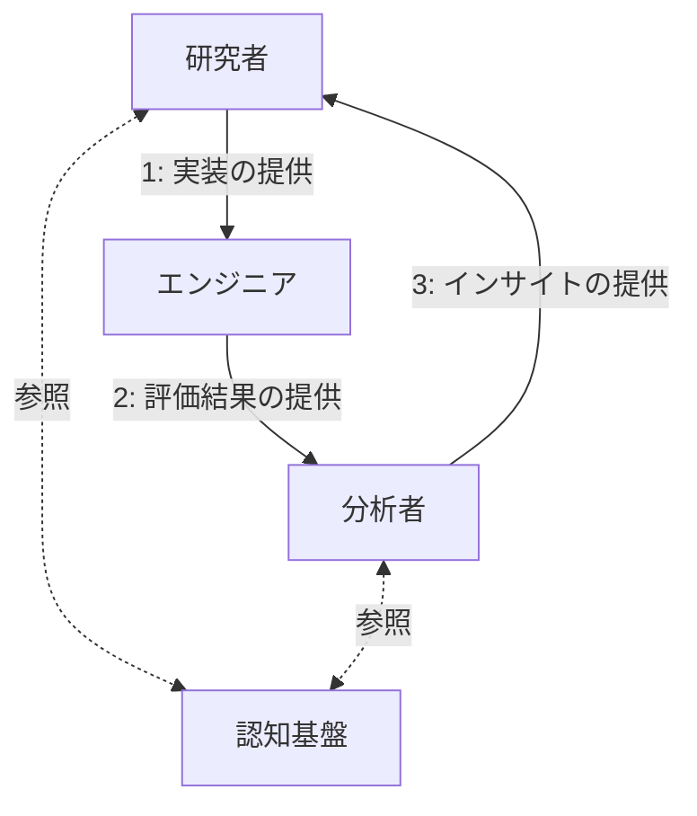

## はじめに

2025 年 11 月 25 日に Anthropic の Claude Opus 4.5 の発表に合わせて、同社の Adam Wolff 氏が X にて以下のポストを行いました（二つ目のポスト）。

https://x.com/dmwlff/status/1993036664428806145

> Claude Code のこの新しいモデルは、私たちが突き進んでいる未来を垣間見せてくれるものだと私は信じています。早ければ来年の前半には、ソフトウェアエンジニアリングが完成するでしょう。
>
> コンパイラの出力をチェックしないのと同じ理由で、すぐに生成されたコードをチェックする必要がなくなります。

さらに年末年始にかけて、上記のポストを補完する記事のリンクとともに、以下のようなポストも行われています。

https://x.com/dmwlff/status/2006403495738622040

> ここで私が言いたいのは「コーディング」です。ソフトウェアエンジニアリングには少なくともあと 18 ヶ月かかるでしょう 😅

この二つのポストはつまり、**2026 年にはコーディングが、2027 年にはソフトウェアエンジニアリング自体が生成 AI によって完結する**と主張しています。

Claude Code 以外でも、Google の Antigravity では、もはや人間が指示を出すだけでソフトウェアを完成できるレベルのシステムが登場しており、実際にエンジニアリングが AI によって完結する未来が近づいているのかもしれません。  
しかし現実的には、完全に AI のみでエンジニアリングを完結させることはまだまだ難しく、様々な問題点も指摘されています。

こうした主張に対して、この記事で行いたいことは二つあります。  
一つ目は、**本当にエンジニアリングが不要になるのかを経済・技術・哲学の観点から状況を整理した上で、現時点において、エンジニアないしソフトウェアに関わる全ての人に求められていることは何なのかを考察すること**です。  
そしてもう一つは、**その考察によって得られた結論ないしその考察の意義自体を問うこと**です。

前提知識は基本的に仮定していませんが、一般的な技術記事と異なり、最後の章に哲学上の踏み込んだ内容が含まれております。哲学はこの記事のコンセプトの一つとなっているため、ご理解いただけますと幸いです。

この記事で得られる結論に大きな驚きはないと思われます。どういった経路を辿っても、行き着く先はみな同じです。  
ただ、私が本当に問いたいのはその先の話です。  
**ソフトウェア開発がオートメーション化する過程とその先で、労働する動物としてではなく、人間として何をすべきなのか・どうあるべきなのか。**  
**これを問いたいのです。**

## 資本主義とソフトウェアの関係

本題の前に、資本主義というシステムにおけるソフトウェアの位置づけについて簡単に整理させてください。

当たり前のことですが、ソフトウェアは他の製品と異なり、ソフトウェアやそれを提供するサーバーが動き続ける限り、質量のないものが人間に対して価値を提供します。  
これは何を意味するのかというと、**生産のためにかかるコストが非常に低い**ということです。

質量のある製品は、生産を行うためには材料を調達し、生産設備を用意し、人件費をかけて生産を行う必要があります。規模が大きくなればなるほど、生産にかかるコストも増大します。  
しかしソフトウェアの場合、生産にかかるコストは、**主に開発にかかる人件費やインフラの維持費**です。  
もちろんソフトウェアも規模が大きくなればこれらのコストは増加しますが、質量のある製品と比較すれば圧倒的に低コストで生産できることは想像がつくと思います。

生産のコストが低いということは、言い換えれば、**生産にかかるコストに対して、回収できる利益が高い**ことを意味します。  
この特徴は資本主義というシステムにおいては都合が良く、つまり、**人間にソフトウェアを消費させるほうが資本主義は成熟しやすい**のです。  
SaaS というビジネスモデルや、サブスクリプションという料金体系がこれほどまでに普及したのは、この理由によるものといえます。

この前提を踏まえた上で、生成 AI とソフトウェア開発の関係について考察を進めていきます。

## 生成 AI はソフトウェア開発をオートメーション化する

生成 AI が台頭する前までのソフトウェアの生産は、**エンジニアの手作業**によって成立していました。  
つまり、エンジニアはプログラミング言語やライブラリ、各種インフラといった材料を組み合わせ、コーディングすることでソフトウェアを生産してきたということです。

ここで問題となっていたのは、工場や機械によって大量生産できる製品と異なり、**ソフトウェアの生産スピードに、エンジニアという人間のボトルネックを抱えている**ことです。  
いかにプログラミング言語やインフラが整備され、効率的に開発できる組織や体制を作り上げたとしても、最終的にコードを書くのは、認知能力や作業速度に限界を抱えた人間です。  
この構造はソフトウェア産業が誕生してから近年に至るまで、本質的には変わっていませんでした。

しかし、生成 AI の登場によって、この状況は劇的に変わりました。  
Github Copilot に始まり、Cline、Cursor、Claude Code、Codex など、数多くの AI コーディングツールが登場し、エンジニアのコーディング作業は大幅に効率化されました。  
さらには Devin や Antigravity のように、AI が自律的にタスクやソフトウェア開発そのものを完結させようとするシステムも現れています。

ここまで来ると、生成 AI は単なる道具とは言えず、ハンナ・アーレントの言葉を借りるならば、もはや**機械**の域に達していると考えています。  
つまり、現在起きている生成 AI の活用とは、人間が生成 AI という道具を使っているのではなく、**生成 AI という名の機械がスムーズに生産できるよう、人間が適用するという、主客逆転のムーブメント**だということです。  
ドキュメント駆動開発（DocDD）という開発手法が注目されたのもこのムーブメントの延長であり、この生産をスムーズにできるようソフトウェアの設計から変容した結果だと言えます。

この機械の登場はソフトウェア開発に何を与えたのでしょうか？  
最も重大で、そして本質的な変化は、**ソフトウェア開発のオートメーション化**です。  
産業革命では、機械によって様々な製品の生産がオートメーション化され、手作業で行われていた紡績や製造が機械に置き換わり、大量生産が可能になりました。  
今ソフトウェア開発で起きていることは、これと同じ、もしくはそれ以上のことです。  
先の資本主義とソフトウェアの関係も合わせて考えると、我々は**ソフトウェアの高速改善や、ソフトウェアの大量生産・大量消費**を目指す世界へと舵を切りつつあるのです。

この世界観において、AI によってエンジニアリングが不要になるか否かという議論は、**実は本質的ではありません**。  
そもそも、**ソフトウェア開発のオートメーション化ができる可能性が出てきた時点で、エンジニアリングを AI という機械によって完結させる方向へと世の中が動くのは、ある意味で必然的な帰結**です。  
「できる・できない」ではなく、**「なんと言われようと、できるようにする」** のです。  
この経済的な要求を今必死に実現しようとしているのが、Anthropic の Claude Code や Google の Antigravity といったプロダクトになるのです。

もちろん、実際にどこまでオートメーション化できるのかは、これからの検証によって明らかになることであり、今のところは未知数です。  
今我々にできることは、この不毛な二元論で消耗することではなく、**この事実と、検証から得られた結果を冷静に整理し、受け入れ、適応することです**。

## ソフトウェアの魔術化と前提依存条件

生成 AI の登場で人間の能力は拡張され、今では非エンジニアでもソフトウェア開発を行えるようになりました。  
確かにこれは大きな恩恵ではあるものの、同時に別の懸念も浮かび上がります。

非エンジニアは、ソースコードを詳細に理解することが基本的にできません。  
このとき生成 AI から提供されるソフトウェアというのは、言わば**魔術**であり、**ブラックボックス**です。  
なぜソフトウェアが動いているのかはわからないが、確かに想定通りに動作し、人間の役に立っている。  
しかし、生成 AI から提供されたこの恩恵を、正しいものとして盲信する、ある意味で前時代的とも思えるようなこの状況は、本当に問題がないといえるのでしょうか？

結論から言えば、**適切に疑い、検証し、必要に応じて介入できるのであれば、問題ない**と考えています。

はじめの Adam Wolff 氏のポストの中に、コードチェックの必要はなくなるとありました。  
なぜそれができるのかというと、彼は以下のように主張しています。

> では、なぜ私たちはコンパイラを信頼するのでしょうか？それは、コンパイラが決定論的だからでも、検証されているからでもありません。数千、数百万ものユーザーによる長年の使用実績を通じて、信頼を勝ち得てきたからです。バグは表面化し、修正されていきます。エコシステムは成熟していきます。
>
> AI が生成するコードも、同じように時間、利用、そして修正される不具合を通じて信頼を得ていくでしょう。（…）
>
> 信頼は決定論から生まれるものではありません。信頼は獲得されるものです。信頼は社会的なものです。

:::details 原文

> So why do we trust compilers? Not because they're deterministic. Not because we've verified them. We trust them because they've earned it through years of use by thousands or millions of users. Bugs surface and get fixed. The ecosystem matures.
>
> AI-generated code will earn trust the same way—through time, usage, and failures that get fixed....
>
> Trust isn't derived from determinism. Trust is earned. Trust is social.
>
> 引用: <https://secretartofscience.com/the-end>（2026 年 1 月 8 日訪問）

:::

彼の主張する、AI が生成したコードがいずれ信頼されるものになるというのは、おそらくその通りだと考えています。  
というのも、そもそもソフトウェアは**前提依存条件**によって成り立っているからです。  
これは**ソフトウェアを構成する個々の要素の中で正しく動くことを保証し、その信頼の上で別の要素を依存させるという方法論**です。

例えば、エンジニアがコードを書くとき、プログラミング言語は正しく動くことを前提として行うことになります。  
しかしそのプログラミング言語もまた、コンパイラやランタイムが正しく動くことを前提としており、さらにコンパイラやランタイムは、OS やハードウェアが正しく動くことを前提としています。  
このようにソフトウェア開発では、エンジニアがより低次のレイヤーを一つひとつ検証することなく、正しく動作することを信頼することで、より高次で抽象的な表現を実現してきました。  
いわば、**ソフトウェアは根底から信頼の連鎖の上で成り立っている**のです。

もしこの連鎖の上に成り立つならば、**生成 AI もこの連鎖の上に置くことができる**と考えるのは、そこまで不自然なことではないはずです。  
生成 AI が生成したコードが正しく動くものとして信頼し、その成果物を人間が利用する。ある意味でこれは、ソフトウェア開発における究極の信頼の形態と言えるのかもしれません。

ただし重要なこととして、**提供されたものが本当に正しいものなのかを疑ったり、検証する余地は残すべき**だと考えます。  
当たり前のことですが、生成 AI は全知全能の神ではありません。これを盲信することは危険です。  
例えば、外側からソフトウェアの正確さを確認したり、内側のシステムの観測可能性といった、**ソフトウェアの品質を観測できる仕組みを確保する**といった工夫が求められるのではないでしょうか。

前提依存条件やソフトウェアの品質については、以下の記事で詳しく論じていますので、ご興味があればご参照ください。

https://zenn.dev/wizleap_tech/articles/8e26df93acdeb8

## 生成 AI が要求するインターフェース

ソフトウェア開発がオートメーション化されたとしても、それは人間が不要になることを意味しません。  
機械は自分自身をうまく扱うためのインターフェースを人間に提示し、人間はそこに対して適用する形で関わり続けます。  
では、生成 AI という機械が人間に要求するインターフェースとは、一体どのようなものでしょうか？

### 生成 AI にもできること

この問いに対して、ここでは 2025 年 7 月に提出された **AlphaGo Moment for Model Architecture Discovery** という論文をもとに考察しようと思います。

この論文は一言で言えば、**AI 研究を AI が自律的に行うこと（ASI4AI）は可能であるかを検証した研究**です。

この研究では、**ASI-ARCH** というシステムを提唱し、以下の AI エージェントによる作業のサイクルを繰り返すことで実験を行っています。

- **研究者**: 認知基盤から参照した研究をもとに新しいアーキテクチャを提案し、実装を行う。
- **エンジニア**: 研究者が実装したコードから、実際の学習環境でモデルを実行し、評価を行う（失敗した場合は自律的にコードを修正する）。
- **分析者**: 上記の結果と認知基盤から得られる知見との比較を通して分析し、その結果をインサイトとして次の研究サイクルへと引き継ぐ。
- **認知基盤**: 先行研究から抽出された科学的知見のデータベース。

この AI エージェント群に対して、DeltaNet という既存のモデルをベースラインとして与え、その性能を超えるアーキテクチャを発見するという研究を行わせました。

サイクルの結果、AI は 1773 回の自律的な実験のうち、**106 個の新しい SOTA（State of the Art）アーキテクチャを発見することができました**。  
また、**発見されたアーキテクチャの累積数は、投入した計算時間と強い相関がある**ことが認められています。  
これにより、**ASI-ARCH における研究では、GPU リソースへ投資すればより高性能なモデルを開発できる可能性が示唆されている**という考察がなされています。

どういうことかというと、これまでの研究では、人間の認知能力が研究スピードのボトルネックとなっていました。  
しかし AI を用いた研究において、研究スピードは AI の稼働スピード、言ってしまえば、GPU リソースの豊かさに依存しています。  
そのためやることは非常にシンプルでして、もしより高性能なモデルの研究を行いたいのであれば、**GPU リソースに投資すればその確率が高くなる**ということを、この論文は主張しているのです。

もしこうした AI による自律的な研究がソフトウェアエンジニアリングの分野でも可能であるならば、文字通りエンジニアリングは不要になるかもしれません。  
例えば、過去にモノリシックなシステムが中心だった時代に、マイクロサービスという概念の登場によってシステム設計が大きく変わりました。  
**こうした新しい概念の発掘を、AI が行える可能性**があるのです。

もちろん、この研究は ASI4AI という限られた分野での実験であり、他分野においても同様であるかは未知数です。  
ただ、その可能性が示されていることは確かだと思います。

### 人間にしかできないこと

なるほど、AI にも自律的に新しい価値の創造ができそうなことはわかった。  
では、AI にはできず、人間にしかできない、この責務の境界はどこにあるのでしょうか？

上記の研究において、ASI-ARCH のサイクルをスタートさせるためには、**人間の目的設定**が必要となります。  
それは DeltaNet をベースラインとして与えたことと、その性能を超えるアーキテクチャを発見するという目的設定がこれに当たります。  
また、**そもそもの研究サイクル自体の意味付けにも人間**が必要となります。  
なぜ DeltaNet を超えるアーキテクチャを発見することが重要なのか、この問いに答えるのは人間です。

つまり、**AI による自律的な価値創造が可能だとしても、その目的設定や意味付けは人間に依存している**のです。

生成 AI により、ソフトウェア開発に限らず多くの文脈において、製品のオートメーション化は進むでしょう。  
しかし、膨大なサービスやコンテンツを生成することに対して、「なんでそれやってるの？」という問に答えるのは人間です。
またそうして大量生産されたものを大量に消費させることに対して、「なんでそれが必要なの？」という問いに答えるのも人間です。

AI が人間に要求しているものは、ここにあるのではないでしょうか。  
**生成 AI は、意味付けを要求している**。

## 結びに代えて - Action へ

オートメーションされた生産の中に人間の意図や目的は存在せず、経済成長のための消費財を作り出すことのみが行われ、生成 AI という機械は、インターフェースとしてここに意味付けや目的設定を人間に要求している。

結論としてはこうであるものの、本当にこれで良いのでしょうか。

上記を生存戦略と捉えるならば、要するにこれはソフトウェアのオートメーション化に人間が適合することとイコールです。  
ハンナ・アーレントに言わせれば、この生存戦略は**人間をより均一化し、労働する動物としての人間をより加速させるもの**になると思います。  
仮説ではあるものの、ここまで議論した生存戦略はおそらく正しいと私は考えています。  
ただ、その生存戦略自体を選択することは、活動の目的自体を消失させ、行為のための共通世界を破壊し、より労働（labor）に人間を縛り付けることに加担している気がしてならないのです。  
人類が今直面している問題は、AI によって職が奪われるとか、生存戦略といった局所的な問題ではなく、AI が自立して生産を行う世界において、残された人間はどのように生きるべきかという、もっと根本的で実存的な問題に直面している気がしてならないのです。  
ここに私の不安と憂鬱が残っているのです。

もちろんアーレントの主張がすべて正しいとは思っていませんし、そもそもこれは傲慢であることも自覚しています。  
ただ、そこに対して蓋をして、この記事を投稿することは誠実ではないと考え、あえてここに記します。

この矛盾に対して、私は答えを持っていません。  
だからこそ次の Action、次の言論を求めています。  
この記事は一つの Work でしかありませんが、この Work を通して、次の Action のきっかけとしたいというのが、この記事における最大の目的なのです。

## 参考

- <https://x.com/dmwlff/status/1993036664428806145>（2026 年 1 月 8 日閲覧）
- <https://x.com/dmwlff/status/2006403495738622040>（2026 年 1 月 8 日閲覧）
- 【落合陽一】東浩紀「人類は自然を明らかにすることなんかできない」「この“詐欺”みたいな事から、いかに人の目を覚まさせるか」 情報・AI 時代、どう『喜びと祈りの時間』を取り戻せるか？［再編 ver.］ - YouTube
  <https://youtu.be/oBMNDxor1K0>（2026 年 1 月 8 日閲覧）
- ハンナ・アレント『人間の条件』（牧野雅彦訳、講談社学術文庫、2023 年）
- 🔚 This is the End
  <https://secretartofscience.com/the-end>（2026 年 1 月 8 日閲覧）
- ソフトウェアの品質定義と技術的な意思決定
  <https://zenn.dev/wizleap_tech/articles/8e26df93acdeb8>（2026 年 1 月 8 日閲覧）
- Y. Liu, Y. Nan, W. Xu, X. Hu, L. Ye, Z. Qin, and P. Liu, "AlphaGo Moment for Model Architecture Discovery," arXiv:2507.18074 [cs.AI], Jul. 2025.
