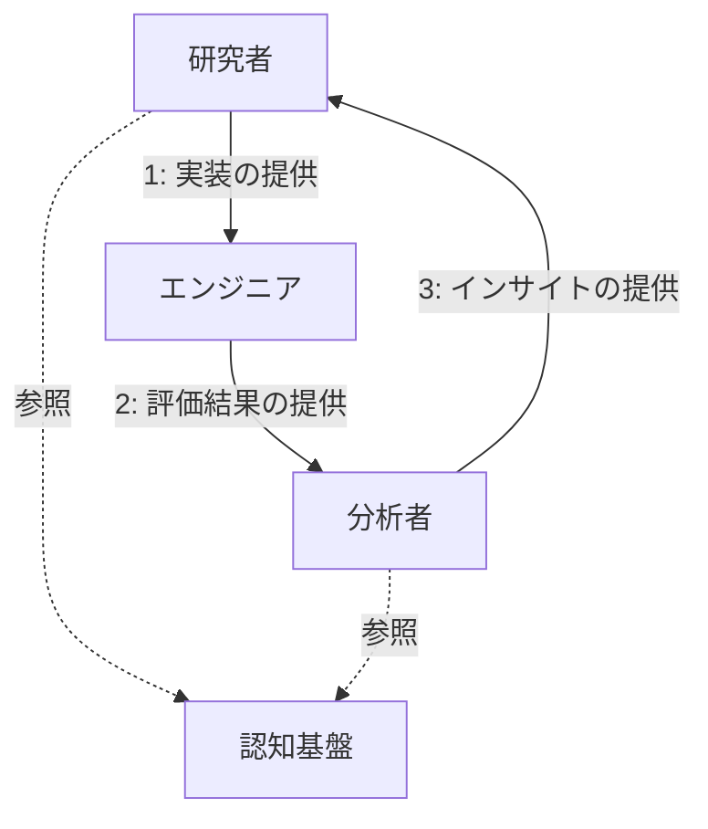

## 要点

- 資本主義におけるソフトウェア開発は、**オープンソースと経済活動の循環の中で効率化され、スタートとリセットが激化する世界観の中で行われるもの**となっている。
- 生成 AI の登場により、ソフトウェア開発はエンジニアの手作業から、**生成 AI という名の機械による開発のオートメーション化**へと変化しつつある。
- **ソフトウェア開発のオートメーション化は経済的な合理性からの要求**であり、ソフトウェアに関わる人々は、**この事実と、その検証の結果を冷静に整理し、現状を受け入れ、適応すること**が求められる。
- 生成 AI によるソフトウェアのブラックボックス化は、**生成物を適切に疑い、検証し、必要に応じて介入できる余地を残したうえで、前提条件依存に基づく信頼の連鎖上に生成 AI を位置づけたものとして受容できる**。
- 生成 AI が人間に要求するインターフェースは **What・Why・責任** であり、これに応えることがソフトウェア開発に関わる人々に求められている生存戦略である。

## はじめに

2025 年 11 月 25 日に Anthropic の Claude Opus 4.5 の発表に合わせて、同社の Adam Wolff 氏が X にて以下のポストを行いました（二つ目のポスト）。

https://x.com/dmwlff/status/1993036664428806145

> Claude Code のこの新しいモデルは、私たちが突き進んでいる未来を垣間見せてくれるものだと私は信じています。早ければ来年の前半には、ソフトウェアエンジニアリングが完成するでしょう。
>
> コンパイラの出力をチェックしないのと同じ理由で、すぐに生成されたコードをチェックする必要がなくなります。

さらに年末年始にかけて、上記のポストを補完する記事のリンクとともに、以下のようなポストも行われています。

https://x.com/dmwlff/status/2006403495738622040

> ここで私が言いたいのは「コーディング」です。ソフトウェアエンジニアリングには少なくともあと 18 ヶ月かかるでしょう 😅

この二つのポストはつまり、**2026 年にはコーディングが、2027 年にはソフトウェアエンジニアリング自体が生成 AI によって完結する**と主張しています。

Claude Code 以外でも、Google の Antigravity では、もはや人間が指示を出すだけでソフトウェアを完成できるレベルのシステムが登場し始めています。  
私の周りでも、そこまでエンジニアリングに詳しくない方が Vibe Coding によって次々とプロダクトを生み出し、仮説・検証を高速で繰り返すというお話を聞くようになりました。  
このような現実を見ていると、実際にエンジニアリングが AI によって完結する未来は近づいているのかもしれません。

しかし一方では、完全に AI のみでエンジニアリングを完結させることはまだまだ難しく、様々な問題点も指摘されておりますし、私自身の体感としても、まだ多くの課題が残されているように感じます。

こうした主張に対してこの記事で行いたいことは、**本当にエンジニアリングが不要になるのかを経済・哲学・技術の観点から状況を整理した上で、現時点において、エンジニアないしソフトウェアに関わる人々に求められていることは何かを考察すること**です。

逆に、**AI 時代における具体的な実践方法や解決策を提示すること、またエンジニア必要・不要論という二項対立に結論を出すことは、この記事の目的ではありません**。  
前者は各々の環境や状況、また対象とする問題によって回答が異なるため一概には言えず、後者はそもそも本質的な問いではないと考えているからです（後述）。

:::details 補足: 本記事の前提について
本記事は経済や哲学といった内容を取り扱っておりますが、前提知識は仮定しておりません。

本記事では、ハンナ・アーレントの『人間の条件』を下敷きにした内容が含まれています。  
この本は 20 世紀中ごろの産業社会を背景としており、現代の AI 時代への適用には解釈に飛躍が含まれていますが、本記事ではそれを理解した上であえてこの試みを行います。

専門用語を使用すると内容が難解になってしまうため、『人間の条件』の一部の用語を意図的に平易な表現へ置き換えて記述しています。

『人間の条件』における中心的な問題は、公的領域と Action（行為）の消失にありますが、本記事では Labor（労働）の加速を中心に議論を展開しています。  
そのため本記事では『人間の条件』の全体を意図的にカバーしておらず、またその解説も目的としておりませんので、あらかじめご了承ください。

本記事では経済的な内容も扱いますが、著者自身、経済学を専門としているわけではなく、理解の及ばない点や不十分な整理が含まれている可能性があります。  
その点を踏まえた上で、お読みいただけますと幸いです。
:::

## 資本主義におけるソフトウェア開発の現状

現代のエンジニアがソフトウェアを開発する際に、**オープンソース**を利用せずに構築することはほとんどないでしょう。  
オープンソースではソースコードを秘匿にするのではなく、知見を公開して共有する方が開発者コミュニティ全体にとって有益であるという考え方に基づいていますが、なぜこうした世界観が可能なのでしょうか？  
理由は非常にシンプルでして、それは**ソースコードに質量がないから**です。

当たり前のことですが、ソースコードはデジタルデータであるためコピー可能であり、その限界費用はゼロになります。  
この性質によってオープンソースは万人に対して開かれ、**物質性を超越した共有材**としてソフトウェアへと活用することができるようになります。  
共有材としてのオープンソースを活用することで効率的にソフトウェアは開発され、その過程において得られた知見がオープンソースへと投下されることによって、さらに効率的な開発が可能になる循環構造が生まれます。  
これによりオープンソースと経済の発展は相互に加速することが可能となりました。

この加速によって経済市場はどのように変化したでしょうか？  
一言で言えば、それは**スタートとリセットのサイクルの高速化**です。  
例えばベンチャー企業の九割は数年で倒産する話はよく聞くと思いますが、それが意味することは、ほとんどのベンチャー企業はシリーズAの資金調達をする前のシードの段階で、市場価値を高めることができずに頓挫（市場価値がリセット）するということです。

こうしたことが起きる背景は主に二つあります。

まず一つ目は、**オープンソースによるコモディティ化の高速化**です。  
オープンソースが可能となった世界観では、誰しもがそこへアクセスし、活用することができます。  
一方でそれが意味することは、何か新しい価値を市場に生み出したとしても、それがすぐにオープンソースへと還元されてしまい、そのものの価値がすぐに一般化（コモディティ化）するということです。  
このコモディティ化によって価値が回収されてしまった企業はリセットを余儀なくされることになります。

そして二つ目は、**市場寡占化への高速化**です。  
オープンソースの存在によってソフトウェアを高速に構築できるようになった世界では、何らかの領域で市場が寡占し始めると、勝者は一気にスケールし、敗者は差別化ができずにリセットされることになります。

このように現代におけるソフトウェア開発は、**オープンソースとの循環構造の中で効率化され、スタートとリセットが激化する世界観の中で行われるもの**となっています。

この前提を踏まえた上で、生成 AI とソフトウェア開発の関係について考察を進めていきます。

## 生成 AI はソフトウェア開発をオートメーション化する

生成 AI が台頭する前までのソフトウェアの生産は、**エンジニアの手作業**によって成立していました。  
つまり、エンジニアはプログラミング言語やライブラリ、各種インフラといった材料を組み合わせ、コーディングすることでソフトウェアを生産してきたということです。

ここで問題となっていたのは、工場や機械によって大量生産できる製品と異なり、**ソフトウェアの生産スピードにエンジニアという人間のボトルネックを抱えている**ことです。  
いかにプログラミング言語やインフラが整備され、効率的に開発できる組織や体制を作り上げたとしても、最終的にコードを書くのは、認知能力や作業速度に限界を抱えた人間です。  
この構造はソフトウェア産業が誕生してから近年に至るまで、本質的には変わっていませんでした。

しかし、生成 AI の登場によって、この状況は劇的に変わりました。  
Github Copilot に始まり、Cline、Cursor、Claude Code、Codex など、数多くの AI コーディングツールが登場し、エンジニアのコーディング作業は大幅に効率化されました。  
さらには Devin や Antigravity のように、AI が自律的にタスクやソフトウェア開発を完結させようとするシステムも現れています。

これを単なる道具と言うこともできますが、ハンナ・アーレントの言葉を借りるならば、これは新しい**機械**と捉えることもできます。  
つまり現在起きている生成 AI の活用とは、人間が生成 AI という道具を使っているのではなく、**生成 AI という名の機械がスムーズに生産できるよう、むしろ人間ほうが機械に適用する、主客逆転のムーブメント**であるということです。  
ドキュメント駆動開発（DocDD）という開発手法が注目されたのもこのムーブメントの延長であり、この生産をスムーズにできるようソフトウェアの設計から変容した結果だと言えます。

この機械の登場はソフトウェア開発に何を与えたのでしょうか？  
最も本質的な変化は、**ソフトウェア開発のオートメーション化**です。  
産業革命では、手作業で行われていた紡績や製造が機械に置き換わり、様々な製品の生産がオートメーション化されることで、大量生産が可能になりました。  
AI を用いたソフトウェア開発では、これと非常に似た現象が起きています。  
前章と合わせて考えると、我々はこれまで経験したことがないようなスピードで、そして大量にソフトウェアが生産される世界へと突入しつつあると言えるのではないでしょうか。

この世界観において、AI によってエンジニアリングが不要になるか否かという議論は、**実はあまり本質的ではありません**。  
そもそも、**ソフトウェア開発のオートメーション化ができる可能性が出てきた時点で、エンジニアリングを AI よって完結させる方向へと世の中が動くのは、経済的な合理性から導かれた必然的な帰結**です。  
なので「できる・できない」ではなく、**「できるようにする」** のです。  
この経済的な要求を今必死に実現しようとしているのが、Anthropic の Claude Code や Google の Antigravity などのプロダクトになるのです。

もちろん、実際にどこまでオートメーション化できるか、またエンジニアという職業がどのくらい変容するかは、今のところ未知数です。  
ただしこれらは議論ではなく、**検証**によって明らかになることです。  
実際に不要になるか否かという、答えの出せない二項対立をめぐって不毛な議論を交わし、直近の状況から安直な結論を出して、安心したり焦ったりすることは生産的ではありません。  
我々にできることは、**この事実と、検証から得られた結果を冷静に整理し、現状を受け入れ、適応すること**ではないでしょうか。

## ソフトウェアの魔術化と前提条件依存

生成 AI の登場で人間の能力は拡張され、今では非エンジニアでもソフトウェア開発を行えるようになりました。  
確かにこれは大きな恩恵ではあるものの、同時に別の懸念も浮かび上がります。

非エンジニアは、ソースコードを詳細に理解することが基本的にできません。  
このとき生成 AI から提供されるソフトウェアは、いわば**魔術**であり、**ブラックボックス**です。  
なぜソフトウェアが動いているかはわからないが、確かに想定通りに動作し、人間の役に立っている。  
しかし、生成 AI から提供されたこの恩恵を、正しいものとして盲信する、ある意味で前時代的とも思えるようなこの状況は、本当に問題がないと言えるのでしょうか？

結論から言えば、**適切に疑い、検証し、必要に応じて介入できるのであれば、問題ない**と考えています。

はじめの Adam Wolff 氏のポストの中に、コードチェックの必要はなくなるとありました。  
なぜそれができるのかというと、彼は以下のように主張しています。

> では、なぜ私たちはコンパイラを信頼するのでしょうか？　それは、コンパイラが決定論的だからでも、検証されているからでもありません。数千、数百万ものユーザーによる長年の使用実績を通じて、信頼を勝ち得てきたからです。バグは表面化し、修正されていきます。エコシステムは成熟していきます。
>
> AI が生成するコードも、同じように時間、利用、そして修正される不具合を通じて信頼を得ていくでしょう。（…）
>
> 信頼は決定論から生まれるものではありません。信頼は獲得されるものです。信頼は社会的なものです。

:::details 原文

> So why do we trust compilers? Not because they're deterministic. Not because we've verified them. We trust them because they've earned it through years of use by thousands or millions of users. Bugs surface and get fixed. The ecosystem matures.
>
> AI-generated code will earn trust the same way—through time, usage, and failures that get fixed....
>
> Trust isn't derived from determinism. Trust is earned. Trust is social.
>
> 引用: <https://secretartofscience.com/the-end>（2026 年 1 月 8 日訪問）

:::

これについては Wolff 氏の言うとおりになると考えています。  
というのも、別の視点になりますが、そもそもソフトウェアは**前提条件依存**によって成り立っているからです。  
これは**ソフトウェアを構成する個々の要素の中で正しく動くことを保証し、その信頼の上で別の要素を依存させる方法論**です。

例えば、エンジニアがコードを書くとき、プログラミング言語は正しく動くことを前提として行うことになります。  
しかしそのプログラミング言語もまた、コンパイラやランタイムが正しく動くことを前提としており、さらにコンパイラやランタイムは OS を、OS はハードウェアが正しく動くことを前提としています。  
このようにソフトウェア開発では、エンジニアがより低次のレイヤーを一つひとつ検証することなく、正しく動作することを信頼することで、より高次で抽象的な表現を実現してきました。  
いわば、**ソフトウェアは根底から信頼の連鎖の上で成り立っている**のです。

もしそうであるならば、**生成 AI もこの連鎖の上に置くことができる**と考えるのは、そこまで不自然なことではないはずです。  
というのも、こうした構造は生成 AI が登場する前から確認することができるからです。  
例えば、**この信頼を行う主体を経営者やマネージャーといった管理職のロールにずらして考えれば**、彼らにとってエンジニアが書いたコードはブラックボックスではありますが、**同時にその成果を信頼する構造を見ることができます**。  
その意味でエンジニアはよりマネージャー的になると言えるかもしれませんが、実際どの程度変容するかは、この信頼をどの程度まで生成 AI にゆだねることができるかという問いへと言い換えることもできるでしょう。

ただし重要なこととして、**提供されたものが本当に正しいものなのかを疑ったり、検証する余地は残すべき**だと考えます。  
当たり前のことですが、**生成 AI は全知全能の神ではありません。これを盲信することは危険です。**  
どのようにしてその余地を残すかの詳細な議論は割愛いたしますが、例えば、外側からソフトウェアの正確さを確認したり、内側のシステムの観測可能性といった、**ソフトウェアの品質を担保できる仕組みを確保する**といった工夫が求められるのではないでしょうか。

前提条件依存やソフトウェアの品質については、以下の記事にて詳しく論じていますので、興味があればぜひご参照ください。

https://zenn.dev/wizleap_tech/articles/8e26df93acdeb8

## 生成 AI が要求するインターフェース

非エンジニアでもソフトウェア開発ができるようになったのは、ソフトウェア開発に本来必要だった技術的なスキルに替わって、**生成 AI という機械が要求するインターフェースに非エンジニアでも適用できるようになったから**です。  
では、生成 AI が人間に要求するインターフェースとは、一体どのようなものでしょうか？

### 生成 AI にできること

この問いに対して、ここでは 2025 年 7 月に提出された **AlphaGo Moment for Model Architecture Discovery** という論文をもとに考察しようと思います。

この論文は一言で言えば、**AI 研究を AI が自律的に行うこと（ASI4AI）は可能であるかを検証した研究**です。
ここでは **ASI-ARCH** というシステムを提唱し、以下の AI エージェントによる作業のサイクルを繰り返すことで実験を行っています。

- **研究者**: 認知基盤から参照した研究をもとに新しいアーキテクチャを提案し、実装を行う。
- **エンジニア**: 研究者が実装したコードから、実際の学習環境でモデルを実行し、評価を行う（失敗した場合は自律的にコードを修正する）。
- **分析者**: 上記の結果と認知基盤から得られる知見との比較を通して分析し、その結果をインサイトとして次の研究サイクルへと引き継ぐ。
- **認知基盤**: 先行研究から抽出された科学的知見のデータベース。

```mermaid
graph TB
  CognitionBase["認知基盤"]
  Researcher["研究者"]
  Engineer["エンジニア"]
  Analyst["分析者"]

  Researcher -.->|参照| CognitionBase
  Researcher -->|1: 実装の提供| Engineer
  Engineer -->|2: 評価結果の提供| Analyst
  Analyst -.->|参照| CognitionBase
  Analyst -->|3: インサイトの提供| Researcher
```

この AI エージェント群に対して、DeltaNet という既存のモデルをベースラインとして与え、その性能を超えるアーキテクチャを発見するという研究を行わせました。

サイクルの結果、AI は 1773 回の自律的な実験のうち、**106 個の新しい SOTA（State of the Art）アーキテクチャを発見することができました**。  
また、**発見されたアーキテクチャの累積数は、投入した計算時間と強い相関がある**ことが認められています。  
これにより、**ASI-ARCH における研究では、GPU リソースへ投資すればより高性能なモデルを開発できる可能性がある**という考察がなされています。

どういうことかというと、これまでの研究では、人間の認知能力が研究スピードのボトルネックとなっていました。  
しかし ASI4AI における研究スピードは、 AI の稼働スピード、言ってしまえば GPU リソースの豊かさに依存しています。  
そのため、やるべきことは単純明快です。  
もしより高性能なモデルを発見したいのであれば、**GPU リソースに投資すればその確率が高くなる**、誤解を恐れず言うならば、**人間の認知能力や閃きといったボトルネックは、GPU で殴れば解決できる**と主張しているのです。

ただ、この事実がソフトウェアエンジニアリングの終焉を意味するとは考えていません。  
というのも、これは自然科学の延長における研究であって、究極的には**因果律や確率における世界の話に過ぎない**からです。  
つまりソフトウェアエンジニアリングのような、**現実の問題（正確に言えば AI の外側）を取り扱う分野において同様のことが言えるとは考えにくい**ということです。  
この点を踏まえると、生成 AI にできることの限界を一言でまとめるならば、新しい研究をもってしても依然として**因果関係によって類推できる範囲、または確率的に予測・構築できる範囲**と仮定できそうです。

### 人間にしかできないこと

では AI にはできず、人間にしかできない、この責務の境界はどこにあるのでしょうか？

上記の研究において、ASI-ARCH のサイクルをスタートさせるためには、人間の **目的設定（What）** が必要でした。  
それは DeltaNet をベースラインとして与えたことと、その性能を超えるアーキテクチャを発見するという目的設定がこれに当たり、先に述べた現実の問題がこれに該当します。

また、研究サイクル自体の **意味付け（Why）** にも人間が必要となります。  
なぜ DeltaNet を超えるアーキテクチャを発見することが重要なのか、この問いに答えるのは人間です。

また、生成 AI が返した結果や、それを利用することに対して**責任**を持つことも、人間にしかできないことです。  
生成 AI が行っていることは、受け取ったプロンプトに基づいてベクトルデータを返却しているに過ぎません。  
その結果がどのように扱われ、どのように世界へ影響するのか、生成 AI は考慮できません。

**What や Why を見据え、How を実行する AI という機械の手綱を握り、責任を持って乗りこなす**。  
人間に求められているものは、ここにあるのではないでしょうか。

## 結びに代えて - 人間と AI

オートメーション化される生産の中に人間の意図や目的は存在せず、経済成長のための消費財を作り出すことのみが行われ、生成 AI という機械は、インターフェースとして What・Why・責任を人間に要求する。
これに応えることが、ソフトウェア開発に関わる人々に求められている生存戦略である。

もちろん仮説ではありますし、これとは全く別の視点で得られる結論もあると思いますが、ひとまず私はこの戦略をもとに実践してみようと考えています。

しかし、結論としてはこうであるものの、本当にこれで良いのでしょうか。

というのも、この生存戦略は言い換えれば、**機械がうまく生産できるように作業しましょう**と言っているに過ぎません。  
機械としての AI がこういったことを要求する背景には資本主義があるわけでして、上記の戦略によってこのシステムでは生き残れるのかもしれませんが、**それはただ盲目的に社会へ適応しているだけであり、その選択自体が本当に人間的であるのかには疑問がある**のです。  
ハンナ・アーレント的に言えば、これは**経済成長のために人間をより均一化し、労働する動物としての人間をより加速させる戦略**なのではないかと。

今人類が直面している問題は、AI によって職が奪われるとか、生存戦略といった局所的な問題もありはするものの、もっと根本のところにおいて、**AI が自立して生産を行う世界において、残された人間はどのように生きるべきかという、より実存的な問題に直面している気がしてならない**のです。  
そうした状況の中で、より懸念がある世界の方へ誘導するような戦略を提示しているこの矛盾に、私の不安が残るのです。

もちろんアーレントの主張がすべて正しいとは思っていませんし、そもそもこれは傲慢であることも自覚しています。  
ただ、そこを見て見ぬふりで蓋をして、この記事を投稿することは誠実ではないと感じますし、何より彼女への敬意に欠ける行為だと思いますので、最後に記させていただきました。

この問題に答えは存在しませんが、この記事が各々にとって AI と向き合うことのきっかけとなりましたら幸いです。

## 参考

- <https://x.com/dmwlff/status/1993036664428806145>（2026 年 1 月 8 日閲覧）
- <https://x.com/dmwlff/status/2006403495738622040>（2026 年 1 月 8 日閲覧）
- 落合陽一『デジタルネイチャー　生態系を為す汎神化した計算機による侘と寂』（株式会社PLANETS／第二次惑星開発委員会、2018 年）
- ハンナ・アレント『人間の条件』（牧野雅彦訳、講談社学術文庫、2023 年）
- 🔚 This is the End
  <https://secretartofscience.com/the-end>（2026 年 1 月 8 日閲覧）
- ソフトウェアの品質定義と技術的な意思決定
  <https://zenn.dev/wizleap_tech/articles/8e26df93acdeb8>（2026 年 1 月 8 日閲覧）
- Y. Liu, Y. Nan, W. Xu, X. Hu, L. Ye, Z. Qin, and P. Liu, "AlphaGo Moment for Model Architecture Discovery," arXiv:2507.18074 [cs.AI], Jul. 2025.
