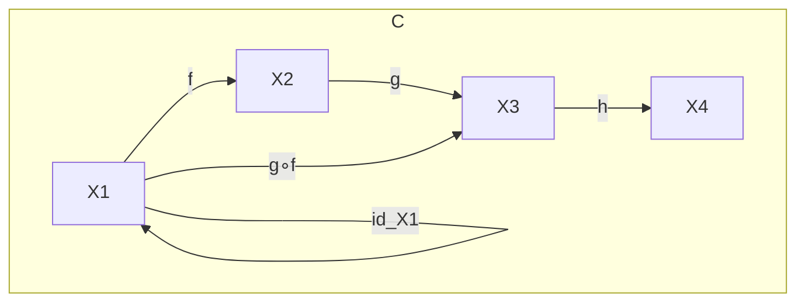
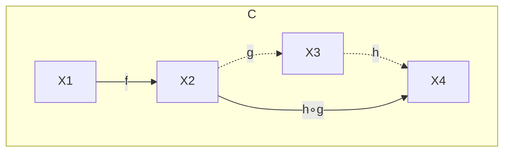
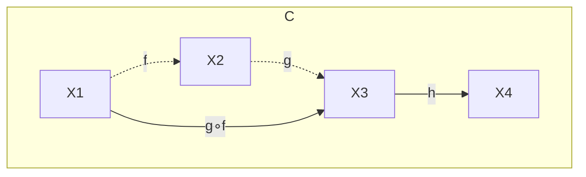
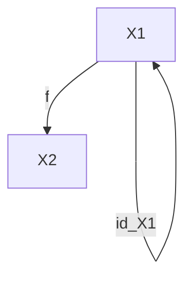

## はじめに

Monad 難しいですよね。私も最初勉強したときに途方にくれた記憶があります。  
Monad の解説の記事を調べれば、いきなり圏論の話が出てくるものがあれば、比喩を使って説明しようとするものもあります。  
前者は話が抽象的すぎて、数学を知らなければその意味を理解できないし、後者は比喩の説明で終始してしまい、結局本質的な性質の理解が得られないまま終わってしまうこともあります。

なぜここまで Monad が難しいのか、いや、難しいと**考えられている**のかは、私が思うに**日常的な言葉でこれを理解しようとする試みが少ないから**ではないかなと思います。  
この記事では Monad を理解するために比喩は使わず本質を理解するスタンスを取ります。ただ、私が行おうとしていることは、**圏論を踏まえた上で Monad の本質や意味を「できるだけ日常の言葉」で解説すること**です。  
もちろん Monad を説明する上で圏論は避けて通れないと考えているので、圏論の話題も出てきますが、できるだけ数学の抽象的な議論を避け、それが何を意味するのかの理解を深めることを目指します。

### 前提知識

最低限

- 静的型付けの言語を使ったことがある
- 例えば JS/TS の `Array.map` 等の高階関数を使ったことがあること

以下の経験があるとより理解が深まります。

- Haskell などの型クラスに相当する概念を持つ関数型言語を使ったことがある
- 内部の仕組みはよくわからんけど Monad を使ったコードを書いたことがある

正直なところ「習うより慣れろ」なところもあるので、この記事を読んで満足するのではなく、ぜひ Haskell や PureScript、Scala や F#といった関数型言語を使ってモナモナしたコードにトライしていただけると非常に嬉しく思います。

この記事では解説に用いる言語として TypeScript と PureScript を使用します。
有名な関数型言語は Haskell だと思いますが、圏論を絡めて Monad を説明する際に Haskell だと都合が悪い部分があるため、ここでは PureScript を使用します。

### Monad を理解するためのロードマップ

この記事では以下の流れで Monad への理解を深めようとしています。

- 準備編
  - 関数型プログラミングの方針を理解する
  - 最低限の圏論の知識を身につける
    - 圏論とは何か
    - 圏・対象・射・合成・恒等射
    - 結合法則
    - 単位法則
  - 型クラスを理解する
- 本編
  - Functor を理解する
  - Applicative Functor を理解する
  - Monad を理解する

はじめに Monad を理解するための前提知識として、関数型プログラミングの方針や圏論の最低限の知識の解説などを行います。そちらを踏まえた上で、Monad を構成する要素として Functor と Applicative Functor を説明し、最後に Monad を完全に理解するという流れで進めていきます。

1 つ 1 つの順を追って解説することになるので、一見遠回りに見えるようなところまで掘り下げることになります。  
結論を焦りたくなるかもしれませんが、Monad に王道なし――結果的にそれが一番わかりやすく、また最短の道になると思いますので、どうか最後までお付き合いいただけますと幸いです。

## 関数型プログラミングの方針を理解する

関数型プログラミングとは何かを解説するときに、よく「手続き的」や「宣言的」というワードを見かけることがあります。この記事でもそのワードを使うのですが、この 2 つの意味から関数型プログラミングがやろうとしていることを解説していきます。

手続き的は「目的達成のための詳細な手順を記述する方法」、宣言的は「目的そのものを記述する方法」といった定義がよく使われますが、この意味をもう少し深掘るため、まずは実際のコードで比較してみましょう。  
ここでは「与えられた配列から偶数のみを抽出する」プログラムを、それぞれの考え方で書くとどうなるかをみていきます。

はじめに手続き的に書くと、おおおよそ下のようなコードになるでしょう。

```ts
function evenNumbers(numbers: number[]): number[] {
  const result: number[] = [];

  for (let i = 0; i < numbers.length; i++) {
    if (numbers[i] % 2 === 0) {
      result.push(numbers[i]);
    }
  }

  return result;
}

const input = [1, 2, 3, 4, 5, 6];
const output = evenNumbers(input);
console.log(output); // [2, 4, 6]
```

解説するまでもないと思いますが、引数で受け取った配列を for 文で回して 1 つずつ確認し、2 で割り切れればその値を結果の配列に追加していくという処理ですね。

では、これが宣言的になるとどうなるでしょうか。

```purs
evenNumbers :: Array Int -> Array Int
evenNumbers = filter even

main :: Effect Unit
main = do
  let input = [1, 2, 3, 4, 5, 6]
  let output = evenNumbers input
  log $ show output  -- [2, 4, 6]
```

言語は PureScript を用いているため、細かい書き方は色々とあると思いますが、注目いただきたいのは`evenNumbers`関数の実装です。  
確認すると、 `filter` （TypeScript でいうところの `Array.filter` とほぼ同じもの）という高階関数を使い、偶数であるかを判別する関数 `even` を渡すことで、配列から偶数のみを抽出しようとしています。

結果的に同じことをしているこの 2 つですが、どこに違いがあるのかというと、**配列という情報の解釈の違い**にあります。

手続き的なアプローチでは、引数で受け取った配列を for 文で展開しておりましたが、この操作の本質は、 **配列を「number の集まり」というそのままの意味で解釈し、構造を展開することで、目的を実現する手続きを記述**しています。

一方、宣言的なアプローチで行ったことは、**「number の集まり」という _高次な情報_ を、`even`というただの number を取り扱う _低次な情報を対象に取る関数_ を使って操作している**ということです。  
関数型プログラミングにおいて for 文が出てこないのは、副作用が発生するというのもあるのですが、手続き的・宣言的という視点で見るならば、配列という高次の情報を高次の状態のまま扱いたくないからと言うこともできます。なのでその代わりに、（後に詳しく説明しますが）Applicative Functor や Monad といった性質を使って、高次な情報を低次の世界の手続きで操作することを可能にしたのです。

まだピンとこないかもしれませんが、とにかくここでのポイントは、関数型プログラミングにおける宣言的とはつまり、**高次な情報の詳細を考えることなく、低次な世界の文脈で操作すること**にあります。  
言い換えるならば、**複雑な情報のあれこれを考えずに、より簡単な手続きでその中身を操作したい**のです。  
これを実現するものの 1 つが、ここで解説する Monad と呼ばれる概念である、ということを押さえていただければと思います。

## 最低限の圏論の知識を身につける

この記事では圏論を解説するために、T.レンスター『ベーシック圏論 普遍性からの速習コース』（以下、ベーシック圏論）を参考にしています。  
しかし、この記事では厳密に数学的な議論を行うことを目的としていません。あくまで Monad を説明するために必要となる知識を大まかに理解することを目的としておりますのでご了承ください。

### 圏論とは何か

ベーシック圏論の監修者まえがきでは以下のように書かれています。

> 圏論とは何であろうか．本書の冒頭に原著者は「圏論は鳥の目で数学を俯瞰する」と述べている．すなわち，数学的対象や構造を理解するさいに，その記述に要する下部構造を忘れてしまい，その上澄みの構造だけをみることにより初めて見えてくるものがある．それを扱うのが圏論だというわけである．
>
> T.レンスター『ベーシック圏論 普遍性からの速習コース』、斎藤 恭司監修、土岡 俊介訳、丸善出版、2017 年、p.iii

つまり圏論はいわばメタ数学のようなもので、代数学や解析学といった数学の各分野の詳細をまるっと抽象化してしまい、その関係性を見ようとする分野であるということですね。

ここで重要なのは、『数学的対象や構造を理解するさいに，その記述に要する下部構造を忘れてしまい，その上澄みの構造だけをみる』という部分です。  
要するに、**細かいところで何をやっているのかは脇に置いておいて、全体の構造を俯瞰するようなものの見方をしたい**ということです。  
先ほどの手続き的・宣言的の解説とほぼ同じことを言っていることに気がつくと思いますが、この考え方は関数型プログラミングおける一貫したコンセプトになります。詳細はまた別の章でお話しますが、ここでは「そういったものなんだな」くらいに捉えていただければと思います。

### 圏・対象・射・合成・恒等射

圏論に登場する用語を厳密に定義するとややこしいので、ここではわかりやすさを優先し、以下のような構造を考えてみようと思います。



まず **圏（category）** とは、 **対象（object）** と呼ばれるものの集まりと、その対象同士を結ぶ **射（map, morphism）** と呼ばれるものの集まりから構成されます。上記の図でいいますと、`X1`、`X2`、`X3`、`X4`が対象、`f`、`g`、`g∘f`、`id_X1`が射を表しており、この構造全体を囲っている`C`が圏になります。

射は **合成（composition）** することができ、上記の図では`X1`から`X2`へ向かう射`f`と、`X2`から`X3`へ向かう射`g`を合成して、`X1`から`X3`へ向かう射`g∘f`を得ることができます。ここは高校数学で学ぶ合成関数と考え方は同じです。

また、`id_X1`のように、ある対象から自身の対象へと向かう射も考えることができ、こうした射を **恒等射（identity）** と呼びます。

圏の登場人物は上記の通りなのですが、圏では**結合法則**と**単位法則**という 2 つの法則が成り立つことが求められます。次にこの 2 つをみていきましょう。

### 結合法則

**結合法則**とは、射を合成したときに、合成の順番を入れ替えても結果が変わらない性質を表しています。例えば、`X1`から`X4`へと向かう合成射`h∘g∘f`を考えたときに、`(h∘g)∘f`の順で合成しても、`h∘(g∘f)`の順で合成しても結果は変わらないということです。

`(h∘g)∘f`で考えると、最初に`X2`から`X4`へと向かう合成射`h∘g`を得て、そこに`X1`から`X2`へ向かう射`f`を合成すると、最終的に`X1`から`X4`へ向かう合成射`h∘g∘f`を得ることができます。



一方`h∘(g∘f)`で考えたとしても、最初に`X1`から`X3`へ向かう合成射`g∘f`を得て、次に`X3`から`X4`へ向かう射`h`をさらに合成すると、同様に合成射`h∘g∘f`を得ることができます。



### 単位法則

**単位法則**とは、射を合成する際に、恒等射を合成しても結果が変わらない性質を表しています。例えば、`X1`から`X2`へ向かう射`f`に対して`id_X1`を合成すると、合成射`f∘id_X1`が得られますが、これは元の射`f`と同じになります。



ここまでが圏論の最低限の知識になります。  
概念としての前提知識の準備は整ったのですが、準備編の最後として、関数型言語固有の概念である型クラスを理解する必要があります。こちらを通してプログラミングと圏論を少しずつ結びつけていきましょう。

## 型クラスを理解する

- 型が持つ共通の性質を定義するもの
- 例: Eq 型クラス

## Functor を理解する

### 定義

- fmap

### 意義

- 対象として取った圏の内部の構造を保ったまま、新しい文脈を付与する
  - 世界観を決定する関数
  - 低次の世界を、意味づけされた高次の世界へと持っていく関数

### 例

## Applicative Functor を理解する

### 定義

- Functor の拡張
- Applicative = Apply の形容詞
- Apply = 適用する
- Applicative Functor = 適用可能な関手

### 意義

- 低次元の値を扱う関数を使って、高次元の値を計算する
- Functor は世界の引き上げをしているのに対し、Applicative Functor は世界の引き上げを行った上で、その世界における計算という性質も導入している

### 例

## Monad を理解する

### 定義

- Applicative Functor の拡張

### 意義

- 文脈を保ちつつ、低次の値を扱う計算で高次の値を連鎖的に操作できる

### 例

## 参考

- T.レンスター『ベーシック圏論 普遍性からの速習コース』、斎藤 恭司監修、土岡 俊介訳、丸善出版、2017 年
- Learn You a Haskell for Great Good! (https://learnyouahaskell.github.io)
