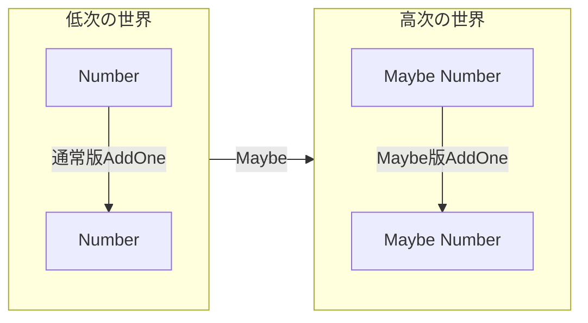
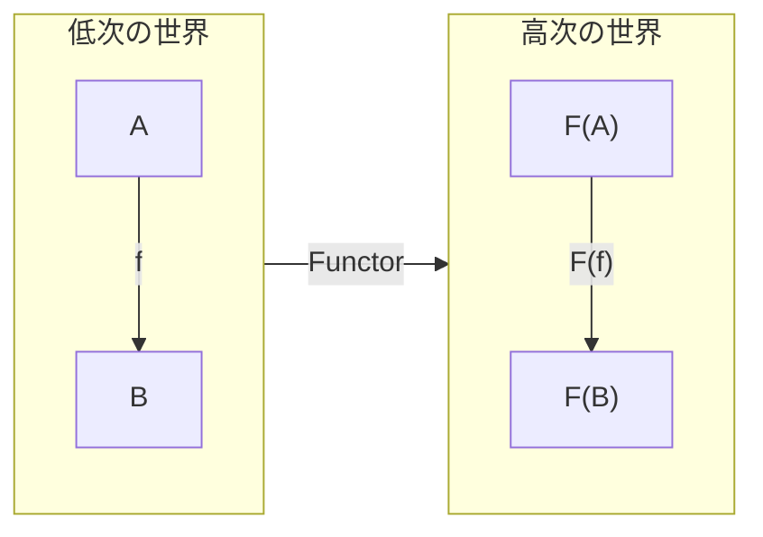

## はじめに

Monad（モナド）難しいですよね。私も最初勉強したときに途方にくれた記憶があります。  
確かに圏論としての Monad の定義や、「Monad は単なる自己関手の圏におけるモノイド対象だよ」をゼロから理解しようとすると一筋縄では行きません。  
ただ、**プログラミングにおける Monad**を理解したり、また Monad を使ったコードを書くことに関しては、**実はそれほど難しいことではありません**。  
この事実を伝えるべく、先日社内のエンジニア勉強会にて Monad をテーマにした勉強会を開催してきましたので、今回はその内容を公開しようと思います。

本記事の目的は、**Functor や Applicative Functor、Monad といった概念が、プログラミングにおいてどのような意味を持つのかを理解すること**です。  
そのため、この記事では取り扱う範囲をプログラミングに限定し、圏論の厳密な議論は避け、プログラミングにおける具体的な事例を通じて理解を深めることを目指します。  
より厳密に Monad を理解したい方向けに追加資料を最後に記載しておりますので、そちらをご参照いただければと思います。

この記事では PureScript という関数型言語を使用します。  
PureScript は Haskell と似た文法を持つ AltJS 系の言語であり、Node.js が動く環境であれば簡単に試すことができます。

https://qiita.com/hiruberuto/items/2316b58162cfec150460

今回作成したコードは GitHub 上に公開しておりますので、実際に試してみたい方は以下のリポジトリをご参照ください。

https://github.com/ichi-h/monad-exercise-in-purescript

## 準備編: 型クラスとは何か

まずは Monad の説明へと入る前に、Monad を理解するための前提知識として**型クラス**についてお話させてください。  
型クラスとは端的に言えば、**型が持つ共通の構造を定義したもの**です。

例えば、我々はプログラムを書くとき、何らかの 2 つの値が等しいかどうかを比較する場面にしょっちゅう出くわします（以下のコードは JavaScript です）。

```js
const a = 1;
console.log(a === 1); // true

const b = "apple";
console.log(b === "banana"); // false

const c = true;
console.log(c === true); // true

// ...
```

上記ではしれっと `===` という演算子を使いましたが、もし関数型言語で上記のような比較を行う場合、この演算子の挙動を関数として実装する必要があります。  
例えば上記の `a === 1` というコードを関数型言語で表現するためには、「2 つの number を受け取って boolean を返す関数 `===`」のようなものを定義する必要があります^[実際には多くの組み込み型（数値や文字列など）には、標準で Eq 型クラスのインスタンスが用意されています。]。  
そのため、上記のような等価性を持つ型は、以下のような関数を実装している必要があります。

- 2 つの number を受け取って boolean を返す関数
- 2 つの string を受け取って boolean を返す関数
- 2 つの boolean を受け取って boolean を返す関数
- 2 つの array を受け取って boolean を返す関数
- etc.

ここで気づくことがあります。  
上記の説明は、**「2 つの {何か} を受け取って boolean を返す」** という共通の構造を持っています。  
もし同じ構造を持っているのであれば、これをなんとかしてコードで表現することはできないでしょうか？

多くの関数型言語では、こうした型にまつわる共通の構造を定義するための機能が用意されており、それが**型クラス**というものです。  
例えば PureScript では、等価性の構造は `Eq` という型クラスで表現されています。

```purescript
class Eq a where
  eq :: a -> a -> Boolean
```

上記の意味は、「等価性を持つ型なら、その型は `eq` を満たす関数を用意する必要があるよ」ということです。  
試しに新しく `Person` という型を定義し、その型が等価性を持つよう `Eq` を実装してみましょう。

```purescript
newtype Person = Person { name :: String, age :: Int }

instance eqPerson :: Eq Person where
  eq (Person { name: name1, age: age1 }) (Person { name: name2, age: age2 }) =
    name1 == name2 && age1 == age2
```

こうして晴れて `Person` は等号を使って比較できるようになりました。

```purescript
person1 :: Person
person1 = Person { name: "Alice", age: 30 }

person2 :: Person
person2 = Person { name: "Bob", age: 25 }

-- `==` とは `eq` 関数を演算子化したものなので、
-- 以下は `eq person1 person2` と書くことと同義
person1 == person2 -- false
```

以上が型クラスの説明となりますが、これから説明する Functor、Applicative Functor、Monad はすべて型クラスとして定義されています。  
これが意味するところは、**Functor、Applicative Functor、Monad はすべて、型が持つ何らかの共通の構造を定義している**ということです。  
では、**その共通の構造とは何か**、また**それがどういう意味を持つのか**について、これから迫っていこうと思います。

## Functor を理解する

例えば、Maybe でラップされた値に 1 を加えるというシンプルな関数を考えてみましょう。

```purs
-- Maybe Int 型の値に 1 を加える関数
-- Nothingの場合は何もしない
addOneMaybe :: Maybe Int -> Maybe Int
addOneMaybe Nothing = Nothing
addOneMaybe (Just x) = Just (x + 1)
```

Maybe を対象にその値が存在する場合は 1 を加え、存在しない場合は何もしないという関数です。  
この書き方で全く問題はないのですが、今回はこの関数をもう少し別の視点で考えてみたいと思います。

突然ですが、上記の処理の**本質的な目的**とは一体何でしょうか？  
命名から察するに、おそらくは**値に 1 を加える**という操作がこの関数において最も重要な部分であると考えられます。  
しかし、上記のコードでは Nothing のパターンマッチによって値の存在やエラーを確認しているため、値に 1 を加えるという純粋な操作以外のコードが含まれてしまっています。

関数型プログラミングの文脈でよく**宣言的**という言葉を聞くことがあると思います。  
これは一般的には「何をするかの目的から記述すること」と説明されることが多いと思います。  
では、これを**どうやって**実現するのかというと、誤解を恐れずに言うならば **「何らかの意味付けがなされた高次^[単に文脈、コンテナといった表現をすることもある。]な世界の詳細を考えることなく、意味づけされていない低次^[素の値といった表現をすることもある。]な世界の文脈で操作すること」** によって実現されます。

例えば上記の Maybe を使った関数では、**存在するかわからない**という**高次に**意味づけされた値を、パターンマッチングを用いて Just なのか Nothing なのかの解釈を行いました。  
これは要するに、**高次の世界の情報を、そのまま高次の世界の情報として扱った**ということであり、上記ではそれがパターンマッチングという形で Maybe の詳細がさらけ出されているわけです。  
しかし、一番重要なのは**値に 1 を加える**という操作だったはずであり、Maybe の存在確認はあくまでその操作を行うための文脈に過ぎません。  
では、なんとかしてこの Maybe の詳細を考えることなく、本質的な操作だけを取り扱えるような方法はないのでしょうか？

結論としては、**あります**。  
どうすればよいのかというと、**低次な世界の文脈で操作できる関数を、高次な世界の文脈に引き上げる**ことができればよいのです。  
つまり、**値に 1 を加えるという本質的な操作をプレーンな関数として定義しておき、それを高次な世界の文脈が伴ったものとして変換する**のです。  
図にすると以下のようなイメージです。



このように、**低次の世界で定義された構造に対して、その構造を保ったまま高次に意味づけされた世界の文脈へ引き上げることを一般化したものが Functor**です。



PureScript では Functor は以下のように定義されています。

```purs
class Functor f where
  map :: forall a b. (a -> b) -> f a -> f b
```

引き上げを行うための関数は `map` と呼ばれています（他の言語では `fmap` と呼ばれることもあります）。  
この関数の型は、**ある型 `a` から別の型 `b` を返す関数を受け取り、それをより高次に意味づけされた型 `f a` から `f b` を返す関数へと引き上げる**という意味です。  
この関数を実装することで Functor の構造を満たすことができます。

これまで出てきた Maybe もこの Functor の構造を持っています。

```purs
instance functorMaybe :: Functor Maybe where
  map fn (Just x) = Just (fn x)
  map _  _        = Nothing
```

まず関数 `fn` を引数として受け取ります。次に第 2 引数の Maybe が Just の場合は、その値に `fn` を適用して Just でラップした値を返し、Nothing の場合はそのまま Nothing を返します。

これにより、一番最初に提示した `addOneMaybe` 関数は以下のように書き換えることができます。

```purs
addOneMaybe' :: Maybe Int -> Maybe Int
addOneMaybe' = map (\x -> x + 1)
```

見事に値に 1 を加えるという操作だけを残して、Maybe の文脈を保ちつつ、その詳細をコードから取り除くことができました！

### Functor のまとめ

- Functor = **低次の世界で定義された構造を保ったまま、高次の世界の文脈に引き上げる（意味づけをする）構造を一般化したもの。**
- PureScript においては、`map` 関数を実装することで Functor の構造を満たすことができる。
- `map` 関数を使うことで、低次の世界で定義された関数から、高次の世界の文脈に適用された関数を得ることができる。
  - = 高次の世界の値を、低次の世界の文脈で操作することができる。

## Applicative Functor を理解する

今度は与えられた 2 つの Maybe の値を足し合わせる関数を考えてみましょう。

```purs
addTwoMaybe :: Maybe Int -> Maybe Int -> Maybe Int
addTwoMaybe Nothing _ = Nothing
addTwoMaybe _ Nothing = Nothing
addTwoMaybe (Just x) (Just y) = Just (x + y)
```

こちらもこの書き方で全く問題はないのですが、これを Applicative に考えるとどのようになるのかを見てみましょう。

そもそも Applicative Functor の **Applicative** とは何でしょうか？  
Applicative とは Apply という動詞を形容詞化したものであり、その意味は **「適用する」** です。  
つまり、Applicative Functor とは**適用可能な Functor** という意味になります。

プログラミングを触っている方であれば、「適用」というワードに聞き覚えがあるかもしれません。  
例えば、関数の引数を一部固定して新しい関数を作ることを「部分適用」と呼んだりしますが、この「適用」は Applicative Functor における Apply と同じ意味です。  
つまり Applicative Functor とは、**Functor によって文脈を引き上げた関数に対して、同じ文脈を持った値を引数として適用するところまで一般化した構造**ということになります。

Applicative Functor の定義の前に、先に上記のコードを Applicative Functor を用いて書き換えるとどうなるかを見てみましょう。

```purs
addTwoMaybe' :: Maybe Int -> Maybe Int -> Maybe Int
addTwoMaybe' mx my = (\x y -> x + y) <$> mx <*> my
```

`<$>` や `<*>` といった謎の記号が出てきましたが、ひとまず詳細は無視してまずは全体像を捉えましょう。  
このコードにおける最も重要な操作は `(\x y -> x + y)` の部分、つまり**受け取った 2 つの Int を足し合わせる関数**です。  
そのあとに謎の記号が続きますが、注目したいのは、各記号の右側にある変数 `mx` と `my` の型が `Maybe Int` であることです。  
つまりこの処理は、**受け取った 2 つの Int を足し合わせる関数に対して、謎の記号を使って 2 つの Maybe Int、つまり Maybe という文脈を持つ値を適用している**ということが推測できます。

もしそうであるならば、`<$>` の正体は想像がつきます。  
おそらくこの記号は、**Functor のときに出てきた `map` 関数と非常に近い役割、つまり受け取った関数を Maybe の世界に引き上げる機能**があり、そして **それに対して `<*>` という記号を用いて引数を適用している**のではないかと考えられそうです。

では、実際に Applicative Functor の定義を見てみましょう。

```purs
-- Functor.purs
class Functor f where
  map :: forall a b. (a -> b) -> f a -> f b

infixl 4 map as <$>

-- Apply.purs
class Functor f <= Apply f where
  apply :: forall a b. f (a -> b) -> f a -> f b

infixl 4 apply as <*>

-- Applicative.purs
class Apply f <= Applicative f where
  pure :: forall a. a -> f a
```

まず先に出てきた謎の記号を確認しましょう。  
`map` っぽい機能をがあると予想された `<$>` ですが、実は `map` 関数のエイリアスとして定義されているため、似ているどころか **`map` と完全に同じものを指しています**（ただしこれを中置演算子、つまり `map fn x` ではなく `fn <$> x` のように使えるよう定義されています）。

次に `<*>` ですが、こちらは型クラス Apply の `apply` 関数のエイリアスとして定義されています。  
`apply` の型は `f (a -> b) -> f a -> f b` です。つまり、**何らかの文脈上にある関数 `f (a -> b)` に、同じ文脈にある値 `f a` を適用して、同文脈の別の値 `f b` として返す**という意味です。

また、その Apply を継承した Applicative が持つ `pure` は、**通常の値を高次の世界の文脈に引き上げる**という意味の関数として定義されています。

そしてもちろん、Maybe も Applicative Functor の構造を持っています。

```purs
instance applyMaybe :: Apply Maybe where
  apply (Just fn) x = fn <$> x -- 実質 map fn x と同じ
  apply Nothing   _ = Nothing

instance applicativeMaybe :: Applicative Maybe where
  pure = Just
```

おそらくこの定義を見てもピンとこないと思いますので、最初の `addTwoMaybe'` のコードをもう一度確認してみましょう。

```purs
addTwoMaybe' :: Maybe Int -> Maybe Int -> Maybe Int
addTwoMaybe' mx my = (\x y -> x + y) <$> mx <*> my
```

まずは `<$>` の部分がややこしいので、`map` になおしてしまいます。

```purs
addTwoMaybe' :: Maybe Int -> Maybe Int -> Maybe Int
addTwoMaybe' mx my = map (\x y -> x + y) mx <*> my
```

ここで、Maybe における `map` の定義を思い出してください。  
そちらを踏まえると、 `map (\x y -> x + y) mx` という処理は、`mx` が Just であれば、与えらた関数 `\x y -> x + y` にその中身を適用するという処理になりそうです。  
しかし、`\x y -> x + y` は 2 つの引数を受け取る関数なので引数が 1 つ足りません。  
するとどうなるのかというと、**引数 `x` が部分適用される形となり、最終的には `\y -> {mxの中身} + y` という形の関数が返される**ことになります。  
なので、`map (\x y -> x + y) mx` の結果は `Just (\y -> {mxの中身} + y)` という形になります。

```purs
Just (\y -> {mxの中身} + y) <*> my
```

では残った `<*>` の部分を `apply` に戻してみましょう。

```purs
apply (Just (\y -> {mxの中身} + y)) my
```

Maybe における `apply` の定義を確認すると、もし第一引数の関数が Just であれば、その中身を取り出して `fn <$> x` として処理することがわかります。  
`<$>` は先と同様なので、一気に書き換えてしまいますと以下のようになります。

```purs
map (\y -> {mxの中身} + y) my
```

これで見慣れた `map` の形になりました！  
もし `my` が Just であれば、`{mxの中身} + {myの中身}` という形で値を足し合わせた結果が Just で返され、Nothing であればそのまま Nothing が返されるという処理になります。

長々と追ってきましたが、結局 ` (\x y -> x + y) <$> mx <*> my` という処理は、**受け取った 2 つの Int を足し合わせる関数に対して、Maybe によって意味づけされた 2 つの値を 1 つずつ適用していた**ことがわかりました。  
はじめの方で「Applicative Functor は Functor によって文脈を引き上げた関数に対して、同じ文脈を持った値を引数として適用するところまで一般化した構造」と説明しましたが、まさにその通りのことを行っていることがわかると思います。

### Applicative Functor のまとめ

- Applicative Functor = **Functor によって文脈を引き上げた関数に対して、同じ文脈を持った値を引数として適用するところまで一般化した構造。**
- PureScript において、`apply` 関数と `pure` 関数を実装することで Applicative Functor の構造を満たすことができる。

## Monad を理解する

いよいよ Monad までやってまいりました。  
最後に少し入り組んだ処理を例に Monad を考えてみましょう。

```purs
safeDivide :: Int -> Int -> Maybe Int
safeDivide _ 0 = Nothing
safeDivide x y = Just (x / y)

complexChain :: Maybe Int -> Maybe Int
complexChain Nothing = Nothing
complexChain (Just x) =
  case safeDivide x 2 of
    Nothing -> Nothing
    Just y ->
      case safeDivide y 3 of
        Nothing -> Nothing
        Just z -> Just (z + 1)
```

やっていること自体はシンプルでして、究極的には**受け取った値を 2 で割って、その結果をさらに 3 で割り、最後に 1 を足す**という処理になります。  
ただ、割り算を行うときに `safeDivide` という関数を使用しており、分母が 0 の場合は Nothing を返すため、そのパターンを考慮する必要があります。

これまでの例で出したコードはシンプルでしたが、今回の例はパターンマッチが複雑になっているため、このままではコードの本質的な処理がわかりにくくなってしまっています。

本来は 0 で割る可能性がない処理なので、`safeDivide` を使う必要は全くないのですが、もしこれを Monad を使って書き換えるとしたらどうなるでしょうか？

```purs
complexChain'' :: Maybe Int -> Maybe Int
complexChain'' mx = do
  x <- mx
  y <- safeDivide x 2
  z <- safeDivide y 3
  pure (z + 1)
```

なんとこれだけでいけるのです。  
パターンマッチは消滅し、Maybe の詳細は隠蔽されつつ、先ほどの本質的な処理だけをシンプルに残すことができました。

それでは、なぜこんなことができるのかに迫るべく、まずは Monad の定義から確認していきましょう。

```purs
-- Bind.purs
class Apply m <= Bind m where
  bind :: forall a b. m a -> (a -> m b) -> m b

infixl 1 bind as >>=

-- Monad.purs
class (Applicative m, Bind m) <= Monad m
```

Monad 自体は Applicative Functor と Bind の両方を満たす型クラスとして定義されています。  
もととなる Bind に定義されている `bind` 関数の型を見ると、これは **「何らかの文脈を持った値 `m a`」 と、「素の値 `a` を受け取って同じ文脈を持った別の値 `m b` を返す関数」を受け取り、最後に同文脈を持つ値 `m b` を返却する**という意味が汲み取れます。  
Applicative Functor の `apply` 関数に対して `<*>` という演算子が割り当てられていたように、`bind` 関数には `>>=` という演算子が割り当てられています。

これまで説明してきた Maybe も Monad の一種となります。

```purs
instance bindMaybe :: Bind Maybe where
  bind (Just x) k = k x
  bind Nothing  _ = Nothing

instance monadMaybe :: Monad Maybe
```

こちらも定義だけではわかりにくいと思いますので、先ほどのコードを `bind (>>=)` を使って書き換えてみましょう。

```purs
complexChain' :: Maybe Int -> Maybe Int
complexChain' mx =
  mx >>= \x ->
    safeDivide x 2 >>= \y ->
      safeDivide y 3 >>= \z ->
        pure (z + 1)
```

まずは `mx` という Maybe の文脈を持った値を `>>=` に渡します。  
次に `\x -> safeDivide x 2` という関数が来るのですが、Maybe における`bind`関数の実装を確認すると、第一引数で受け取った Maybe の値が Just であれば、その中身を第二引数で受け取った関数の引数として渡して評価し、Nothing であればそのまま Nothing を返しています。  
要するに、 **「もし `>>=` で受け取った値が Just であれば、その中身を `\x -> safeDivide x 2` に渡して実行し、その結果を返すよ」** ということです。

ここで注目したいのは、`safeDivide x 2` の戻り値の型が `Maybe Int` であることです。  
`bind` 関数の型の定義は `m a -> (a -> m b) -> m b` でしたが、第一引数で受け取った値と戻り値の型は同じ文脈を持っていることがわかります。  
つまり、**`bind` 関数によって得られた戻り値は、そのまま次の `bind` 関数の第一引数として渡すことができる**のです。

そうすると続きの処理は簡単で、`safeDivide x 2` の戻り値が Just であれば次の `\y -> safeDivide y 3` が実行され、同様に `safeDivide y 3` の戻り値が Just であれば最後に `\z -> pure (z + 1)` が**連鎖的に**実行されることになります。

**この連鎖性こそが Monad の本質です。**  
プログラミングにおける Monad とは、**高次の世界の文脈を保ちつつ、素の値を取り扱う計算で文脈を持った値を『連鎖的に』操作できる構造の一般化**です。  
Applicative Functor では文脈を引き上げた関数への引数の適用を行いましたが、Monad ではこの**引数の適用と関数の評価を『連鎖的に』行ってしまおう**という仕組みなのです。

さて、この時点でも目的の処理の流れは一応見えるようになるのですが、関数型プログラミングにおいてこの書き方は頻繁に用いられます。  
なので毎回 `>>=` で関数を繋げて書くのは面倒ですし、`>>=` の数が増えるとコードが読みにくくなってしまいます。

そのため多くの関数型言語では、この `>>=` の連鎖を簡潔に書くための糖衣構文が用意されています。  
PureScript や Haskell では、do 構文を使うことで以下のように書くことができます。

```purs
complexChain'' :: Maybe Int -> Maybe Int
complexChain'' mx = do
  x <- mx             -- mx >>= \x ->
  y <- safeDivide x 2 -- safeDivide x 2 >>= \y ->
  z <- safeDivide y 3 -- safeDivide y 3 >>= \z ->
  pure (z + 1)
```

こうして `>>=` の連鎖や Monad の中身を意識することなく、まるで手続き型言語のように書けるようになりました！

### Monad のまとめ

- Monad = **高次の世界の文脈を保ちつつ、素の値を取り扱う計算で文脈を持った値を『連鎖的に』操作できる構造の一般化。**
- PureScript においては、Applicative Functor と Bind の両方を実装することで Monad の構造を満たすことができる。
- `bind (>>=)` を使うことで連鎖的に関数を繋げて書くことができる。
- `>>=` の連鎖を簡潔に書くための糖衣構文として、do 構文が用意されている。

### 補足: bindFlipped について

改めて Functor の `map`、 Apply/Applicative Functor の `apply`、 Bind/Monad の `bind` の型を比較してみましょう。

```purs
map :: forall a b. (a -> b) -> f a -> f b
apply :: forall a b. f (a -> b) -> f a -> f b
bind :: forall a b. m a -> (a -> m b) -> m b
```

ところで、`bind` では第一引数と戻り値を同じ文脈を持った型にすることで連鎖的に `bind` を適用できるというお話でしたが、`map` や `apply` はともに第一引数に**関数**を受け取っているのに、Bind/Monad だけ**値**を受け取っているのに違和感を覚えませんか？  
もし `map` や `apply` の流れを踏むのであれば、以下のような型の関数が登場する方が自然のように思いますが、いかがでしょうか？

```purs
forall a b. (a -> m b) -> m a -> m b
```

実はこの関数、ちゃんと存在しており、PureScript では `bindFlipped (=<<)` として定義されています。

```purs
-- Function.purs
flip :: forall a b c. (a -> b -> c) -> b -> a -> c
flip f b a = f a b

-- Bind.purs
bindFlipped :: forall m a b. Bind m => (a -> m b) -> m a -> m b
bindFlipped = flip bind

infixr 1 bindFlipped as =<<
```

`bind` と `bindFlipped` の型を比較してみると、実は `bind` の第一引数と第二引数の順番を逆にすると `bindFlipped` の型になることがわかります。  
なので仮に `bindFlipped` が先に定義されていたとしても、逆の手順で `bind` を作ることも可能なのですが、例のごとくプログラミングにおいては `bind` の方が利用頻度が高いので、利便性を取りそちらの定義を優先しているのだと思います。

## 全体のまとめ

はじめに Functor によって、**低次の世界で定義された構造を保ったまま、高次の世界の文脈に引き上げる構造**を発見しました。  
次に Applicative Functor によって、**Functor によって文脈を引き上げた関数に対して、同じ文脈を持った値を引数として適用するところまで一般化した構造**を見ることができ、最後の Monad によって、ただ計算するだけでなく、**高次の世界の文脈を保ちつつ、素の値を取り扱う計算で文脈を持った値を『連鎖的に』操作する構造**を理解することができました。

長々と説明してきましたが、プログラミングにおける Monad がやっていることは、結局のところ上記の 3 つの構造を組み合わせているだけであり、順を追って考えればそこまで難解なものではないのです。

もしこの記事を読んで「なーんだこんなものなのか」と思っていただければ、この記事は大成功と言えるでしょう。  
まだ理解しきれていないと感じたならば、最後のまとめを踏まえて何度か読み返してみたり、実際に関数型言語でコードを書いてみると、少しずつ理解を深めることができると思います。  
焦らずに、1 つずつ理解を進めていけば、きっと Monad の本質が見えてくるはずです。

## より深く学ぶために

今回の記事では Maybe Monad しか取り扱うことができませんでしたが、他にも Monad の構造を持つ型はたくさんあります。  
また、これまで説明していた Monad はあくまで「プログラミングにおける」ものであり、**圏論における Monad**の定義は少し異なった形をしています。  
なので最後に、より深く Monad を学ぶための資料をいくつかご紹介できればと思います。

### IO モナドと副作用 純粋関数型プログラミングで副作用を扱う方法

https://haskell.jp/blog/posts/2020/io-monad-and-sideeffect.html

Haskell における IO Monad の解説記事です。  
PureScript でもそうですが、純粋関数型言語はコード内で副作用を扱うことができず、関数は参照透過性を持つことが要求されます。  
しかし、実際のプログラミングでは副作用を扱うことは避けられないため、この問題を解決する仕組みとして IO Monad が存在します。  
上記の記事ではそもそも純粋性とは何かからはじまり、IO Monad がどのようにして副作用を扱うのかを解説しています。

Haskell や PureScript といった純粋関数型言語を学びはじめた人にとっては非常に参考になる記事ですので、ぜひ一度ご覧ください。

### 圏論のモナドと PureScript のモナドの関係性を知ろう

https://zenn.dev/funnycat/articles/746676aa22addd#%E3%83%A2%E3%83%8A%E3%83%89

こちらは圏論の Monad の定義を解説しつつ、PureScript においてそれがどのように実装されているのかを解説している記事です。  
根気は必要になるかもしれませんが、圏論の入門から Monad の定義まで図を交えながら丁寧に解説されているため、圏論の知識がなくても理解できる内容となっています。

他にも funnycat さんは圏論と PureScript に関する記事を多数書かれており、どれも非常に参考になるので、興味のある方はぜひ他の記事もご覧ください。

### プログラマのためのモナド入門 稲見 泰宏 | プログラマのためのモナド入門

https://www.youtube.com/watch?v=fhuAlDPgi2Q

Monad を調べていると、 **「モナドは単なる自己関手の圏におけるモノイド対象だよ。何か問題でも？」** という呪文に出くわすことがあります。  
こちらの動画では、この意味を順を追って解説するというものになります。  
圏論の導入からスタートするものの、中盤辺りから突っ込んだ圏論の話題が入り始めるため、初見では少し難しく感じられるかもしれません。  
しかし、スライドと合わせてわかりやすく解説されておりますので、この呪文を理解したい方はぜひチャレンジしてみましょう。

また、プログラミングにおける Monad の定義と圏論における Monad の定義が少し異なるとお話しておりましたが、この動画の最後のほうでその違いについても触れられています。  
プログラミングにおける Monad では `bind` が重要な役割を果たしていましたが、圏論でこの `bind` を説明するには、さらにひと工夫が必要になります。  
圏論的にプログラミングにおける Monad を理解したい方も、ぜひ最後までご覧ください。

### T.レンスター『ベーシック圏論 普遍性からの速習コース』

https://www.maruzen-publishing.co.jp/book/b10112149.html

こちらは圏論に関する入門書となります。  
界隈では有名な本なのですが、これまで資料とは打って変わり、完全に学術としての圏論を学ぶための本ですので、読むにはかなりの時間と根気が必要になると思います。  
私もまだ途中までしか読めておりません。一緒に勉強していきましょう。

## 参考

- Learn You a Haskell for Great Good! (https://learnyouahaskell.github.io)
- 型クラス - ウォークスルー Haskell (http://walk.northcol.org/haskell/type-classes)
- Prim - Pursuit (https://pursuit.purescript.org/builtins/docs/Prim)
- purescript-prelude - Pursuit (https://pursuit.purescript.org/packages/purescript-prelude/6.0.2)
- purescript-maybe - Pursuit (https://pursuit.purescript.org/packages/purescript-maybe/6.0.0)
- purescript-either - Pursuit (https://pursuit.purescript.org/packages/purescript-either/6.1.0)
