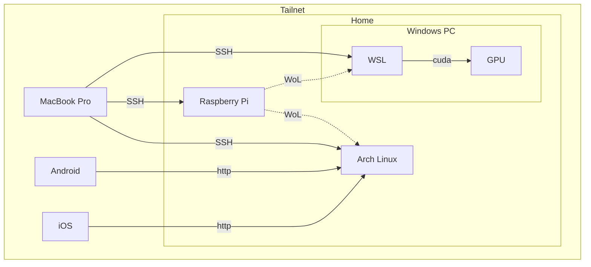
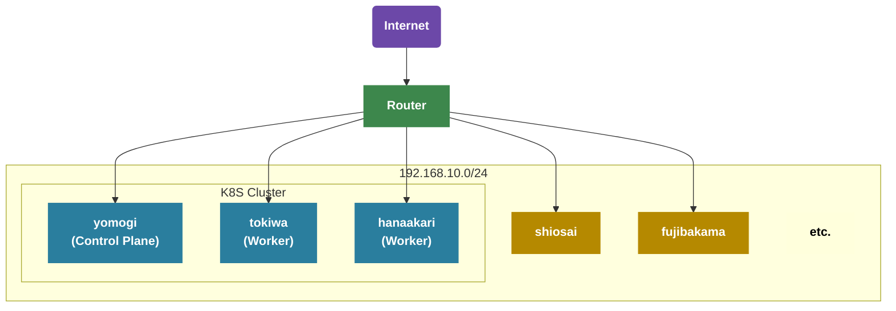

## はじめに

これまでインフラやネットワークといった領域にそこまで深く踏み込んだことがなく、そのあたりの技術力に少し不満があったため、勉強がてらに元々あった自宅サーバーの環境を刷新しつつ、**ついでに NixOS + Kubernetes というロマンの塊のような技術スタックで作る自宅サーバーの簡単なガイドを作ってやろう**というのが今回の趣旨です。

また NixOS とタイトルにあるものの、オンプレ環境における Kubernetes の構築としても参考になる内容になっていると思います。

私のサーバー環境のすべては dotfiles で管理されています。

https://github.com/ichi-h/dotfiles

すべての設定をこの記事で紹介するとあまりにも長くなりすぎるため、詳細な設定方法については割愛させていただきます。  
データ数 1 ではありますが、動くレベルの環境にはなりましたので、もし同様のことを行いたい場合は、上記のリポジトリのコードを参考にしていただければと思います（もちろん、私以外にも同じことをやっている方が GitHub に転がっていますので、そちらもぜひ参考にしてみてください）。

## 旧自宅サーバー環境

刷新前の自宅サーバーは、Arch Linux で構築された開発サーバーや、Windows PC 内の GPU リソースを利用できる WSL に、MacBook Pro から SSH で接続して開発するという非常にシンプルな構成でした。

自宅内だけでなく外出先でも開発ができるように、Tailscale を用いて VPN 環境を構築し、インターネットに接続できればどこでも開発ができるようにしていました。  
また Android や iOS といったモバイル端末を Tailnet に参加させておくことで、モバイル向けの UI を伴う Web アプリケーションの開発時に、モバイル端末から開発サーバーで立ち上がっているアプリケーションへ http で確認することもできます。

サーバーの電源を必要なときだけ稼働させておきたいという気持ちもあったので、外出の際は Raspberry Pi を常時稼働させ、そこから各サーバーの電源を Wake-on-Lan で起こせるようにしていました。



MacBook Pro によってそれなりのスペックのラップトップを持ち運びつつ、どこからでも強いサーバーのリソースを利用できるということで、開発面において大きな不満はありませんでした。

https://tailscale.com

## 実現したいこと

今回の自宅サーバー刷新では、上記の機能に追加して以下のことができるようになることを目標としていました。

- **Dropbox や OneDrive のようなストレージサービスの提供**
- **手持ちの端末間でパスワード等の機密情報を安全に管理できる仕組みの提供**
- **クラスターが提供する各アプリケーションに対して、独自ドメインかつセキュアにアクセスできる**
- **稼働するサーバーのログやメトリクスを収集する基盤作成**

正直これをやるだけであれば Kubernetes を導入する必要はないのですが、今回は学習目的も兼ねているため、オーバーエンジニアリングは許容して構築を進めていきます。

## OS 選定

今回自宅サーバーで利用するディストリビューションとして **NixOS** を選択しました。

https://nixos.org

半分趣味の側面もあるのですが、今回は NixOS の**再現性**と**宣言的**という性質を最大限活かすためこの技術選定をいたしました。

### Nix/NixOS とはなにか

Nix とは、**純粋関数型言語である Nix 言語をを用いて、開発環境やビルド環境に必要なパッケージを宣言的に管理できるツール**です。

例えば Node.js を採用するプロジェクトの開発環境を考えてみましょう。  
Node.js のバージョンを揃えるために Volta や nvm といったバージョン管理ツールを使うこともありますし、Docker を使って Node.js の実行環境を用意するケースもあるでしょう。

もしこのバージョン管理を Nix で行う場合、以下のような flake.nix ファイルをプロジェクトに作成することになります。

```nix
{
  description = "node.js";

  inputs = {
    nixpkgs.url = "github:nixos/nixpkgs?ref=nixos-unstable";
    flake-utils.url = "github:numtide/flake-utils";
  };

  outputs = { self, nixpkgs, flake-utils }:
    flake-utils.lib.eachDefaultSystem (system:
      let
        packages = nixpkgs.legacyPackages.${system};
      in
      {
        devShells = {
          default = packages.mkShell {
            buildInputs = with packages; [
              nodejs_22
            ];

            shellHook = ''
              echo "Node.js version: $(node --version)"
            '';
          };
        };
      }
    );
}
```

このファイルが存在するディレクトリで `nix develop` を実行すれば、Node.js が使えるシェルへと入ることができます（ホストのグローバルなアプリケーションとしてインストールしているわけではなく、このシェルの中のみで Node.js は有効になります）。  
もし Node.js のパッケージマネージャーとして pnpm を利用したいのであれば、buildInputs の中に `nodePackages.pnpm` を追加するだけで OK です（他に利用したいツールがあっても基本的には同様です）。

```nix
buildInputs = with packages; [
  nodejs_22
  nodePackages.pnpm # add
];
```

ところで、Nix は Docker のような仮想化技術は用いておらず、パッケージを動作させるために必要な依存関係をローカルにインストールし、それらのリソースを用いてパッケージを動作させます。  
上記のようなシンプルな環境であれば良いかもしれませんが、もしさらに複雑なパッケージ管理を必要とするプロジェクトの場合、仮想化なしでマシン間の動作差がない開発環境を用意できるのかという、至極最もな疑問が出てくると思います。

ですが、**Nix ではそうした問題は原理上発生しません。**

> Nix builds packages in isolation from each other. This ensures that they are reproducible and don’t have undeclared dependencies, so **if a package works on one machine, it will also work on another.**
>
> 引用: https://nixos.org、2025年10月3日訪問

> Nix はパッケージを互いに隔離して構築します。これにより、パッケージの再現性が保証され、宣言されていない依存関係が存在しないため、**あるマシンで動作するパッケージは、別のマシンでも動作します。**

Nix は依存関係の衝突や暗黙的な依存関係が発生しないようにパッケージ間で発生する依存関係を裏側で厳密に管理しているため、UNIX 系の OS であれば、ホストの環境に依存しない安定した開発環境を提供することができます。

Nix の詳しい仕組みについてはすでに解説記事がございますので以下をご参照ください。

https://zenn.dev/asa1984/books/nix-introduction

そして、この Nix の仕組みを OS レベルに適用したものが **NixOS** になります。  
Nix では管理者権限が必要な領域まで操作することはできませんが、NixOS ではユーザーの管理、パーティション、ネットワークやファイアウォールの設定、systemd で動くデーモンの管理などなど、ありとあらゆる設定を宣言的に管理できるようにしたディストリビューションです。

例えば Docker をインストールしたいなぁ……と思ったら、以下の設定を追記するだけで導入が完了します。

```nix
{
  virtualisation.docker.enable = true;
}
```

### なぜ NixOS なのか

改めてなぜ今回の Kubernetes を用いた自宅サーバー構築で NixOS に目をつけたのかというと、それは NixOS が持つ **再現性** と **宣言的** という 2 つの特徴が今回のケースにマッチすると考えたからです。

今回の環境構築では、合計 3 つのサーバーのセットアップを行うことになります。  
1 つ 1 つのサーバーのセットアップを行うのは面倒ですし、また今回 Raspberry Pi をノードに参加させたかったので、CPU アーキテクチャの違いによる動作差も懸念されていました。

では、もしここで NixOS を使うとどうなるのでしょうか。

まず、**各サーバーのセットアップが数コマンドで完了**します。  
NixOS は特性上、1 回動く環境を作ってしまえば、どのマシンに持っていっても基本的には同様に動く環境を簡単に再現できます。  
この強力な再現性により、面倒な複数台のサーバーセットアップを爆速で完了することができます。

また設定がすべて .nix ファイルとして管理されているため、**サーバー間で共通の設定を再利用することが可能**です。  
例えば NixOS における Kubernetes の Worker Node の設定は以下のようになっています。

https://github.com/ichi-h/dotfiles/blob/349d8d7c8823c18bcc2dcf2006b24e756f5c8ef6/nix/modules/k8s/node.nix#L1-L48

ここから新しく Worker Node を増やしたいとなった場合、上記の設定をサーバーに import するだけでセットアップがほぼ完了します。

```nix
{
  imports = [
    path/to/node.nix # add
  ];
}
```

将来的にノードを増やすことが考えられたため、ほぼ確実に動くであろうノードの設定を再利用できるのは大きなメリットになると考えました。

つまり、**NixOS の再現性と宣言的という特性を活用することで、複数あるサーバーの個別ないし共通の設定を宣言的に管理しつつ、再現性のある環境構築を可能にしたかった**、ということです。

## サーバー・ネットワーク構成

自宅にはサーバーが 5 台あり、今回クラスターに参加させるノードはそのうち 3 台になります。  
大まかなサーバースペックとネットワーク構成は以下のとおりです。  
（家のサーバーが多くなり、それぞれの区別が必要になったため、ホスト名に各サーバーの呼び名をつけています）

| Machine                      | Hostname                      | Role          | CPU/GPU                                        | RAM  | Storage                                |
| ---------------------------- | ----------------------------- | ------------- | ---------------------------------------------- | ---- | -------------------------------------- |
| **Raspberry Pi 4**           | **yomogi<br>（蓬）**          | Control Plane | ARM Cortex-A72                                 | 4GB  | 64GB（SD カード）                      |
| **Mini PC 1**                | **tokiwa<br>（常磐）**        | Worker        | Intel N97                                      | 16GB | 512GB（M.2 SSD）                       |
| **Mini PC 2**                | **hanaakari<br>（花明かり）** | Worker        | Intel N97                                      | 16GB | 512GB（M.2 SSD）<br>1 TB（外付け SSD） |
| **Arch Linux<br>Dev Server** | **shiosai<br>（潮騒）**       | -             | Intel Core i5-13400                            | 32GB | 1 TB（M.2 SSD）                        |
| **Windows PC（WSL）**        | **fujibakama<br>（藤袴）**    | -             | Intel Core i5-12600K + NVIDIA GeForce RTX 5070 | 32GB | 1 TB x 2（M.2 SSD）                    |



蓬サーバー（Raspberry Pi）を Control Plane とし、Mini PC x 2 台にアプリケーションをデプロイしていく方針です。  
ただ、**Raspberry Pi を単一の Control Plane として運用する方法は基本的におすすめしません**（[理由へジャンプ](#サーバースペック・構成ついて)）。

また、後に解説しますが、クラスターのストレージの供給として **Rook Ceph** を利用しており、容量確保のため花明かりサーバー（Mini PC 2）に 1TB の 外付け SSD をマウントしています。

ネットワーク構成図では省略していますが、各サーバーを**Tailscale** に登録しており、それぞれに `100.x.y.z` の IP アドレスが割り振られています。

## 基盤構築 - NixOS

今回使用した NixOS のバージョンは 25.05 になります。  
NixOS にまつわる大まかなアーキテクチャは以下のとおりです。


### Kubernetes

NixOS では Kubernetes のパッケージが公式から提供されています。

https://nixos.wiki/wiki/Kubernetes

いきなりですがこのパッケージ、**ややクセのある設計になっている**ので、少し補足いたします。

例えば kubeadm でクラスターを立ち上げた場合、kubelet はホストのサービスとして在中し、apiserver、etcd、control-manager、scheduler といったコンポーネントは Static Pod として立ち上がるのが一般的な構成だと思います。

しかし、公式のパッケージでクラスターを立ち上げた場合、基本的に kubelet を除く他の要素はすべて **systemd のサービス**として立ち上がります。  
Kubernetes の設定の中に `services.kubernetes.roles` という設定があり、この項目を `master` か `node`、もしくは両方に設定することで立ち上げるサービスを選択することができます。

```nix
{
  services.kubernetes.roles = ["master" "node"];
}
```

具体的には以下のものが立ち上がります。

- master
  - etcd
  - apiserver
  - scheduler
  - controller manager
  - addon manager
  - flannel
  - proxy
- node
  - flannel
  - docker
  - kubelet
  - proxy

`services.kubernetes.roles` の設定を行った場合、いくつかのサービスが自動的に有効になります。  
まず、上記のリストの通り CNI として **Flannel** が自動的に選択されます。

https://github.com/flannel-io/flannel

ホストで Flannel が立ち上がっていたとしても、基本的な仕組みは同様になりますので、詳細は割愛させていただきます。  
詳しくは以下の記事が参考になると思います。

https://zenn.dev/taisho6339/books/fc6facfb640d242dc7ec/viewer/0d112c

また、**easyCerts**という機能も自動的に ON になります。

https://github.com/NixOS/nixpkgs/blob/73dfe087eeb750197fc539ee5c6aec5007b8825e/nixos/modules/services/cluster/kubernetes/default.nix#L190-L194

https://github.com/NixOS/nixpkgs/blob/73dfe087eeb750197fc539ee5c6aec5007b8825e/nixos/modules/services/cluster/kubernetes/default.nix#L278-L283

これはノード間で通信する際に使用する証明書を自動で発行・更新してくれる非常に便利な機能なのですが、公式パッケージの見解としては **「for a production-grade cluster you shouldn't use `easyCerts`（本番環境のクラスタでは easyCerts を使用すべきではありません）」** とのことなので注意が必要です（今回の開発では easyCerts を利用しています）。

### VPN + Local DNS

各端末間の通信は引き続き **Tailscale** を用いて行っています。

Tailnet 内で公開されているマシンと通信する方法として一番簡単なものは、Tailscale から提供される IP アドレス（例: `100.xx.xx.xx`）を使うというものだと思います。  
しかし、ただの数字の羅列をいくつも覚えるのは人間がするべきことではないので、もっと楽な方法で解決したいところです。

別の方法として、https://login.tailscale.com/admin/dns ページから確認できる Tailnet DNS name と各マシンのホスト名を組み合わせた `hostname.xxxx-xxxxx.ts.net` というドメインを使って通信する方法もあります。  
IP アドレスに比べれば覚えやすく、IP アドレスが変わったとしても変化しない。そして**このドメインに対して TLS 証明書を発行できる**という状況によっては強力な機能を使うこともできます。

なのですが、できればこれも使いたくないのです……。  
というのも、Tailnet DNS name の一部がランダムな文字列になっていたり、またこの名前を変更することも可能ですが、コンソールを確認する限り、現状では任意のドメイン名を使うことができないようなので、使い勝手が少し悪いのです。

一番の理想は、

1. **独自ドメインを使って通信**でき、
2. **TLS 証明書**を発行しつつ、
3. そのドメインを**外部の人が踏んでも自宅サーバーに繋がらない**

といった具合なのですが、**実はこれ全部実現できます。**

証明書は Kubernetes の章で紹介するとして、1 番と 3 番については Tailscale の **Split DNS** という機能を使うことで実現できます。

https://tailscale.com/learn/why-split-dns

これは何なのかというと、**特定のドメインに対する名前解決を、指定した DNS で行う**という機能です。  
設定方法としては、https://login.tailscale.com/admin/dns から「Nameservers」の項目に進み、「Add nameserver」というセレクターから「Custom...」という項目をクリックすると下記のようなモーダルが表示されます。


この設定では、`home.hogehoge.com` というドメインの名前解決には、`1.2.3.4` というネームサーバーを使うことになります。  
ここに自分が所有しているドメインと、そのドメインの名前解決ができる DNS を用意できれば、Tailnet 内でのみで解決可能なドメイン名を使用することができます。

アーキテクチャ図でこの仕組みを表現した部分は以下になります。


私の環境では `home.ichi-h.com` というドメインを自宅サーバーに割り当てています。  
このドメインに対して Tailnet に参加して**いない**端末からアクセスしようとすると、Public DNS によって `127.0.0.1` へと解決するようになっています。  
一方、Tailnet に参加して**いる**端末がこのドメインにアクセスしようとすると、Split DNS 機能により、**`home.ichi-h.com` のドメインのみ蓬サーバー（Raspberry Pi）から提供される Local DNS を名前解決に使用します**（それ以外のドメインは Public DNS を用いて通常通り名前解決を行います）。

今回は **CoreDNS** を用いて Local DNS を立ち上げました。

```nix
# coredns/default.nix
{ impurelibs, ... }:
{
    services.coredns = {
      enable = true;
      extraArgs = [
        "-dns.port=53"
      ];
      config = ''
.:53 {
  log
  errors

  template IN A home.ichi-h.com {
    match "^(.+\.)?home\.ichi-h\.com\.$"
    answer "{{ .Name }} 60 IN A ${impurelibs.secrets.ip-address-hanaakari.tailscale}"
    fallthrough
  }

  forward . 1.1.1.1 1.0.0.1

  cache 30
  health
}'';
    };
}
```

上記の設定により、`home.ichi-h.com` を含むドメインは、すべて花明かりサーバー（Mini PC 2）へと名前解決されます。

### Proxy Server

上記のドメインの解決先となる花明かりサーバー（Mini PC 2）では、**Nginx** を用いて Node Port で公開された Pod へリバースプロキシを行っています。

```
events {
    worker_connections 1024;
}

stream {
    upstream traefik_https {
        server localhost:31443;
    }

    upstream traefik_http {
        server localhost:31080;
    }

    server {
        listen 443;
        proxy_pass traefik_https;
        proxy_protocol off;
    }

    server {
        listen 80;
        proxy_pass traefik_http;
    }
}
```

転送先は **Traefik** となっており、そちらがクラスター内の Pod へのリバースプロキシサーバー兼 TLS 終端になっています。  
詳細は Kubernetes の章にてお話いたします。

#### 補足: ロードバランシングについて

上記では Node Port へのリバースプロキシを行っていましたが、今回の自宅サーバー構築では、**ロードバランサーの導入やそれによる冗長性の確保は行わない**という方針を選択しています。

おそらくオンプレ環境では、**Service Load Balancer + MetalLB**という構成でロードバランシングを行うのが一般的だと思います。  
しかし今回は Split DNS を使用したことにより、**名前解決の時点で特定のサーバーとの通信が確定してしまいます。**  
もし Split DNS を使いつつロードバランシングも行う場合、名前解決時にどのサーバーへアクセスするかを決定する等の仕組みが必要ですが、そもそもサーバーの利用者は 1 人なので、現時点でそこまで複雑な仕組みを導入する必要はないだろうと判断しました。

### Firewall

NixOS + Kubernetes で環境構築した際にハマりやすい沼の 1 つに **Firewall** があります。  
ここの設定をミスると、「なぜか Control Plane のノード内の Pod から kube-apiserver へのリクエストだけが通らない」などの謎現象が起こります。

試行錯誤した結論としては、私の環境では `10.0.0.0/8` と `192.168.10.0/24` からのリクエストを信頼することで動くようになりました（一応 Private IP Address といえど、かなり広い範囲を開けているので、より Better な設定はあると思います）。  
CIDR は環境によって異なると思うので、どの範囲を開けるかは適宜調整をお願いいたします。

```nix
{
  networking = {
    networkmanager.enable = true;

    # 10.0.0.0/8 -> クラスター内のPodとの通信を信頼
    # 192.168.10.0/24 -> 各端末間の通信を信頼
    firewall.enable = true;
    firewall.extraCommands = ''
      iptables -A nixos-fw -s 10.0.0.0/8 -j nixos-fw-accept
      iptables -A nixos-fw -s 192.168.10.0/24 -j nixos-fw-accept
    '';
  };
}

```

### Rook Ceph 関連

サーバースペックを紹介した際に少しお話しましたが、ストレージに **Rook Ceph** を利用している関係で、設定をいくつか追加する必要があります。  
私の環境では、NixOS が提供する Kubernetes の docs や Rook Ceph が紹介している設定とも少し違う結果になりましたが、以下の設定は参考程度にお捉えください。

```nix
{
  # カーネルへcephとrbdのモジュールを追加
  boot.kernelModules = [ "ceph" "rbd" ];

  # kubeletの起動オプションを追加
  # そもそもkubeletのroot directoryの初期値は/var/lib/kubeletのはずなので、
  # 明示する必要はなさそうなのですが、NixOSのKubernetesパッケージの指示に従い追加
  services.kubernetes.kubelet.extraOpts = "--root-dir=/var/lib/kubelet";

  # containerdが同時に開けるファイルディスクリプタの上限を拡張する
  # Rook CephのドキュメントではLimitNOFILEを削除するように記述があったが、
  # 提供された設定はビルド時にエラーが発生したため、上限を上げることで対応
  systemd.services.containerd.serviceConfig = {
    LimitNOFILE = "1048576";
  };
}
```

https://rook.io/docs/rook/latest-release/Getting-Started/Prerequisites/prerequisites/

## 開発環境 - Kubernetes 編

この章から Kubernetes についてお話させていただきます。  
Kubernetes のバージョンは v1.33.0 です。
まずは簡単に開発環境にご紹介できればと思います。

### Manifest & Package Management

導入するアプリケーションや Manifest の管理には **Helm/Helmfile** を用いました。

https://helm.sh

https://helmfile.readthedocs.io/en/latest/

Helm は **Manifest を Chart という単位でパッケージ化することで、それらをクラスターへインストールしたり、バージョン管理、Manifest の再利用などを可能にする仕組み**です。  
ところが Helm では、作成した（ないし公開されている） Chart を**どのように**扱うかに関しては手続き的な操作を必要とします。

例えば、すでに公開されている Helm Chart をクラスターへインストールするには、その Chart が管理されているリポジトリを追加し、インストールするコマンドを実行する必要があります。

```
$ helm repo add bitnami https://charts.bitnami.com/bitnami
$ helm install bitnami/mysql --generate-name
```

**こうした手続きを考えることなく、宣言的に Helm Chart を扱えるようにした仕組みが Helmfile** です。  
もし上記のコマンドを Helmfile で管理した場合、以下のような `helmfile.yaml` を作成することになります。

```yaml
repositories:
  - name: bitnami
    url: https://charts.bitnami.com/bitnami

releases:
  - name: mysql
    chart: bitnami/mysql
    version: 14.0.3
```

そしてこのファイルを置いているディレクトリにて `helmfile apply` を実行するだけで、変更があった差分だけをクラスターに反映することができます。

今回作成した環境では、親となる helmfile.yaml をプロジェクトルートに置き、そこから `releases/{package}/` ディレクトリ内にある helmfile.yaml を呼び出す形で管理しています。  
各パッケージの設定に環境差がある場合は、`xxxx-values.yaml` や `xxxx-values.yaml.gotmpl（yamlファイルにGo Templateを適用できるファイル）` を使って切り替えています。

```
./
├── helmfile.yaml
└── releases
     ├── loki
     │   ├── helmfile.yaml
     │   ├── loki-mics
     │   └── values.yaml.gotmpl
     ├── traefik
     │   ├── base-values.yaml.gotmpl
     │   ├── dev-values.yaml.gotmpl
     │   ├── helmfile.yaml
     │   ├── prod-values.yaml.gotmpl
     │   └── traefik-mics
     └── ...
```

```yaml
# ./helmfile.yaml
repositories:
  - name: grafana
    url: https://grafana.github.io/helm-charts
  - name: traefik
    url: https://traefik.github.io/charts
  # ...

environments:
  dev: {}
  prod: {}

helmfiles:
  - ./releases/loki/helmfile.yaml
  - ./releases/traefik/helmfile.yaml
  # ...
```

```yaml
# ./releases/traefik/helmfile.yaml
environments:
  dev:
    secrets:
      - ../../secrets/dev-secrets.yaml
  prod:
    secrets:
      - ../../secrets/prod-secrets.yaml
---
# ...
---
releases:
  - name: traefik
    chart: traefik/traefik
    version: 37.1.0
    namespace: traefik
    createNamespace: true
    values:
      - ./base-values.yaml.gotmpl
      # 実行するコマンドによって適用するvaluesを切り替え（dev or prod）
      - ./{{ .Environment.Name }}-values.yaml.gotmpl
```

またパッケージに対して追加の Manifest が必要になった場合、私の環境では、その配下に `xxxx-mics` という Helm Chart を作成し Manifest をパッケージ化したものをインポートしています。

```
releases/traefik
├── base-values.yaml.gotmpl
├── dev-values.yaml.gotmpl
├── helmfile.yaml
├── prod-values.yaml.gotmpl
└── traefik-mics
    ├── chart
    │   ├── Chart.yaml
    │   ├── templates
    │   └── values.yaml
    ├── dev-values.yaml
    ├── helmfile.yaml
    └── prod-values.yaml
```

```yaml
# releases/traefik/helmfile.yaml

# ...

---
# traefik-mics 内にも helmfile.yaml を作成し、
# 本番環境と開発環境で設定を切り替えられるようにしているのですが、
# おそらく親パッケージ内で traefik と traefik-mics 用の
# values を分けて管理すればもう少しシンプルな構成になると思います
helmfiles:
  - path: ./traefik-mics/helmfile.yaml
---
# ...
```

### Secret Encryption

今回の自宅サーバーでは、クラスターのバックアップを S3 に保存したいため、そのアクセスキーを管理する必要がありました。  
こうした機密情報を Helm/Helmfile で取り扱う場合は、**age + sops + helm-secrets** を用いて暗号化した機密情報を Git リポジトリにコミットし、Helm Chart に適用する運用が一番楽だと思います。

まず **age** とは、**暗号化・復号を行う本体となるツール**です。  
`age-keygen -o key.txt` というコマンドを使って公開鍵と秘密鍵を作成し、公開鍵を用いてファイルの暗号化、秘密鍵でその復号ができます。

```
$ age-keygen -o key.txt
Public key: age1ql3z7hjy54pw3hyww5ayyfg7zqgvc7w3j2elw8zmrj2kg5sfn9aqmcac8p
$ tar cvz ~/data | age -r age1ql3z7hjy54pw3hyww5ayyfg7zqgvc7w3j2elw8zmrj2kg5sfn9aqmcac8p > data.tar.gz.age
$ age --decrypt -i key.txt data.tar.gz.age > data.tar.gz
```

https://github.com/FiloSottile/age

次に **sops** ですが、こちらは **age 等の暗号化ツールを利用して、.env や yaml ファイルなどの機密情報の暗号化・復号を管理するためのツール**です。  
設定方法は割愛いたしますが、簡単にいえば `sops -e -i {file}` で暗号化、`sops -d -i {file}` で復号ができるようになります。  
また、`sops edit {file}` コマンドを利用すれば、暗号化されたファイルを一時的に復号し、vim 等のテキストエディタで編集して再度暗号化するといったことも可能です。

https://getsops.io

https://github.com/getsops/sops

そして **helm-secrets** は、sops を使って暗号化された値を Helm Chart のテンプレートや Values に埋め込むことができる仕組みです。  
helm-secrets では `helm secrets encrypt` や `helm secrets edit` コマンドで暗号化や機密情報の編集ができます。

```
$ helm secrets encrypt -i {file}
$ helm secrets edit {file}
```

https://github.com/jkroepke/helm-secrets

私の環境では、使用する機密情報が開発環境と本番環境で異なっているため、それぞれに secrets.yaml の作成し、各 helmfile.yaml の environments.secrets から呼び出すという方針を取っています。  
（下記の方法では secrets がグローバル管理になってしまうので、もし皆さまが新しく環境を作る際には、パッケージごとに secrets を作成して管理することをおすすめします）

```
secrets
├── dev-secrets.yaml
└── prod-secrets.yaml
```

```yaml
# ./releases/traefik/helmfile.yaml
environments:
  dev:
    secrets:
      - ../../secrets/dev-secrets.yaml
  prod:
    secrets:
      - ../../secrets/prod-secrets.yaml
---
# ...
```

sops + age + helm-secrets の詳細な解説は以下の記事が参考になると思います。

https://cloudandbuild.jp/blog/article-20240928

ちなみに、もし Nix（NixOS ではない）で Kubernetes の周辺ツールの環境構築を行っていた場合、以下の flake.nix を利用すると helm-secrets が使える状態になりますので、よければご利用ください。

```nix
{
  description = "home-server";

  inputs = {
    nixpkgs.url = "github:nixos/nixpkgs/25.05";
    flake-utils.url = "github:numtide/flake-utils";
  };

  outputs = { self, nixpkgs, flake-utils }:
    flake-utils.lib.eachDefaultSystem (system:
      let
        overlays = [
          (final: prev: rec {
            kubernetes-helm-wrapped = prev.wrapHelm prev.kubernetes-helm {
              plugins = with prev.kubernetes-helmPlugins; [
                helm-diff
                helm-secrets
              ];
            };
          })
        ];
        pkgs = import nixpkgs { inherit system overlays; };
      in
      {
        devShells.default = pkgs.mkShell {
          packages = with pkgs; [
            kubectl
            kubernetes-helm-wrapped
            helmfile-wrapped
          ];
        };
      }
    );
}
```

### Cluster Management

クラスターを操作するツールとして **K9s** を導入しています。


_今回の開発で最もお世話になったツール_

Kubernetes Dashboard のようなコンテナのデプロイが不要で、CLI 上でのクラスターの操作はもちろん、各 Pod のデプロイ状況やコンテナのログ監視までできるのは非常に便利です。  
コマンドも Vim ライクな操作感のため、少しでも Vim を触ったことがあれば直感的に使うことができると思います。  
kubectl でコマンドを叩く機会も激減するのでおすすめです。

https://github.com/derailed/k9s

## 基盤構築 - Kubernetes 編

この章ではクラスターの基盤を担うアプリケーションについてお話できればと思います。  
アーキテクチャ図は以下のとおりです。


### Ingress Controller

Ingress Controller もとい Proxy Server には **Traefik** を採用しました。  
Proxy Server の設定は Nginx が一番慣れているのですが、Traefik は設定がとにかく楽という風の噂を聞いたので試してみることにしました。

https://github.com/traefik/traefik

#### Proxy Settings

設定してみた感想としては、Nginx との比較になりますが、**確かにかなりスムーズに進めることができました。**

Traefik を Ingress Controller として使用する場合、最低限以下の設定だけで動作します。

```yaml
# releases/traefik/base-values.yaml
ports:
  web:
    # 前述の通り今回はロードバランシングは行わないためnodePortで公開
    nodePort: 31080
  websecure:
    nodePort: 31443

service:
  type: NodePort

# 配置するノードを指定
nodeSelector:
  role: application
  proxy: "true"
```

アプリケーションをルーティングしたい場合は、最低限以下のように Service と Ingress を設定すれば動くようになると思います。

```yaml
apiVersion: v1
kind: Service
metadata:
  name: app-svc
spec:
  type: ClusterIP
  selector:
    app: app
  ports:
    - name: http
      port: 80
      targetPort: 80
      protocol: TCP
---
apiVersion: networking.k8s.io/v1
kind: Ingress
metadata:
  annotations:
    traefik.ingress.kubernetes.io/router.tls: "true" # TLSを有効化
  name: app-ing
  namespace: default
spec:
  rules:
    - host: app.localhost # アクセスしたいドメインを指定
      http:
        paths:
          - backend:
              service:
                name: app-svc
                port:
                  name: http
            path: /
            pathType: Prefix
  tls:
    - hosts:
        - app.localhost
```

これで Traefik がデプロイされているサーバーに対して `http://app.localhost:31080` または `https://app.localhost:31443` でアクセスできるようになります。  
上記の設定の場合、HTTPS 通信時には Traefik から提供される自己署名証明書が用いられます。

#### Certification

プロキシの設定は楽だったのですが、証明書の自動発行については動く設定がネットに転がっておらず苦戦しました……。

まず、証明書の発行には **Let's Encrypt** を使用します。  
自分しか使わないサーバーなので、自己署名証明書でも問題はないのですが、ブラウザでアクセスする際に警告が出てくるのは鬱陶しいので、ちゃんとした CA から証明書を貰おうと思います。

また証明書発行のチャレンジ方法は **DNS-01 challenge** で行います。

自宅サーバーで使用するドメインは Claudflare で管理しているため、そちらの DNS を使って証明書を発行することになるのですが、Split DNS でお話した際に、**独自ドメインは使いたいが、外部にサーバーを公開したくない**という要望がありました。  
もしこの要件でサーバーを構築した場合、Let's Encrypt 側から自宅サーバーにアクセスする経路がないため、HTTP-01 challenge^[HTTP-01 challenge: サーバーにトークンを設置し、`http://<YOUR_DOMAIN>/.well-known/acme-challenge/<TOKEN>` にアクセスしてもらう形でドメインの所有権を証明する方法。] を選択することができません。

一方、DNS-01 challenge で行う場合、チャレンジ時に Let's Encrypt から与えらるトークンを TXT レコードで DNS に追加する形でドメインの所有権を証明することになります。  
この方法であればプライベートなサーバーであっても証明書を発行できるため、今回はこちらで行います。

また Traefik には **Lego** という ACME が採用されているため、こちらを用いて証明書の自動発行まで設定していきます。

https://github.com/go-acme/lego

試しに試しまくった結論としては、以下の設定で想定通り動くようになりました。

```yaml
# releases/traefik/prod-values.yaml
certificatesResolvers:
  cloudflare-resolver:
    acme:
      email: "{{ .Values.cloudflare.email }}"
      storage: /data/acme.json

      # 証明書を発行するサーバー
      caServer: https://acme-v02.api.letsencrypt.org/directory

      # 証明書が発行できるか検証する場合はステージングサーバーを利用すること
      # 本番環境はレート制限が厳しいので、上記のURLで何回もチャレンジを行わないように
      # caServer: https://acme-staging-v02.api.letsencrypt.org/directory

      dnsChallenge:
        provider: cloudflare
        delayBeforeCheck: 10

deployment:
  # Legoがacme.jsonを生成する際にPermission deniedが発生するため、
  # 事前にディレクトリやファイルを作成しておくことでアクセス権限を固定する
  initContainers:
    - name: volume-permissions
      image: busybox:latest
      command:
        - sh
        - -c
        - |
          mkdir -p /data
          touch /data/acme.json
          chown 65532:65532 /data/acme.json
          chmod 600 /data/acme.json
          chown 65532:65532 /data
          chmod 755 /data
      volumeMounts:
        - name: cloudflare-resolver
          mountPath: /data
      securityContext:
        runAsUser: 0
        runAsNonRoot: false

# 証明書情報を永続化
persistence:
  enabled: true
  name: cloudflare-resolver
  storageClass: traefik
  path: /data

# CloudflareからDNSのEdit権限とZoneのRead権限を持った
# トークンを発行し、環境変数に追加
env:
  - name: CF_DNS_API_TOKEN
    value: "{{ .Values.cloudflare.dnsApiToken }}"
  - name: CF_ZONE_API_TOKEN
    value: "{{ .Values.cloudflare.zoneApiToken }}"
```

また Ingress の annotation の設定も少し変更が必要です。  
ホスト名も合わせて以下のように変更すると、取得した証明書を使って HTTPS で通信できるようになります。

```yaml
apiVersion: networking.k8s.io/v1
kind: Ingress
metadata:
  annotations:
    traefik.ingress.kubernetes.io/router.tls: "true"
    traefik.ingress.kubernetes.io/router.entrypoints: websecure # 追記
    # certificatesResolversで追加したリゾルバの名前を指定
    traefik.ingress.kubernetes.io/router.tls.certresolver: cloudflare-resolver
  name: app-ing
  namespace: default
spec:
  rules:
    - host: app.home.ichi-h.com
      http:
        paths:
          - backend:
              service:
                name: app-svc
                port:
                  name: http
            path: /
            pathType: Prefix
  tls:
    - hosts:
        - app.home.ichi-h.com
```

Traefik を Node Port で公開しているため、このままの設定でアクセスする場合 `https://app.home.ichi-h.com:31443` というオリジンを使うことになると思います。  
ただ、今回の自宅サーバーでは、このポートに向けてリバースプロキシを行う Nginx をホストで立ち上げているため、実際には `https://app.home.ichi-h.com` でアクセスすることが可能です。

### Logs & Metrics Monitoring


_Grafana - Node Exporter Full_

今回自宅サーバーを構築するうえでの 1 つのモチベーションが、**Kubernetes におけるログ基盤のデファクトスタンダードを調査・実践すること**でした。  
そのため、自宅サーバー構築前から数回に渡りモックアップを作成していたのですが、結論としては以下の構成がおそらく現代における一般的なログ基盤なのではないかなと思います。

- **Grafana**: ログやメトリクスのモニタリング・通知
- **Loki**: ログストレージおよびクエリエンジン
- **Prometheus**: メトリクスコレクタ
- **Vector**: ログコレクタ

Kubernetes の監視基盤については別途記事を執筆する予定なので、ここでの解説は割愛させていただければと思います。

https://grafana.com/oss/grafana

https://grafana.com/oss/loki

https://prometheus.io

https://vector.dev

### Storage

クラスター内でボリュームの永続化が必要になった際に、PVC にて要求された分の PV を供給するために **Rook Ceph** を用いています。

> Rook is an open source **cloud-native storage orchestrator**, providing the platform, framework, and support for Ceph storage to natively integrate with cloud-native environments.
>
> Ceph is a distributed storage system that provides file, block and object storage and is deployed in large scale production clusters.
>
> 引用: https://rook.io/docs/rook/latest/Getting-Started/intro/ 、10 月 7 日訪問

> Rook はオープンソースの**クラウドネイティブストレージオーケストレーター**であり、Ceph ストレージがクラウドネイティブ環境とネイティブに統合するためのプラットフォーム、フレームワーク、サポートを提供します。
>
> Ceph は分散ストレージシステムであり、ファイル、ブロック、オブジェクトストレージを提供し、大規模な本番クラスターに展開されます。

つまり Rook とは、Kubernetes のようなクラウド環境上で Ceph ストレージをうまく扱えるようにしつつ、そのストレージをネイティブのものと統合するためのフレームワークであり、実際に分散ストレージの供給を行っているのは Ceph である、ということですね。

簡単に仕組みを解説いたしますと、Rook Ceph では **Operator** と呼ばれる仕組みが提供されており、こちらによって CephCluster などの **Ceph CRs（Custom Resources）** の監視を行っています。  
また Ceph CRs を用いることで、Ceph のデーモンがどのように稼働すべきかを宣言的に定義することができます。  
この定義を Operator が稼働するクラスターへ反映すると、その内容に基づき Operator がクラスター内に Ceph の Pod 群を配置します。  
これにより Kubernetes 上にて Ceph を動かすことが可能となり、分散ストレージを提供できるようになる、ということです。  
Rook Ceph が提供する Helm Chart では、Operator が rook-ceph、Ceph CRs が rook-ceph-cluster というパッケージで提供されています。

詳細な導入方法については公式のドキュメントが整っているため、基本的にはこちらの手順に従って進めるのが良いと思います。

https://rook.io/docs/rook/latest-release/Getting-Started/quickstart/#create-a-ceph-cluster

ただ、NixOS で Rook Ceph を扱う場合、Operator を設定する際に以下を有効にする必要がありますのでご注意ください（設定内容は Values のテンプレートにあった設定例をそのまま拝借しました）。

```yaml
# release/ceph/operator/values.yaml
csi:
  # -- The volume of the CephCSI CephFS plugin DaemonSet
  csiCephFSPluginVolume:
    - name: lib-modules
      hostPath:
        path: /run/booted-system/kernel-modules/lib/modules/
    - name: host-nix
      hostPath:
        path: /nix

  # -- The volume mounts of the CephCSI CephFS plugin DaemonSet
  csiCephFSPluginVolumeMount:
    - name: host-nix
      mountPath: /nix
      readOnly: true

  # -- The volume of the CephCSI RBD plugin DaemonSet
  csiRBDPluginVolume:
    - name: lib-modules
      hostPath:
        path: /run/booted-system/kernel-modules/lib/modules/
    - name: host-nix
      hostPath:
        path: /nix

  # -- The volume mounts of the CephCSI RBD plugin DaemonSet
  csiRBDPluginVolumeMount:
    - name: host-nix
      mountPath: /nix
      readOnly: true
```

他の技術記事でも言及している方がいらっしゃいますが、**Rook Ceph を安定して動作させるためにはだいぶ手間がかかります。**  
少なくとも「ドキュメントの通りに進めておわり！」という感じにはいかないと思うので、もし手軽さを求めるのであれば NFS を使ってストレージを供給するのが一番楽だと思います。

一方、NixOS + Kubernetes で環境構築したメリットとして、**今回作成した環境をそのままコピーすれば、他のマシンでも再現できる可能性が高い**とも考えています。  
全く同じ設定にはならないと思いますが、少なくとも 0 から構築するよりは間違いなく早く進められるはずなので、試してみる価値はあると思います。

### Backup System

**自宅サーバーを運用しているご家庭に雷が落ち、データがすべて消滅する確率は 100%** という統計が報告されているため、バックアップ環境を構築することは喫緊の課題と言えます。

今回はクラスターのバックアップツールとして **Velero** を採用しています。  
また、バックアップしたデータを HDD 等で管理したくなかったため、データはすべて **AWS S3** へと保存しています（ここだけはクラウドを頼らざるを得ません……）。

https://velero.io

今回デプロイしているアプリケーションの中には機密情報を含むものがあるため、バックアップを作成する際に暗号化が必要になります。  
S3 上でも基本的に暗号化が行われていますが、万が一コンソール上で S3 の中身をダウンロードされたり、億が一データとその復号鍵が同時に流出すると詰んでしまうため、サーバー側だけでなく、念には念を入れてクライアント側でも暗号化を行うほうがベターだと思います。

最近のバージョンの Velero では、**Kopia** というデータ圧縮や暗号化等ができるバックアップツールがデフォルトで使用されます。  
Kopia ではエンベロープ暗号化が採用されており、データを暗合するデータキーと、そのデータキーを暗号化するマスターキーの 2 つを用いて暗号化を行います。

https://kopia.io

Helm で Velero をインストールした場合、これらの設定がなされた状態で使用できるため、そのままバックアップを取れば一応暗号化された状態で保存することができます。

ただ、この方法でインストールした場合、**マスターキーとして利用されるパスワードが固定の初期値になっているため、ここを変更することを強く推奨します。**

変更方法は、Base64 でエンコードしたパスワードを以下の Secret Manifest に記入してデプロイするだけで OK です。  
もちろんこのパスワードも機密情報になりますので、前述の helm-secrets を使う等で工夫しましょう。

```yaml
apiVersion: v1
data:
  repository-password: <your-strong-password-encoded-in-base64>
kind: Secret
metadata:
  name: velero-repo-credentials
  namespace: velero
type: Opaque
```

## デプロイしたアプリケーション

### Nextcloud


**Nextcloud** はオープンソースのオンラインストレージサービスです。  
端的に言ってしまえば、Dropbox や OneDrive などの OSS 版という理解でほぼあっています。

使っている感想としては、若干動作がもっさりする時があるのが少しネックですが、それ以外に関してはごく普通のストレージサービスなので、特に問題なく使用できています。

私はゼロから Manifest を組んでデプロイしてしまったのですが、実は公式から Helm Chart が出ており、これからデプロイする場合はこちらから立ち上げるのが手っ取り早いと思います。

https://github.com/nextcloud/helm

Nextcloud は権限の設計に少しクセがあるため、Kubernetes にデプロイしようとするとうまくいかないケースがあります。  
結論としては、**data ディレクトリのアクセス権限と Pod の実行ユーザーに気をつければなんとかなる**での、少し解説いたします。

Nextcloud ではデータを保存するディレクトリとして `/var/www/html/data` が割かれているのですが、**このディレクトリは権限が 770 でないとアプリケーション上で権限エラーが発生し、事実上使用できなくなります。**  
このディレクトリを PersistentVolume としてマウントした際、たまにアクセス権限が狂うときがあるので、権限エラーが発生した際はまずはこちらを疑ってみましょう。

また上記の `/var/www/html/data` の所有者は `www-data` というユーザーになっているため、 Pod の実行ユーザーがこちらになるよう securityContext を以下のようにいじります。

```yaml
securityContext:
  runAsUser: 33 # = www-data
  runAsGroup: 33
  fsGroup: 33
```

こちらで権限周りのエラーは撲滅できるようになりましたので、もし権限エラーが発生した場合は上の 2 箇所を確認してみると良いかもしれません。

### Vaultwarden


**Vaultwarden** はオープンソースのパスワードマネージャーになります。  
Bitwarden というプロダクトがあるのですが、こちらのソースコードがオープンソースで公開されており、これを Rust で再実装したものが Vaultwarden になります。  
そのため Vaultwarden は Bitwaden の API と互換性があり、Bitwaden が提供するデスクトップ/モバイル向けのアプリケーションから Vaultwarden のサーバーに接続することができます。

https://github.com/dani-garcia/vaultwarden

https://bitwarden.com/ja-jp/

もともと私自身 Bitwarden ユーザーでして、フリープランでも使用できる範囲が広くそこまで困ってはいなかったのですが、フリープランでは添付ファイルを扱うことができず、特に最近になって機密情報を持つファイルを扱う機会が増えたため、フリープランで運用することができなくなってしまいました。  
なので今回の自宅サーバー構築で Vaultwarden をデプロイし、ファイル管理まで行える環境を作ってしまおうというのが導入の経緯になります。  
本当にこれは大丈夫なのかと心配になるくらい Bitwarden と全く違いがないので、使用感は非常に良好です。

## 実際運用してみての所感

今回の自宅サーバーで行った主な取り組みは以上になります。  
ここからは実際にサーバーを構築し、運用してみての所感をいくつかお話できればと思います。

### サーバースペック・構成ついて

#### 良かったところ

まず Mini PC についてですが、こちらは**想像の十二分に動いてくれています。**  
動作面は非常に軽快で、RAM も 16GB 中 20% 弱ほどしか使っていない状態なので、まだまだパワーに余裕がありそうです。

正直 Mini PC の性能を舐めていたのですが、GUI を立ち上げて簡単な操作をしたり、VSCode からリモートエクスプローラーでファイルを編集してもサクサク動くので、世の中が注目していた理由がよくわかりました。

#### 悪かったところ

一方 Raspberry Pi についてですが、こちらはだいぶ難がありまして……。

色々と試行錯誤してきましたが、**基本的に NixOS + Raspberry Pi での Kubernetes 運用はおすすめできません。**  
少なくとも、今回構築した自宅サーバーでは**スペックが全く足りていない**ので、どこかの機能を落とすか、そもそも Raspberry Pi をクラスターから外すかしたほうが良さそうです。

まず RAM の観点からお話しますと、私の環境ではメモリが常に 75〜90% ほど使用されています。  
`top` コマンドからプロセスごとのメモリ使用量を確認したところ、kube-apiserver で約 15%、ceph-mgr も同様に 15% ほど使用しており、**この 2 つだけでメモリの 3 割弱を消費している状態**です。  
Ceph が想像よりもかなりメモリを食っていたため、この分が通常の Control Plane よりも動作負荷につながっているのかなと予想しています。

次に CPU とディスク I/O です。

Grafana で表示できるダッシュボードのテンプレートに [Node Exporter Full](https://grafana.com/ja/grafana/dashboards/1860-node-exporter-full/) というものがあり、その中に **Sys Load** という指標があります。  
CPU 使用率に近い指標なのですが、正確には、**一定期間内に CPU がどれだけ処理しきれないタスクを抱えているかを示す負荷率**として用いられます。

こちらと CPU 使用率を観測していると、高負荷時に CPU 使用率が 90% ほど、Sys Load が **約 350%** というとんでもない数値を観測することがあります。


この 2 つが示唆することは、**CPU 使用率は高いもののかろうじて余力を残しているが、タスクが全く消化できていない**ということです。

なぜ CPU を限界まで使い切っていないのにこんなことが起こるのかというと、ほとんどの場合、**ディスクやネットワークの I/O で遅延が発生し、プロセスを完了できない状況**になっているからです。  
試しに高負荷時に `vmstat 1` を監視すると、以下のようなログを確認できます。

```
procs -----------memory---------- ---swap-- -----io---- -system-- -------cpu-------
 r  b   swpd   free   buff  cache   si   so    bi    bo   in   cs us sy id wa st gu
 1  2      0 199028   9832 363856    0    0 28476   280 9918 14172 13 15 31 41  0  0
 1  4      0 955468  10396 391640    0    0 27524   228 9371 13623 12 29 26 33  0  0
 0  8      0 921836  13216 413752    0    0 24280   100 11941 18190 19 26 28 26  0  0
 2  1      0 888412  14464 438156    0    0 24660   356 10484 15156 21 21 29 29  0  0
 1  9      0 882376  15404 449824    0    0 12488   236 7490 11147 15 26 47 13  0  0
 0 12      0 873360  15640 475188    0    0 25044  1152 10304 15452  5 11  1 83  0  0
 0  8      0 848916  16020 502596    0    0 27572   196 10693 15462 12 20  1 68  0  0
10  0      0 826488  16972 524028    0    0 22144   280 12741 18488 23 17 13 48  0  0
```

注目すべきは `wa` の値です。  
これは vmstat 実行時に指定した時間のうち、どのくらい CPU が I/O の完了待ちで処理を止めているかの割合を表す指標です。  
上記の 8 秒間のログから wa の値を平均を出すと約 43% になりますので、**この 8 秒の間、3.5 秒くらいは I/O 待ちで仕事が止まっている**ということです。

なぜこんな状況になるのかというと、結論は **SD カード** です。  
ものにも依りますが、基本的に SD カードの書き込みのスピードは約 10 〜 100 MB/s ほどになります。  
一方昨今だと M.2 SSD が主流になっていますが、こちらの書き込みはおおよそ 2000 ～ 7000 MB/s 以上 のスピードになることがあります。  
なので単純計算でディスク I/O の性能に**最大 700 倍**ほどの開きがあるわけでして、この分が Sys Load のあり得ない数値の原因となっているわけです。

スペック以外の点として、CPU アーキテクチャが arm64 で追加の対応が必要になったり、Wake-on-Lan で起動できなかったりと、様々な面で辛いなと思うことがやはり多いです。  
彼には彼の得意分野があると思いますので、そうしたところで活躍させてあげるのが良いんじゃないかなと思います。

**※ 私の環境だけがおかしい説も考えられるので、もし同様のスペックの Raspberry Pi で快適に Kubernetes を運用している方がいらっしゃいましたらぜひコメントいただけますと幸いです。**

### NixOS について

#### 良いところ

何と言っても**OS の再現性と、設定の再利用性の高さ**です。

特に 2 つの Mini PC の環境構築を行った際に、**文字通り数コマンドで同じ環境を立ち上げられた**のはさすがに引きました……笑  
全く同じハードを使っているというのもありますが、理論をここまで正確に体現できるものなのかというのはある種の感動があります。

またサーバースペック・構成の所感の章で少しお話しましたが、今回 Raspberry Pi の CPU アーキテクチャが arm64 ということで、特別な設定をいくつか Nix 上で行っています。  
具体的には、Control Plane で DNS を立ち上げる際に、参照するイメージの URL が x86_64 のものになっているため、そのリンクの修正と、etcd に渡す環境変数を追加する必要がありました。

```nix
{
  services.kubernetes.addons.dns = {
    enable = true;
    coredns = {
      finalImageTag = "1.10.1";
      imageDigest = "sha256:a0ead06651cf580044aeb0a0feba63591858fb2e43ade8c9dea45a6a89ae7e5e";
      imageName = "coredns/coredns";
      sha256 = "0c4vdbklgjrzi6qc5020dvi8x3mayq4li09rrq2w0hcjdljj0yf9";
    };
  };

  systemd.services.etcd = {
    environment = {
      ETCD_UNSUPPORTED_ARCH = "arm64";
    };
  };
}
```

この辺りはハードウェアの違いによる問題なので、ここまでをより宣言的に扱うのは NixOS といえどさすがに厳しいと思いますし、またどのディストリビューションであっても同様の問題は発生する可能性があるので、NixOS 固有の問題ではないかなと捉えています。

また、**意外にも AI からの回答が思ったよりも正確です**。全く使い物にならないだろうなと予想していましたが、いい意味で裏切られました。  
もちろん嘘をつく頻度は他の言語に比べれば多い印象ですが、ネット検索を使うようプロンプトで指示を出せばそこそこ使える印象です。  
NixOS もこうした面で導入のハードルが下がっていると思いますので、ちょっと背伸びするくらいの技術選定を行って良いかもしれません。

#### 悪いところ

今回の開発で NixOS 関連のトラブルに幾度となく遭遇したのですが、その中で思った NixOS の弱点として、**nixpkgs のブラックボックス化**が挙げられると思います。

NixOS でトラブルに遭った際、情報がどこにもないというのは最初からわかっていたことだったので、そこ自体は大きな問題にはなりませんでした。  
ただ、何らかのトラブルが発生したときに、**そのトラブルは Nix 式上のどの設定項目に依存していているのかが表面からわからないことが多く、また解決方法を試そうとしても、その設定をどこに記述すればよいのか、はたまた自前の設定を Nix 式で表現すればよいのかがわからない**という問題に多く遭遇しました。

Nix/NixOS のコンセプトの 1 つに**宣言的**というものがあります。  
これはつまり**あるべき状態を記述せよ**ということになりますが、逆を言うと、**その状態を実現するための具体的な手続きは隠蔽される**ということです。  
その詳細のレベルに起因する問題が発生すると、該当箇所を nixpkgs から実装を探して愚直に読むことになるので、そうした力技のトラブルシューティングを多くやる必要がある印象を受けました。  
一見 NixOS から完成されたパッケージが提供され、そこを組み合わせるだけで OS を構築できるかと思いきや、その中身で何が起きているかはわからないという点において、実は意外にも、**NixOS は Ubuntu のような完成された状態で提供されるディストリビューションと近い問題を抱えているんじゃないかな**と思いました。

一方、私が一番長く使っているディストリビューションは Arch Linux なのですが、あちらは**まっさらな状態から手続きの積み重ねによって環境を構築する**という NixOS とはある意味で対極に位置するディストリビューションだと考えています。  
Arch Linux は Nix 式のような形でシステムの全体像を把握する手段が基本的にはないので、そういった概要を把握することは苦手ですが、逆に**必ず 1 回は手続きを踏む必要があり、かつそうした手続きをドキュメントとして残す風習があるため、詳細な操作には強い**印象があります。

これは本来良し悪しの問題ではなく、単なるトレードオフの関係なので、どこに価値を置くかによって評価が変わる事柄です。  
ただ今回初めて NixOS を使ったということもあり、NixOS 流のトラブルシューティングにまだ慣れておらず、またそこのハードルが高く感じられた点から、こちらを悪いところとして評価させていただければと思います。

こんなことを言っていますが、**NixOS はマジで最高のディストリビューション**なので、皆さんも使っていきましょう。

### Kubernetes について

#### 良いところ

Kubernetes もクラスターの設定を宣言的に管理するという特性から、**環境の再現性**はメリットの 1 つだなと感じます。  
極端な話、クラスターを 1 回全部爆破してしまっても、コマンドを叩けば同じ状態をほぼ復元できるというのは安心感があります（開発時にこの機能に何回か助けられました）。

また、**Reconciliation Loop**というコンセプトの恩恵を受けられた場面が多かったと感じています。  
Reconciliation Loop とは、端的に言えば、**Desired State（望ましい状態）と Current State（現在の状態）に差異がある場合、その差分を継続的に解消する**というコンセプトを指します。  
例えばクラスター内のとある Pod がダウンしてしまった場合、普通であればその Pod を再起動する手続きが発生しますが、Manifest ではその Pod はデプロイされているべきものとして定義されているため、これは理想的な状態ではないとクラスターが判断し、正常に Pod が稼働するまでリバカリーを繰り返し行ってくれます。

こちらも開発時のお話になりますが、更新した Manifest を反映した際に、自動的にその状態へ持っていこうとしてくれるので、変更したリソースに対して個別に操作を考える必要が基本的にないのですね。  
また特定の Pod の挙動が怪しかったときは、一旦 Pod を消してしまっても、クラスターが新しく勝手に Pod を再生成してくれるので、そのあたりを自動的に操作してくれるのは地味にありがたかったと感じることが多かったです。

#### 悪いところ

Kubernetes の開発陣には申し訳ないのですが、**公式ドキュメントの中に使い物にならないページがあるのは本当にしんどい**です……。

例えば StorageClass について調べていたのですが、そのドキュメントの冒頭に書かれているのは以下の文章です。

> StorageClass は、管理者が提供するストレージの「クラス」を記述する方法を提供します。
>
> 引用: https://kubernetes.io/ja/docs/concepts/storage/storage-classes/ 、10 月 8 日訪問

いくつかの修飾表現がついていますが、文章の骨格をあぶり出すと実は **「StorageClass とはストレージのクラスです」** というトートロジーが現れます。  
またこの先を読み進めていっても書かれているのは技術の詳細のことばかりで、**この機能が本質的に何を解決しているのかが全く読み取れませんでした**。これではドキュメントとしての機能を果たしていません。  
StorageClass に限らず、こういった文章が Kubernetes のドキュメントには大量に存在するのです……（もちろん中には参考になったページもあります）。

ちなみに StorageClass とは、**提供する PV の仕様を定義する機能**です。  
つまり、**PVC に対して具体的にどういった PV を Pod に提供するかはわからないが、少なくとも StorageClass で規定した仕様に沿ったストレージを提供することを約束するために作られた機能である**、ということです。

**これが本質です。**  
**技術とは何らかの問題を解決するために生み出されるものです。例外はありません。技術には必ず本質、つまり解決できる問題が存在します。**  
それなのになぜその問題について明確に語らず、技術を技術の言葉で語ろうとするのかが私にはわからないのです。

Kubernetes の学習コストの高さはその複雑さにもあると思いますが、**一番の問題は Kubernetes のコンセプトやその複雑さを本質的に説明できるドキュメントが決定的に足りていないから**なのではないかなと感じています。

## 結論: NixOS + Kubernetes をおすすめできるか

**できません（即答）**  
**ただし、ロマンを追い求める『同志』には大変おすすめできます。**

一番のネックは、**アーキテクチャのトリッキーさと、インフラの自由度のなさ**が挙げられると思います。

NixOS の Kubernetes パッケージを紹介した際に、**`services.kubernetes.roles` を設定すると kube-apiserver 等のサービスが自動的に『ホスト』で立ち上がる**とお話したと思います。  
こうした構成はおそらく現代においてはほぼないと思うので、その固有の設計による問題が発生したときにどうしようもなくなるのが辛いところです。

また `services.kubernetes.roles` を使用した場合、**CNI が Flannel で固定されてしまう**のも微妙なところです。  
調べる限り、最近は Calico や Cillium を選択するほうが多い印象を受けるので、そこを選択できないのは不自由さを感じます。

また、**NixOS 以外のディストリビューションで立ち上げたノードをクラスターに参加させにくい（というよりできない）** という問題もあります。  
NixOS で構築したクラスターにノードを追加する際に `nixos-kubernetes-node-join` というコマンドを実行するのですが、こちらは以下のように実装されています。

```sh
set -e
exec 1>&2

if [ $# -gt 0 ]; then
  echo "Usage: $(basename $0)"
  echo ""
  echo "No args. Apitoken must be provided on stdin."
  echo "To get the apitoken, execute: 'sudo cat /var/lib/kubernetes/secrets/apitoken.secret' on the master node."
  exit 1
fi

if [ $(id -u) != 0 ]; then
  echo "Run as root please."
  exit 1
fi

read -r token
if [ ${#token} != 32 ]; then
  echo "Token must be of length 32."
  exit 1
fi

install -m 0600 <(echo $token) /var/lib/kubernetes/secrets/apitoken.secret

echo "Restarting certmgr..." >&1
systemctl restart certmgr

echo "Waiting for certs to appear..." >&1

while [ ! -f /var/lib/kubernetes/secrets/kubelet.pem ]; do sleep 1; done
echo "Restarting kubelet..." >&1
systemctl restart kubelet


while [ ! -f /var/lib/kubernetes/secrets/kube-proxy-client.pem ]; do sleep 1; done
echo "Restarting kube-proxy..." >&1
systemctl restart kube-proxy


while [ ! -f /var/lib/kubernetes/secrets/flannel-client.pem ]; do sleep 1; done
echo "Restarting flannel..." >&1
systemctl restart flannel


echo "Node joined successfully"
```

ここを見ると、certmgr、kubelet、kube-proxy、flannel あたりのサービスに依存していることがわかるので、このあたりをホストで立ち上げ設定することができればどのディストリビューションであっても**技術的には**クラスターに追加できると思います。  
ただ、こうしたサービスをホストで立ち上げたいですか？　またそこまでやってそのノードを追加したいですか？　というお話になるので、あまり現実的な方法ではないと感じます。

ここまでお話して薄々気づいていると思いますが、**すべての問題は `services.kubernetes.roles` を使った環境構築に起因しています。**  
なのでこの設定を使わなければ、例えば kubeadm といった一般的な方法でのクラスター立ち上げができるようになるはずです（やっていないため未検証）。

ただ、そうするとまた別の問題が現れてきます。  
つまり、**結局 kubeadm でやるのであれば、それを NixOS でやる必要がありますか？**　というお話になってしまうのですね……。

どんな理由であっても、必要があれば積極的に行って良いと思っています。  
ただ正直なところ、それを実行するだけの正当な理由を自分は見いだせていないので、他の方にこの環境はおすすめできない、という結論に至ってしまったわけです。

ただ 1 点補足すると、**この技術スタックは個人的にはかなり楽しいものでもあると思っています。**

意味不明なエラーはバンバン出るわ、
調べても答えは出てこないわ、
AI に聞いても変な回答ばっか返ってくるわ……

毎回てんやわんやではあるのですが、**おそらくこんなことをやっている人は世界に 100 人もいない**と思うので、こういった**ロマン全振りでバカなことに全力を注げるようなタイプの人であれば問答無用で GO です。今すぐやりましょう。**

皆さまの実行報告を心待ちにしております。

## おまけ: 今後改善したいこと

### 電源管理

今一番の問題は**電源管理のめんどくささ**ですね……。  
私の自宅サーバーは常時動かす必要がないため、就寝時間の間は電気代節約のためサーバーの電源を落としておきたいのですが、電源をダウンする方法が現状**サーバーに SSH してコマンドを叩く**しかないので、ここは要改善です。  
現在サーバーの電源を一括管理するアプリケーションの要求・要件を練っています。もしいけそうであれば OSS で公開する予定です。

### 開発サーバーの NixOS 化

本当には元々使っていた Arch Linux の開発サーバーや、Windows 上で動いている WSL のディストリビューションを NixOS に移行できるのが一番の理想です。  
もしこちらが実行できれば、これらのサーバーも Kubernetes クラスターに参加させてしまい、DaemonSet で Prometheus Node Exporter を配置してサーバーのメトリクスが取れるようになるので、こちらは時間があるときに実行したいところです。

### CI/CD の構築

現在 Kubernetes のデプロイはすべて手動で行っており、CI/CD の環境はありません。  
というのも、開発から保守・運用フェーズに乗せられるほどまた安定した状態になっておらず、適当にデプロイをするとどこかがコケるというケースがそれなりにあります。  
ArgoCD 等を導入したとしても、手動で環境をいじって調節するケースもあるみたいなので、それが普通なのかもしれませんが、まだ高頻度にデプロイを行うわけではないので、現状でも困っているわけではないというのが大きいです。

ただ、**自宅サーバーはロマンを追い求めてなんぼ**の世界だと思うので、そのためだけに導入を検討しております。

また Kubernetes に限らず、**実は NixOS にも CD を提供するパッケージが存在します。**  
例えば **comin** は GitOps 型、**deploy-rs** は CIOps 型の CD ツールです。

https://github.com/nlewo/comin
https://github.com/serokell/deploy-rs

このあたりを絡めつつ、NixOS と Kubernetes のデプロイフローを分離して面倒を見れたらなぁ……と画策しています。

### 他アプリケーションのデプロイ

現状使っているのは Nextcloud と Vaultwarden（と Grafana）しかありませんが、他にもいくつか導入したいアプリケーションがあります。  
特に Miniflux はどこかで間違いなくデプロイすると思います。

https://miniflux.app

他にもバンバンデプロイをして、賑やかなクラスターを運用できればと思います。
