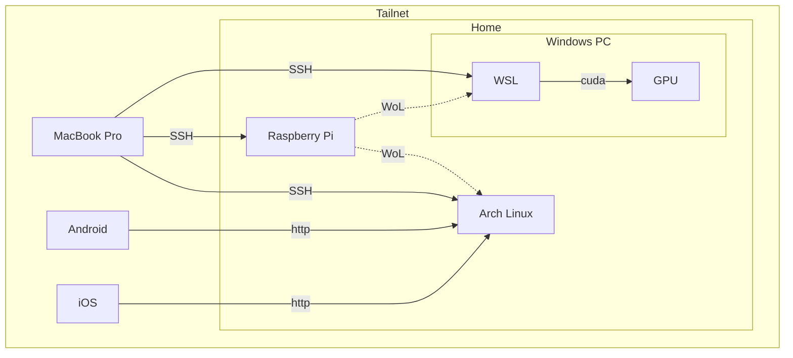
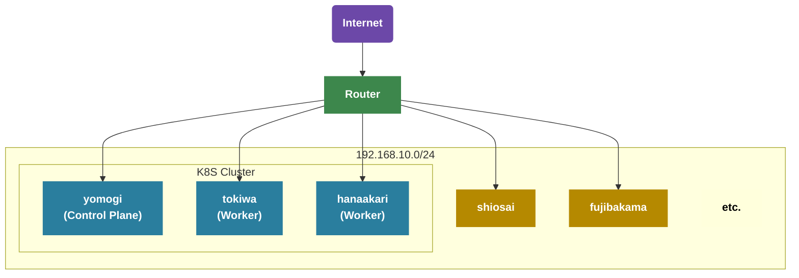

## はじめに

これまでインフラやネットワークといった領域にそこまで深く踏み込んだことがなく、そのあたりの技術力に少し不満があったため、勉強がてらに元々あった自宅サーバーの環境を刷新しつつ、**ついでに NixOS + Kubernetes というロマンの塊のような技術スタックで作る自宅サーバーの簡単なガイドを作ってやろう**というのが今回の趣旨です。

私のサーバー環境のすべては dotfiles で管理されています。

https://github.com/ichi-h/dotfiles

すべての設定をこの記事で紹介するとあまりにも長くなりすぎるため、詳細な設定方法については割愛させていただきます。  
データ数 1 ではありますが、動くレベルの環境にはなりましたので、もし同様のことを行いたい場合は、上記のリポジトリのコードを参考にしていただければと思います（もちろん、私以外にも同じことをやっている方が GitHub に転がっていますので、そちらもぜひ参考にしてみてください）。

## 旧自宅サーバー環境

刷新前の自宅サーバーは、Arch Linux で構築された開発サーバーや、Windows PC 内の GPU リソースを利用できる WSL に、MacBook Pro から SSH で接続して開発するという非常にシンプルな構成でした。

自宅内だけでなく外出先でも開発ができるように、Tailscale を用いて VPN 環境を構築し、インターネットに接続できればどこでも開発ができるようにしていました。  
また Android や iOS といったモバイル端末を Tailnet に参加させておくことで、モバイル向けの UI を伴う Web アプリケーションの開発時に、モバイル端末から開発サーバーで立ち上がっているアプリケーションへ http で確認することもできます。

サーバーの電源を必要なときだけ稼働させておきたいという気持ちもあったので、外出の際は Raspberry Pi を常時稼働させ、そこから各サーバーの電源を Wake-on-Lan で起こせるようにしていました。



MacBook Pro によってそれなりのスペックのラップトップを持ち運びつつ、どこからでも強いサーバーのリソースを利用できるということで、開発面において大きな不満はありませんでした。

https://tailscale.com

## 実現したいこと

今回の自宅サーバー刷新では、上記の機能に追加して以下のことができるようになることを目標としていました。

- **手持ちの端末間でパスワード等の機密情報を安全に管理できる仕組みを作る**
- **Dropbox や OneDrive のようなストレージサービスの提供**
- **クラスターが提供する各アプリケーションに対して、独自ドメインかつセキュアにアクセスできる**
- **稼働するサーバーのログやメトリクスを収集する基盤作成**

正直これをやるだけであれば Kubernetes を導入する必要はないのですが、今回は学習目的も兼ねているため、オーバーエンジニアリングは許容して構築を進めていきます。

## OS 選定

今回自宅サーバーで利用するディストリビューションとして **NixOS** を選択しました。

https://nixos.org

半分趣味の側面もあるのですが、今回は NixOS の**再現性**と**宣言的**という性質を最大限活かすためこの技術選定をいたしました。

### Nix/NixOS とはなにか

Nix とは、**純粋関数型言語である Nix 言語をを用いて、開発環境やビルド環境に必要なパッケージを宣言的に管理できるツール**です。

例えば Node.js を採用するプロジェクトの開発環境を考えてみましょう。  
Node.js のバージョンを揃えるために Volta や nvm といったバージョン管理ツールを使うこともありますし、Docker を使って Node.js の実行環境を用意するケースもあるでしょう。

もしこのバージョン管理を Nix で行う場合、以下のような flake.nix ファイルをプロジェクトに作成することになります。

```nix
{
  description = "node.js";

  inputs = {
    nixpkgs.url = "github:nixos/nixpkgs?ref=nixos-unstable";
    flake-utils.url = "github:numtide/flake-utils";
  };

  outputs = { self, nixpkgs, flake-utils }:
    flake-utils.lib.eachDefaultSystem (system:
      let
        packages = nixpkgs.legacyPackages.${system};
      in
      {
        devShells = {
          default = packages.mkShell {
            buildInputs = with packages; [
              nodejs_22
            ];

            shellHook = ''
              echo "Node.js version: $(node --version)"
            '';
          };
        };
      }
    );
}
```

このファイルが存在するディレクトリで `nix develop` を実行すれば、Node.js が使えるシェルへと入ることができます（ホストのグローバルなアプリケーションとしてインストールしているわけではなく、このシェルの中のみで Node.js は有効になります）。  
もし Node.js のパッケージマネージャーとして pnpm を利用したいのであれば、buildInputs の中に `nodePackages.pnpm` を追加するだけで OK です（他に利用したいツールがあっても基本的には同様です）。

```nix
buildInputs = with packages; [
  nodejs_22
  nodePackages.pnpm # add
];
```

ところで、Nix は Docker のような仮想化技術は用いておらず、パッケージを動作させるために必要な依存関係をローカルにインストールし、それらのリソースを用いてパッケージを動作させます。  
上記のようなシンプルな環境であれば良いかもしれませんが、もしさらに複雑なパッケージ管理を必要とするプロジェクトの場合、仮想化なしでマシン間の動作差がない開発環境を用意できるのかという、至極最もな疑問が出てくると思います。

ですが、**Nix ではそうした問題は原理上発生しません。**

> Nix builds packages in isolation from each other. This ensures that they are reproducible and don’t have undeclared dependencies, so **if a package works on one machine, it will also work on another.**
>
> 引用: https://nixos.org、2025年10月3日訪問

> Nix はパッケージを互いに隔離して構築します。これにより、パッケージの再現性が保証され、宣言されていない依存関係が存在しないため、**あるマシンで動作するパッケージは、別のマシンでも動作します。**

Nix は依存関係の衝突や暗黙的な依存関係が発生しないようにパッケージ間で発生する依存関係を裏側で厳密に管理しているため、UNIX 系の OS であれば、ホストの環境に依存しない安定した開発環境を提供することができます。

Nix の詳しい仕組みについてはすでに解説記事がございますので以下をご参照ください。

https://zenn.dev/asa1984/books/nix-introduction

そして、この Nix の仕組みを OS レベルに適用したものが **NixOS** になります。  
Nix では管理者権限が必要な領域まで操作することはできませんが、NixOS ではユーザーの管理、パーティション、ネットワークやファイアウォールの設定、systemd で動くデーモンの管理などなど、ありとあらゆる設定を宣言的に管理できるようにしたディストリビューションです。

例えば Docker をインストールしたいなぁ……と思ったら、以下の設定を追記するだけで導入が完了します。

```nix
{
  virtualisation.docker.enable = true;
}
```

### なぜ NixOS なのか

改めてなぜ今回の Kubernetes を用いた自宅サーバー構築で NixOS に目をつけたのかというと、それは NixOS が持つ **再現性** と **宣言的** という 2 つの特徴が今回のケースにマッチすると考えたからです。

今回の環境構築では、合計 3 つのサーバーのセットアップを行うことになります。  
1 つ 1 つのサーバーのセットアップを行うのは面倒ですし、また今回 Raspberry Pi をノードに参加させたかったので、CPU アーキテクチャの違いによる動作差も懸念されていました。

では、もしここで NixOS を使うとどうなるのでしょうか。

まず、**各サーバーのセットアップが数コマンドで完了**します。  
NixOS は特性上、1 回動く環境を作ってしまえば、どのマシンに持っていっても基本的には同様に動く環境を簡単に再現できます。  
この強力な再現性により、面倒な複数台のサーバーセットアップを爆速で完了することができます。

また設定がすべて .nix ファイルとして管理されているため、**サーバー間で共通の設定を再利用することが可能**です。  
例えば NixOS における Kubernetes の Worker Node の設定は以下のようになっています。

https://github.com/ichi-h/dotfiles/blob/349d8d7c8823c18bcc2dcf2006b24e756f5c8ef6/nix/modules/k8s/node.nix#L1-L48

ここから新しく Worker Node を増やしたいとなった場合、上記の設定をサーバーに import するだけでセットアップがほぼ完了します。

```nix
{
  imports = [
    path/to/node.nix # add
  ];
}
```

将来的にノードを増やすことが考えられたため、ほぼ確実に動くであろうノードの設定を再利用できるのは大きなメリットになると考えました。

つまり、**NixOS の再現性と宣言的という特性を活用することで、複数あるサーバーの個別ないし共通の設定を宣言的に管理しつつ、再現性のある環境構築を可能にしたかった**、ということです。

## サーバー・ネットワーク構成

自宅にはサーバーが 5 台あり、今回クラスターに参加させるノードはそのうち 3 台になります。  
大まかなサーバースペックとネットワーク構成は以下のとおりです。  
（家のサーバーが多くなり、それぞれの区別が必要になったため、ホスト名に各サーバーの呼び名をつけています）

| Machine                      | Hostname                      | Role          | CPU/GPU                                        | RAM  | Storage                                |
| ---------------------------- | ----------------------------- | ------------- | ---------------------------------------------- | ---- | -------------------------------------- |
| **Raspberry Pi 4**           | **yomogi<br>（蓬）**          | Control Plane | ARM Cortex-A72                                 | 4GB  | 64GB（SD カード）                      |
| **Mini PC 1**                | **tokiwa<br>（常磐）**        | Worker        | Intel N97                                      | 16GB | 512GB（M.2 SSD）                       |
| **Mini PC 2**                | **hanaakari<br>（花明かり）** | Worker        | Intel N97                                      | 16GB | 512GB（M.2 SSD）<br>1 TB（外付け SSD） |
| **Arch Linux<br>Dev Server** | **shiosai<br>（潮騒）**       | -             | Intel Core i5-13400                            | 32GB | 1 TB（M.2 SSD）                        |
| **Windows PC（WSL）**        | **fujibakama<br>（藤袴）**    | -             | Intel Core i5-12600K + NVIDIA GeForce RTX 5070 | 32GB | 1 TB x 2（M.2 SSD）                    |



蓬サーバー（Raspberry Pi）を Control Plane とし、Mini PC x 2 台にアプリケーションをデプロイしていく方針です。  
また後に解説しますが、クラスターの共有ストレージの供給として **Rook Ceph** を利用しており、ストレージ確保のため花明かりサーバー（Mini PC 2）に 1TB の 外付け SSD をマウントしています。

またネットワーク構成図では省略していますが、各サーバーを**Tailscale** に登録しており、それぞれに `100.x.y.z` の IP アドレスが割り振られています。

## 基盤構築 - NixOS 編

NixOS にまつわる大まかなアーキテクチャは以下のとおりです。


### Kubernetes

NixOS では Kubernetes のパッケージが公式から提供されています。

https://nixos.wiki/wiki/Kubernetes

いきなりですがこのパッケージ、**ややクセのある設計になっている**ので、少し補足いたします。

例えば kubeadm でクラスターを立ち上げた場合、kubelet はホストのサービスとして在中し、apiserver、etcd、control-manager、scheduler といったコンポーネントは Static Pod として立ち上がるのが一般的な構成だと思います。

しかし、公式のパッケージでクラスターを立ち上げた場合、基本的に kubelet を除く他の要素はすべて **systemd のサービス**として立ち上がります。  
Kubernetes の設定の中に `services.kubernetes.roles` という設定があり、この項目を `master` か `node`、もしくは両方に設定することで立ち上げるサービスを選択することができます。

```nix
{
  services.kubernetes.roles = ["master" "node"];
}
```

具体的には以下のものが立ち上がります。

- master
  - etcd
  - apiserver
  - scheduler
  - controller manager
  - addon manager
  - flannel
  - proxy
- node
  - flannel
  - docker
  - kubelet
  - proxy

`services.kubernetes.roles` の設定を行った場合、いくつかのサービスが自動的に有効になります。  
まず、上記のリストの通り CNI として **Flannel** が自動的に選択されます。

https://github.com/flannel-io/flannel

ホストで Flannel が立ち上がっていたとしても、基本的な仕組みは同様になりますので、詳細は割愛させていただきます。  
詳しくは以下の記事が参考になると思います。

https://zenn.dev/taisho6339/books/fc6facfb640d242dc7ec/viewer/0d112c

また、**easyCerts**というサービスも自動的に ON になります。

https://github.com/NixOS/nixpkgs/blob/73dfe087eeb750197fc539ee5c6aec5007b8825e/nixos/modules/services/cluster/kubernetes/default.nix#L190-L194

https://github.com/NixOS/nixpkgs/blob/73dfe087eeb750197fc539ee5c6aec5007b8825e/nixos/modules/services/cluster/kubernetes/default.nix#L278-L283

これはノード間で通信する際に使用する証明書を自動で発行・更新してくれる非常に便利なサービスなのですが、公式パッケージの見解としては **「for a production-grade cluster you shouldn't use `easyCerts`（本番環境のクラスタでは easyCerts を使用すべきではありません）」** とのことです（こちらについては記事の最後にて後述）。

### VPN + Local DNS

各端末間の通信は引き続き **Tailscale** を用いて行っています。

Tailnet 内で公開されているマシンと通信する方法として一番簡単なものは、Tailscale から提供される IP アドレス（例: `100.xx.xx.xx`）を使うというものだと思います。  
しかし、ただの数字の羅列をいくつも覚えるのは人間がするべきことではないので、もっと楽な方法で解決したいところです。

別の方法として、https://login.tailscale.com/admin/dns ページから確認できる Tailnet DNS name と各マシンのホスト名を組み合わせた `hostname.xxxx-xxxxx.ts.net` というドメインを使って通信する方法もあります。  
IP アドレスに比べれば覚えやすく、IP アドレスが変わったとしても変化しない。そして**このドメインに対して TLS 証明書を発行できる**という状況によっては強力な機能を使うこともできます。

なのですが、できればこれも使いたくないのです……。  
なぜなら Tailnet DNS name の一部はランダムな文字列なので、長くはないですが覚えにくいのです……。

一番の理想は、

1. **独自ドメインを使って通信**でき、
2. **TLS 証明書**を発行しつつ、
3. そのドメインを**外部の人が踏んでも自宅サーバーに繋がらない**

といった具合なのですが、**実はこれ全部実現できます。**

証明書は Kubernetes の章で紹介するとして、1 番と 3 番については Tailscale の **Split DNS** という機能を使うことで実現できます。

https://tailscale.com/learn/why-split-dns

これは何なのかというと、**特定のドメインに対する名前解決を、指定した DNS で行う**という機能です。  
設定方法としては、https://login.tailscale.com/admin/dns から「Nameservers」の項目に進み、「Add nameserver」というセレクターから「Custom...」という項目をクリックすると下記のようなモーダルが表示されます。


この設定では、`home.hogehoge.com` というドメインの名前解決には、`1.2.3.4` というネームサーバーを使うことになります。  
ここに自分が所有しているドメインと、そのドメインの名前解決ができる DNS を用意できれば、Tailnet 内でのみで解決可能なドメイン名を使用することができます。

アーキテクチャ図でこの仕組みを表現した部分は以下になります。


私の環境では `home.ichi-h.com` というドメインを自宅サーバーに割り当てています。  
このドメインに対して Tailnet に参加して**いない**端末からアクセスしようとすると、Public DNS によって `127.0.0.1` へと解決するようになっています。  
一方、Tailnet に参加して**いる**端末がこのドメインにアクセスしようとすると、Split DNS 機能により、**`home.ichi-h.com` のドメインのみ蓬サーバー（Raspberry Pi）から提供される Local DNS を名前解決に使用します**（それ以外のドメインは Public DNS を用いて通常通り名前解決を行います）。

今回は **CoreDNS** を用いて Local DNS を立ち上げました。

```nix
# coredns/default.nix
{ impurelibs, ... }:
{
    services.coredns = {
      enable = true;
      extraArgs = [
        "-dns.port=53"
      ];
      config = ''
.:53 {
  log
  errors

  template IN A home.ichi-h.com {
    match "^(.+\.)?home\.ichi-h\.com\.$"
    answer "{{ .Name }} 60 IN A ${impurelibs.secrets.ip-address-hanaakari.tailscale}"
    fallthrough
  }

  forward . 1.1.1.1 1.0.0.1

  cache 30
  health
}'';
    };
}
```

上記の設定により、`home.ichi-h.com` を含むドメインは、すべて花明かりサーバー（Mini PC 2）へと名前解決されます。

### Proxy Server

上記のドメインの解決先となる花明かりサーバー（Mini PC 2）では、**Nginx** を用いて NodePort で公開された Pod へリバースプロキシを行っています。

```
events {
    worker_connections 1024;
}

stream {
    upstream traefik_https {
        server localhost:31443;
    }

    upstream traefik_http {
        server localhost:31080;
    }

    server {
        listen 443;
        proxy_pass traefik_https;
        proxy_protocol off;
    }

    server {
        listen 80;
        proxy_pass traefik_http;
    }
}
```

転送先は **Traefik** となっており、そちらがクラスター内の Pod へのリバースプロキシサーバー兼 TLS 終端になっています。  
詳細は Kubernetes の章にてお話いたします。

### Firewall

NixOS + Kubernetes で環境構築した際にハマりやすい沼の 1 つに **Firewall** があります。  
ここの設定をミスると、「なぜか Control Plane のノード内の Pod から kube-apiserver へのリクエストだけが通らない」などの謎現象が起こります。

試行錯誤した結論としては、私の環境では `10.0.0.0/8` と `192.168.10.0/24` からのリクエストを信頼することで動くようになりました（一応 Private IP Address といえど、かなり広い範囲を開けているので、より Better な設定はあると思います）。  
CIDR は環境によって異なると思うので、どの範囲を開けるかは適宜調整をお願いいたします。

```nix
{
  networking = {
    networkmanager.enable = true;

    # 10.0.0.0/8 -> クラスター内のPodとの通信を信頼
    # 192.168.10.0/24 -> 各端末間の通信を信頼
    firewall.enable = true;
    firewall.extraCommands = ''
      iptables -A nixos-fw -s 10.0.0.0/8 -j nixos-fw-accept
      iptables -A nixos-fw -s 192.168.10.0/24 -j nixos-fw-accept
    '';
  };
}

```

### Rook Ceph 関連

サーバースペックを紹介した際に少しお話しましたが、共有ストレージに **Rook Ceph** を利用している関係で、設定をいくつか追加する必要があります。  
私の環境では、NixOS が提供する Kubernetes の docs や Rook Ceph が紹介している設定とも少し違う結果になりましたが、以下の設定は参考程度にお捉えください。

```nix
{
  # カーネルへcephとrbdのモジュールを追加
  boot.kernelModules = [ "ceph" "rbd" ];

  # kubeletの起動オプションを追加
  # そもそもkubeletのroot directoryの初期値は/var/lib/kubeletのはずなので、
  # 明示する必要はなさそうなのですが、NixOSのKubernetesパッケージの指示に従い追加
  services.kubernetes.kubelet.extraOpts = "--root-dir=/var/lib/kubelet";

  # containerdが同時に開けるファイルディスクリプタの上限を拡張する
  # Rook CephのドキュメントではLimitNOFILEを削除するように記述があったが、
  # 提供された設定はビルド時にエラーが発生したため、上限を上げることで対応
  systemd.services.containerd.serviceConfig = {
    LimitNOFILE = "1048576";
  };
}
```

https://rook.io/docs/rook/latest-release/Getting-Started/Prerequisites/prerequisites/

## 基盤構築 - Kubernetes 編

### ストレージ

- Rook Ceph

### CNI

- Flannel

### 監視基盤

- Grafana
- Loki
- Prometheus
- Vector

### バックアップ

- Velero

### ダッシュボード

- k9s

### TLS 終端・証明書自動化

## デプロイしたアプリケーション

## できなかったところ

- 開発環境の NixOS 化
- 他アプリケーションのデプロイ
- CI/CD の構築
- 電源管理

## サーバー構成・スペックについての所感

- 今回の規模感であれば Mini PC で十分運用可能
- ただし Raspberry Pi ではスペックが圧倒的に足りない

## NixOS の良かったところ・悪かったところ

### 良いところ

### 悪いところ

## Kubernetes の良かったところ・悪かったところ

### 良いところ

### 悪いところ

## 結論: おすすめできるか

- できない
- 自由度がない
  - https://discourse.nixos.org/t/kubernetes-the-nixos-module-of-the-future/3922
- 問題が発生したときにどこで壊れているかがわからない・どう直せばいいかがわからない
  - 情報がなく、かなりトリッキーなシステム構成になっているので、バグったときにどこに問題があるのかを探るのが難しかった
  - 宣言的というのは良くも悪くも詳細が見えないので、こういうブラックボックス化してしまう問題は NixOS の 1 つの弱点だなと感じた
  - 全てが明示的にならないので、どうやって直せばいいかがわからないっていうのは、ある意味で ubuntu と似た問題なのかもしれない
